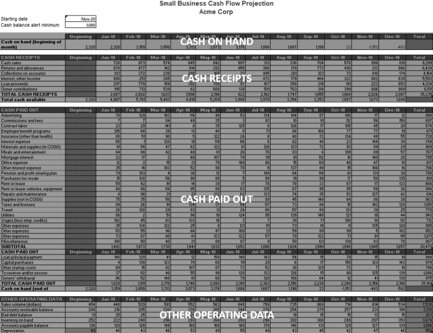
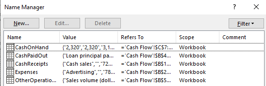
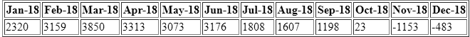
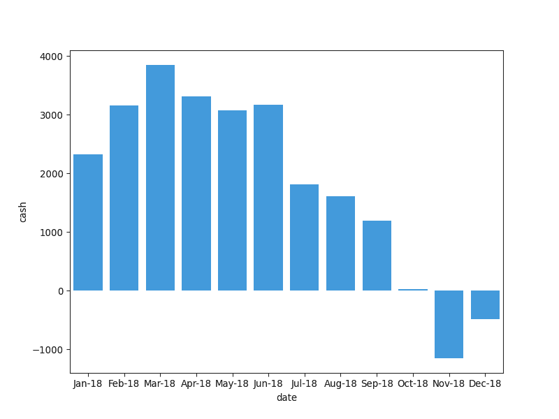
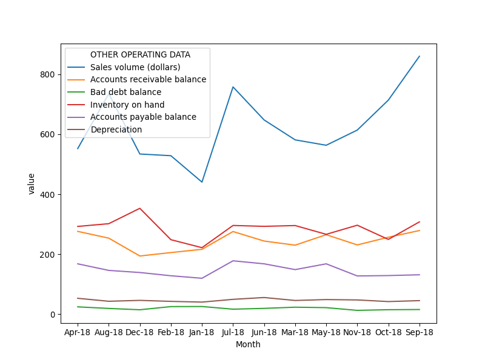
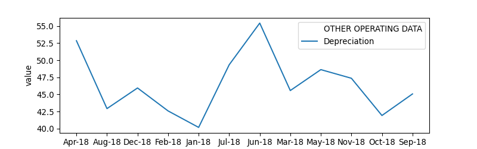
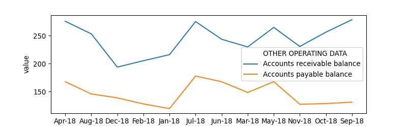

# Cash flow

A [small business cash flow projection](https://templates.office.com/en-in/small-business-cash-flow-projection-tm16410107)
generally has a single Excel sheet with multiple sections:

1. Cash on hand
2. Cash receipts
3. Cash paid out
4. Other operating data

[{.img-fluid}](cashflow.xlsx)

We'll use [FormHandler](../) to expose the data in these sheets as simple charts.

<div class="ratio ratio-16x9">
  <iframe src="https://www.youtube.com/embed/R07qHe5dUa8" allowfullscreen></iframe>
</div>

## Expose Excel data

Download the dataset [cashflow.xlsx](cashflow.xlsx).

This file has 5 pre-defined tables, which you can view via the Name Manager (`Ctrl-F3`).

{.img-fluid}

1. CashOnHand
2. CashPaidOut
3. CashReceipts
4. Expenses
5. OtherOperationalData

Let's expose the `OtherOperationalData` table via FormHandler. Create this `gramex.yaml` with this content:

```yaml
url:
  formhandler/cashflow/data:
    pattern: /$YAMLURL/data
    handler: FormHandler
    kwargs:
      url: $YAMLPATH/cashflow.xlsx
      table: OtherOperationalData
```

[Run Gramex and visit the `/data` page](data). You should see the Excel table as JSON:

```json
[{"OTHER OPERATING DATA":"Sales volume (dollars)","Beginning":454,"Jan-18":440.461,...}]
```

[To see the page as a HTML table, visit `/data/?_format=html`](data?_format=html)

## Prepare the data

Let's create a bar chart to show the `CashOnHand` table. For this, we need to prepare data.

Add this to `gramex.yaml`:

```yaml
formhandler/cashflow/chart:
  pattern: /$YAMLURL/chart
  handler: FormHandler
  kwargs:
    url: $YAMLPATH/cashflow.xlsx
    name: CashChart
```

[Visit the `/chart` page](chart1). You should see the `CashChart` named range data as JSON:

```json
[{"Jan-18":2320,"Feb-18":3159,"Mar-18":3850,...}]
```

[Visit `/chart?_format=html` page](chart1?_format=html) to see this as HTML:

{.img-fluid}

Let's convert this into a format that we can use for charts. Add this function to transform the data:

```yaml
function: "data.T.reset_index().rename(columns={'index': 'date', 0: 'cash'})"
```

This does the following:

- `.T` rotates the data 90°, transposing rows and columns
- `.reset_index()` converts the headers `Jan-18`, `Feb-18`, etc into a column called `index`
- `.rename(...)` renames the columns into `date` and `cash`, which makes it easy to refer to them

[Now, the data looks like this](chart?_format=html):

{.img-fluid}

## Create the chart

Add this to your `gramex.yaml`:

```yaml
barchart: # Define a format called barchart
  format: seaborn # This uses seaborn as the format
  chart: barplot # Chart can be any standard seaborn chart
  x: date # Use 'date' column for the bars
  y: cash # Use 'cash' column for height of the bars
  color: "#2A9DF4" # Bar chart color is a light blue
  width: 800 # Width in pixels. Default: 640
  height: 600 # Height in pixels. Default: 480
  dpi: 96 # Zoom (dots per inch)
  ext: png # Use a matplot backend (svg, pdf, png)
  headers:
    Content-Type: image/png # Set the corresponding MIME type
```

[Now, visit `chart?_format=barchart` to see this bar chart](chart?_format=barchart)

[{.img-fluid}](chart?_format=barchart)

## Customize the chart

You can now embed [this chart URL `chart?_format=barchart`](chart?_format=barchart) in any application.

To customize its appearance using URL query parameters, change the `color`, `width`, and `height` lines in `gramex.yaml` from:

```yaml
color: "#2A9DF4" # Bar chart color is a light blue
width: 800 # Width in pixels. Default: 640
height: 600 # Height in pixels. Default: 480
dpi: 96 # Zoom (dots per inch)
```

... to ...

```yaml
color: "{color}" # Bar chart color is a light blue
width: "{width}" # Width in pixels. Default: 640
height: "{height}" # Height in pixels. Default: 480
dpi: "{dpi}" # Zoom (dots per inch)
```

Then, add this to your `gramex.yaml`:

```yaml
default:
  color: "#2A9DF4"
  width: 800
  height: 600
  dpi: 96
```

This picks up the color, width and height from the URL query parameters. For example, [`chart?_format=barchart&color=red&width=600&height=400&dpi=72`](chart?_format=barchart&color=red&width=600&height=400&dpi=72) looks like this:

[{.img-fluid}](chart?_format=barchart&color=red&width=600&height=400&dpi=72)

When embedding this into another application, you can change the URL to control the style of the chart.

## Create another chart

Using the same cash flow data, let's create another chart that shows operational data.

```yaml
formhandler/cashflow/operational:
  pattern: /$YAMLURL/operational
  handler: FormHandler
  kwargs:
    url: $YAMLPATH/cashflow.xlsx
    table: OtherOperationalData
    function: |
      (data                                   # Take the data
      .drop(columns=['Beginning', 'Total'])   # Remove these columns
      .melt(                                  # "Unpivot" the table
        id_vars=['OTHER OPERATING DATA'],     # using OTHER OPERATING DATA
        var_name='Month'))                    # ... and Month
    formats:
      linechart: # Define a format called linechart
        format: seaborn # This uses seaborn as the format
        chart: lineplot # Pick the lineplot chart type
        x: Month # Use 'Month' column for the X-axis
        y: value # Use 'value' column for the Y-axis
        hue: OTHER OPERATING DATA # Color by the OTHER OPERATING DATA col
        width: "{width}" # Width in pixels. Default: 640
        height: "{height}" # Height in pixels. Default: 480
        dpi: "{dpi}" # Zoom (dots per inch)
        ext: png # Use a matplot backend (svg, pdf, png)
        headers:
          Content-Type: image/png # Set the corresponding MIME type
    default:
      width: 800
      height: 600
      dpi: 96
```

[This creates a chart at `operational?_format=linechart`](operational?_format=linechart)

[{.img-fluid}](operational?_format=linechart)

You can use [FormHandler filters](../#formhandler-filters) to restrict the data to specific rows. You can also use `?width=`, `?height=` and `?dpi=` to control the size. For example:

[operational?\_format=linechart&OTHER OPERATING DATA=Depreciation&height=250](operational?_format=linechart&OTHER%20OPERATING%20DATA=Depreciation&height=250)

[](operational?_format=linechart&OTHER%20OPERATING%20DATA=Depreciation&height=250)

[operational?\_format=linechart&OTHER OPERATING DATA=Accounts payable balance&OTHER OPERATING DATA=Accounts receivable balance&height=250](operational?_format=linechart&OTHER%20OPERATING%20DATA=Accounts%20payable%20balance&OTHER%20OPERATING%20DATA=Accounts%20receivable%20balance&height=250)

[](operational?_format=linechart&OTHER%20OPERATING%20DATA=Accounts%20payable%20balance&OTHER%20OPERATING%20DATA=Accounts%20receivable%20balance&height=250)

## See the result

- [This is the dataset: cashflow.xlsx](cashflow.xlsx)
- [This is the final configuration: gramex.yaml](gramex.yaml.source){.source}
- Try it out yourself!
