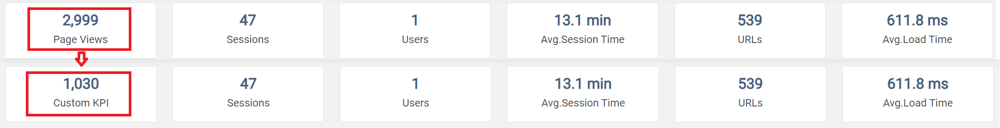
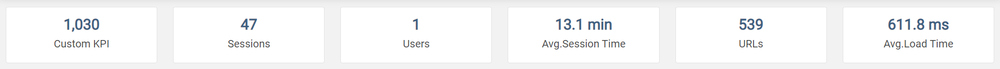
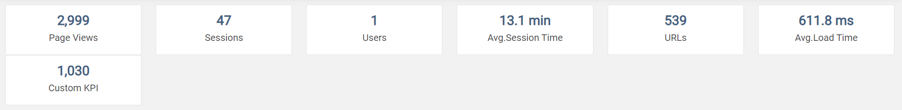
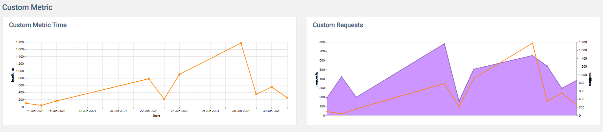
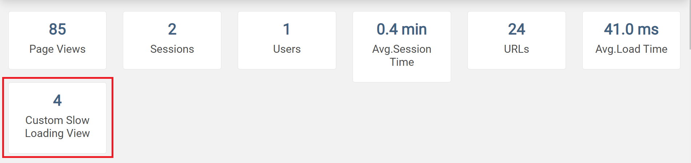

---
title: Log viewer
prefix: Log viewer
icon: logviewer.png
desc: Add logviewer to your project for visualizing the logging data
by: TeamGramener
type: app
deprecated: False
...

[TOC]

From v1.25, Gramex ships with a log file viewer.

To use it, add this to your `gramex.yaml`:

```yaml
import:
  logviewer:
    path: $GRAMEXAPPS/logviewer/gramex.yaml   # Source of the app
    YAMLURL: $YAMLURL/log/                    # Location to mount at
    auth: ...                                 # Restrict access as required
```

This configuration mounts the app at [log/](log/):

::: example href=log/ source=https://github.com/gramener/gramex-guide/blob/master/logviewer/gramex.yaml
    Try Log Viewer

## Logviewer usage

Use `LOGVIEWER_*` variables to configure your app.

- `LOGVIEWER_PATH_UI`: path to customized layout config. Use sample default `$GRAMEXAPPS/logviewer/config.yaml` layout
- `LOGVIEWER_PATH_RENDER`: path to customized renderer config. Use sample default `$GRAMEXAPPS/logviewer/render.js` js file
- `LOGVIEWER_FORMHANDLER_KWARGS`: to update `url.name.kwargs` section
- `LOGVIEWER_FORMHANDLER_QUERIES`: to update or add to `queries` section  of `/$YAMLURL/query/` formhandler
- `LOGVIEWER_CAPTURE_KWARGS`: to pass additional kwargs to capture handler
- `LOGVIEWER_SCHEDULER_PORT`: when running multiple instances of gramex, you can control to run scheduler only once from certain port
- `LOGVIEWER_SCHEDULER_SETUP`: to control frequency when to run the scheduler. Default: daily.
- `LOGVIEWER_SCHEDULER_KWARGS`: to change `transforms`
- `LOGVIEWER_CUSTOM_DIMENSIONS`: to define custom columns and their value patterns

All variables are optional.

## Using Variables

Examples usage with `LOGVIEWER_*` variables

```yaml
import:
  ui:
    path: $GRAMEXAPPS/ui/gramex.yaml
    YAMLURL: $YAMLURL/ui/
  logviewer:
    path: $GRAMEXAPPS/logviewer/gramex.yaml
    YAMLURL: $YAMLURL/log/
    LOGVIEWER_LAYOUT_KWARGS:
      auth:                                  # Add auth to layout page
        login_url: /$YAMLURL/login
    LOGVIEWER_FORMHANDLER_KWARGS:
      headers:
        Cache-Control: public, max-age=3600   # cached for 1 hour
    LOGVIEWER_FORMHANDLER_QUERIES:
      kpi-pageviews:  # overwrites existing query
        SELECT SUM(duration_count) AS value
        FROM {table} {where}
      kpi-custom-metric:  # adds new query
        SELECT AVG(duration_count) AS value
        FROM {table} {where}
    LOGVIEWER_SCHEDULER_PORT: '9006'  # run scheduler only on --listen.port=9006
    LOGVIEWER_PATH_UI: $YAMLPATH/logviewer-config.yaml    # local .yaml file
    LOGVIEWER_PATH_RENDER: $YAMLPATH/logviewer-render.js  # local js file
    LOGVIEWER_CAPTURE_KWARGS:
      timeout: 30              # Change timeout to 30
    LOGVIEWER_SCHEDULER_SETUP:
      minutes: 45              # Change minute to 45
    LOGVIEWER_SCHEDULER_KWARGS:
      transforms: # Add custom transforms, default transforms will be replaced
      - type: derive
        expr:
          col: user.id
          op: NOTIN
          value: ['-', 'dev']
        as: user.id_1
    LOGVIEWER_CUSTOM_DIMENSIONS:
      user_agent: df['headers.User-Agent'].str.extract(r"\((?P<user_agent>[^\(|\)]+)\)")
      slow: df['duration'] > 100
```

## Multiple logviewer instances

When running multiple instances of the same app, each instance will start
log viewer. Avoid this by specifing `LOGVIEWER_SCHEDULER_PORT: <one-port>`. For example:

```yaml
logviewer:
    path: $GRAMEXAPPS/logviewer/gramex.yaml
    YAMLURL: $YAMLURL/log/
    LOGVIEWER_SCHEDULER_PORT: '9001'    # Run LogViewer only if the app is run on port 9001, not otherwise
```

Now, you can run the app on multiple ports. Only port 9001 will host the log viewer:

```bash
gramex --listen.port=9001     # Log viewer works here
gramex --listen.port=9002     # ... not here
gramex --listen.port=9003     # ... nor here
```


## logviewer.db

Gramex logs all HTTP requests to `logs/requests.csv` under `$GRAMEXDATA`.

It logs:

- `time`: Time of the request in milliseconds since epoch
- `ip`: The IP address of the client requesting the page
- `user.id`: The unique ID of the user requesting the page
- `status`: The HTTP status code of the response (e.g. 200, 500)
- `duration`: Time taken to serve the request in milliseconds
- `method`: The HTTP method requested (e.g. GET or POST)
- `uri`: The full URL requested (after the host name)
- `error`: Any error raised while processing the request

Typical `requests.csv` looks like

```text
1530008663609.0,::1,,200,2708.0,GET,/,
1530008665319.0,::1,,200,948.0,GET,/ui/jquery/dist/jquery.min.js,
1530008665404.0,::1,,200,81.0,GET,/script.js,
1530008665410.0,::1,,200,1.0,GET,/style.css,
1530008667319.0,::1,,404,678.0,GET,/favicon.ico,HTTPError: HTTP 404: Not Found
1530012727106.0,::1,user1,200,210.0,GET,/,
1530012729481.0,::1,,200,74.0,GET,/ui/jquery/dist/jquery.min.js,
1530012729538.0,::1,user2,200,1.0,GET,/script.js,
1530012729594.0,::1,,200,2.0,GET,/style.css,
```

By default, `requests.csv` are backed up on a weekly basis with date prefix.
For eg: `requests.csv.2017-11-21`.

Logviewer application uses data from `logviewer.db` for the front-end visuals.
`logviewer.db` stores the aggregated data (day (aggD), week (aggW), month (aggM)) tables of `requests.csv*`.

Data is grouped for every combination of (`time` (daily), `user.id`, `ip`, `status`, `uri`) and
aggregrated on (`duration`, `new_session`, `session_time`) metrics with (`_count`, `_sum`) suffix.

- `duration_count` - Count of requests for given row combination
- `duration_sum` - Sum of the requests's time taken to serve the request in ms

### Session Calculations

Every time a user logs into a gramex app, a `new_session` is flagged.
`session_time` duration (in seconds) is the length of time someone spends on the app.

For example, let's take `user1`

- `user1` logs in at `10:00AM` on page `/page1`
- Does nothing for next few minutes
- Hits `/page2` at `10:05AM` -- right now `user1`'s session_time is 5 minutes and counting.
- By default, a 15-minute threshold is considered to flag `new_session`.
- Now the `user1` comes back again at `11:30AM`
- This request is flagged for `new_session` and `session_time` is reset for this session.

Let's take another scenario:

- `user2` hits `/page1` at `02:00PM`
- `user2` hits `/page2` at `02:10PM`
- `user2` hits `/page3` at `02:18PM`
- Total sessions by `user2` is `1` and `session_time` is `18mint`

Session related metrics include:

- `new_session_sum` - Total number of sessions
- `session_time_sum` - Total time spent by the user on given `uri` `user.id` `ip` `time:freq` combination

Note: You'd want to ignore test users, non-logged-in users [`-`, `dev`] for session related calulations.
As they tend to skew the session duration.

Currently, logviewer application having `session` related visuals, is based on following

- [`kpi-avgtimespent`](https://github.com/gramener/gramex/blob/master/gramex/apps/logviewer/gramex.yaml):
  performs `SUM(session_time_sum)/SUM(new_session_sum)`
- `kpi-sessions`: performs `SUM(new_session_sum)`

You can customize `kpi-avgtimespent` to consider only logged-in users

```yaml
import:
  logviewer:
    path: $GRAMEXAPPS/logviewer/gramex.yaml
    YAMLURL: $YAMLURL/log/
    LOGVIEWER_FORMHANDLER_QUERIES:
      kpi-avgtimespent:
        SELECT SUM(session_time_sum)/SUM(new_session_sum) AS value
        FROM {table}
        WHERE "user.id_1" == 1 {where}
```

[`user.id_1`](https://github.com/gramener/gramex/blob/master/gramex/apps/logviewer/gramex.yaml) by
default ignores `['-', 'dev']` users.

## Customizing Logviewer

Let’s say we want to replace an KPI (Page Views) with custom KPI as below:

{.img-fluid}

This can be achieved by following below steps.

**Step 1:**

First add the query for custom KPI to the gramex.yaml file as shown. You also need to configure the
`LOGVIEWER_PATH_UI` and `LOGVIEWER_PATH_RENDER` to point to the custom files as below.

```yaml
logviewer:
  path: $GRAMEXAPPS/logviewer/gramex.yaml
  YAMLURL: $YAMLURL/log/
  auth:
    login_url: /$YAMLURL/google
    membership:
      - {hd: [gramener.com]}
  LOGVIEWER_FORMHANDLER_QUERIES: # add custom query
    kpi-customview:
      SELECT COUNT(duration_count) AS value
      FROM {table}
      WHERE uri_1 == 1 {where}

  LOGVIEWER_PATH_UI: $YAMLPATH/logviewer-config.yaml  # use local config
  LOGVIEWER_PATH_RENDER: $YAMLPATH/logviewer-render.js  # use local render
```

**Step2:**

In the file [logviewer-config.yaml](logviewer-config.yaml) file (in your app folder) change
the first list entry under the KPI as shown below:

From:

```yaml
    # KPIs
    - '@class': d-flex flex-wrap my-4
      _$: [
          {'tpl': 'lv-kpi', 'on': 'kpi-pageviews', 'title': 'Page Views'},
          {'tpl': 'lv-kpi', 'on': 'kpi-sessions', 'title': 'Sessions'},
          {'tpl': 'lv-kpi', 'on': 'kpi-users', 'title': 'Users'},
          {'tpl': 'lv-kpi', 'on': 'kpi-avgtimespent', 'title': 'Avg.Session Time'},
          {'tpl': 'lv-kpi', 'on': 'kpi-urls', 'title': 'URLs'},
          {'tpl': 'lv-kpi', 'on': 'kpi-avgloadtime', 'title': 'Avg.Load Time'}]
```

to:

```yaml
    # KPIs
    - '@class': d-flex flex-wrap my-4
      _$: [
          {'tpl': 'lv-kpi', 'on': 'kpi-customview', 'title': 'Custom KPI'},
          {'tpl': 'lv-kpi', 'on': 'kpi-sessions', 'title': 'Sessions'},
          {'tpl': 'lv-kpi', 'on': 'kpi-users', 'title': 'Users'},
          {'tpl': 'lv-kpi', 'on': 'kpi-avgtimespent', 'title': 'Avg.Session Time'},
          {'tpl': 'lv-kpi', 'on': 'kpi-urls', 'title': 'URLs'},
          {'tpl': 'lv-kpi', 'on': 'kpi-avgloadtime', 'title': 'Avg.Load Time'}]
```

This ensures that right query is called to fetch data from the tables.

**Step 3:**

To render this in the UI, we need to make changes in the [logviewer-render.js](logviewer-render.js)
file (in your app folder) so that right visuals are displayed. To do that, in the
`viewsConfig:` list, change the first entry from:

```yaml
   {
      type: 'kpi', url: 'query/aggD/kpi-pageviews/', on: '.kpi-pageviews',
      formatter: d3.format(',.2d')
    },
```

to:

```yaml
    {
      type: 'kpi', url: 'query/aggD/kpi-customview/', on: '.kpi-customview',
      formatter: d3.format(',.2d')
    },
```

Refresh logviewer. You should see the Page Views KPI being replaced by the Custom KPI, like below:

{.img-fluid}

You can add your own custom KPIs and Visuals. Add more queries to your gramex.yaml file as below:

```yaml
logviewer:
  path: $GRAMEXAPPS/logviewer/gramex.yaml
  YAMLURL: $YAMLURL/log/
  auth:
    login_url: /$YAMLURL/google
    membership:
      - {hd: [gramener.com]}
  LOGVIEWER_FORMHANDLER_QUERIES: # add custom queries
    kpi-customview:
      SELECT COUNT(duration_count) AS value
      FROM {table}
      WHERE uri_1 == 1 {where}
    custloadtimetrend:
      SELECT time, SUM(duration_sum)/SUM(duration_count) AS loadtime
      FROM {table} {where}
      GROUP BY time
    custloadtimerequeststrend:
      SELECT time, SUM(duration_sum)/SUM(duration_count) AS loadtime,
      SUM(duration_count) AS requests
      FROM {table} {where}
      GROUP BY time

  LOGVIEWER_PATH_UI: $YAMLPATH/logviewer-config.yaml  # use local config
  LOGVIEWER_PATH_RENDER: $YAMLPATH/logviewer-render.js  # use local render
```

Now you should add corresponding entries for the above queries in your
[logviewer-config.yaml](logviewer-config.yaml) file. This can be done as shown below:

```yaml
settings:
  # ... TODO: configure head, navbar, footer, script, style sections
render: $LOGVIEWER_PATH_RENDER
layout:
  section:
    # filters
    - '@class': filters bg-white shadow pt-2 pb-2
      div:
        - '@class': container-fluid px-0
          _$: {'tpl': 'lv-filters', 'values': [
                {'on': 'filter-time', 'type': 'daterange'},
                {'on': 'filter-status', 'type': 'select', 'name': 'status', 'value': 'Status'},
                {'on': 'filter-users', 'type': 'select', 'name': 'user.id', 'value': 'User Name'},
                {'on': 'filter-uri', 'type': 'select', 'name': 'uri', 'value': 'Page Name'},
                {'on': 'filter-ip', 'type': 'select', 'name': 'ip', 'value': 'IP'}]}
    # KPIs
    - '@class': d-flex flex-wrap my-4
      _$: [
          {'tpl': 'lv-kpi', 'on': 'kpi-pageviews', 'title': 'Page Views'},
          {'tpl': 'lv-kpi', 'on': 'kpi-sessions', 'title': 'Sessions'},
          {'tpl': 'lv-kpi', 'on': 'kpi-users', 'title': 'Users'},
          {'tpl': 'lv-kpi', 'on': 'kpi-avgtimespent', 'title': 'Avg.Session Time'},
          {'tpl': 'lv-kpi', 'on': 'kpi-urls', 'title': 'URLs'},
          {'tpl': 'lv-kpi', 'on': 'kpi-avgloadtime', 'title': 'Avg.Load Time'},
          {'tpl': 'lv-kpi', 'on': 'kpi-customview', 'title': 'Custom KPI'}]
    # Heading
    - _$: {'tpl': 'lv-header', 'values': {'title': 'Traffic Trend'}}
    - div:
        '@class': container-fluid pr-lg-0
        _$: {'tpl': 'lv-card-deck', 'values': [
              {'on': 'vegam-pageviewstrend', 'title': 'Page Views'},
              {'on': 'vegam-sessionstrend', 'title': 'Sessions'}]}
    - _$: {'tpl': 'lv-header', 'values': {'title': 'Top Metrics'}}
    - div:
        '@class': container-fluid pr-lg-0
        _$:
        - {'tpl': 'lv-card-deck', 'values': [
            {'on': 'vegam-toptenuri', 'title': 'Top URLs'},
            {'on': 'vegam-toptenusers', 'title': 'Top Users'}]}
        - {'tpl': 'lv-card-deck', 'values': [
            {'on': 'vegam-toptenstatus', 'title': 'Top Status'},
            {'on': 'vegam-toptenip', 'title': 'Top IPs'}]}
    - _$: {'tpl': 'lv-header', 'values': {'title': 'Server Load'}}
    - div:
        '@class': container-fluid pr-lg-0
        _$: {'tpl': 'lv-card-deck', 'values': [
              {'on': 'vegam-loadtimetrend', 'title': 'Server Response Time'},
              {'on': 'vegam-loadtimerequeststrend', 'title': 'Response Time and Requests'}]}
    - _$: {'tpl': 'lv-header', 'values': {'title': 'Custom Metric'}}
    - div:
        '@class': container-fluid pr-lg-0
        _$: {'tpl': 'lv-card-deck', 'values': [
              {'on': 'vegam-custloadtimetrend', 'title': 'Custom Metric Time'},
              {'on': 'vegam-custloadtimerequeststrend', 'title': 'Custom Requests'}]}
```

Similarly, you would need to add the code to render the output of the queries as visuals. For that
you need to update your [logviewer-render.js](logviewer-render.js) file as shown below:

```js
/* globals d3 */
/* exported config */

var x_axis_format = '%d %b %Y'
var dt_axis_tickcount = {interval: 'day', 'step': 1}
var config = {
  filters: [
    {'column': 'status', 'type': 'select', 'el': '.filter-status select', 'url': 'query/aggD/filterstatus/'},
    {'column': 'user.id', 'type': 'select', 'el': '.filter-users select', 'url': 'query/aggD/filterusers/'},
    {'column': 'uri', 'type': 'select', 'el': '.filter-uri select', 'url': 'query/aggD/filteruri/'},
    {'column': 'ip', 'type': 'select', 'el': '.filter-ip select', 'url': 'query/aggD/filterip/'},
    {'column': 'time', 'type': 'daterange', 'el': '.filter-time input', 'url': ''}
  ],
  viewsConfig: [
    {
      type: 'kpi', url: 'query/aggD/kpi-pageviews/', on: '.kpi-pageviews',
      formatter: d3.format(',.2d')
    },
    {
      type: 'kpi', url: 'query/aggD/kpi-sessions/', on: '.kpi-sessions',
      keep: ['user.id', 'time'],
      formatter: d3.format(',.2d')
    },
    {
      type: 'kpi', url: 'query/aggD/kpi-users/', on: '.kpi-users',
      formatter: d3.format(',.2d')
    },
    {
      type: 'kpi', url: 'query/aggD/kpi-avgtimespent/', on: '.kpi-avgtimespent',
      keep: ['user.id', 'time'],
      formatter: (function(v){ return d3.format(',.1f')(v/60) + ' min' })
    },
    {
      type: 'kpi', url: 'query/aggD/kpi-urls/', on: '.kpi-urls',
      formatter: d3.format(',.2d')
    },
    {
      type: 'kpi', url: 'query/aggD/kpi-avgloadtime/', on: '.kpi-avgloadtime',
      formatter: (function(v){ return d3.format(',.1f')(v) + ' ms' })
    },
    {
      type: 'kpi', url: 'query/aggD/kpi-customview/', on: '.kpi-customview',
      formatter: d3.format(',.2d')
    },
    {
      type: 'viz', url: 'query/aggD/pageviewstrend/', on: '.vegam-pageviewstrend',
      viz: [
        {data: null, options: {types: {time: 'date'}}},
        {apply: 'area', x: 'time', y: 'pageviews', props: {fill:'#c5e5f8'}},
        {apply: 'line', x: 'time', y: 'pageviews', props: {stroke:'#186de5'}},
        {apply: 'scatter', x: 'time', y: 'pageviews', mark: 'circle', props: {fill: '#186de5', size: 50}},
        {apply: 'style', x_axis_format: x_axis_format, x_axis_tickCount: dt_axis_tickcount}
      ]
    },
    {
      type: 'viz', url: 'query/aggD/sessionstrend/', on: '.vegam-sessionstrend',
      keep: ['user.id', 'time'],
      viz: [
        {data: null, options: {types: {time: 'date'}}},
        {apply: 'area', x: 'time', y: 'sessions', props: {fill:'#cc95ff'}},
        {apply: 'line', x: 'time', y: 'sessions', props: {stroke:'#8f65b5'}},
        {apply: 'scatter', x: 'time', y: 'sessions', mark: 'circle', props: {fill: '#8f65b5', size: 50}},
        {apply: 'style', x_axis_format: x_axis_format, x_axis_tickCount: dt_axis_tickcount}
      ]
    },
    {
      type: 'viz', url: 'query/aggD/toptenuri/', on: '.vegam-toptenuri',
      viz: [
        {data: null},
        {apply: 'bar', y: 'uri', x: 'views', order: 'views', props: {fill: '#77b7f1'}},
        {apply: 'style', y_sort_op: 'sum', y_sort_field: 'views', y_sort_order: 'descending'}
      ]
    },
    {
      type: 'viz', url: 'query/aggD/toptenusers/', on: '.vegam-toptenusers',
      viz: [
        {data: null},
        {apply: 'bar', y: '[user.id]', x: 'views', order: 'views', props: {fill: '#8f65b5'}},
        {apply: 'style', y_sort_op: 'sum', y_sort_field: 'views', y_sort_order: 'descending'}
      ]
    },
    {
      type: 'viz', url: 'query/aggD/toptenstatus/', on: '.vegam-toptenstatus',
      viz: [
        {data: null},
        {apply: 'bar', y: 'status', x: 'requests', order: 'requests', props: {fill: '#77b7f1'}},
        {apply: 'style', y_sort_op: 'sum', y_sort_field: 'requests', y_sort_order: 'descending'}
      ]
    },
    {
      type: 'viz', url: 'query/aggD/toptenip/', on: '.vegam-toptenip',
      viz: [
        {data: null},
        {apply: 'bar', y: 'ip', x: 'requests', order: 'requests', props: {fill: '#8f65b5'}},
        {apply: 'style', y_sort_op: 'sum', y_sort_field: 'requests', y_sort_order: 'descending'}
      ]
    },
    {
      type: 'viz', url: 'query/aggD/loadtimetrend/', on: '.vegam-loadtimetrend',
      viz: [
        {data: null, options: {types: {time: 'date'}}},
        {apply: 'line', x: 'time', y: 'loadtime', props: {stroke:'#ff8101'}},
        {apply: 'scatter', x: 'time', y: 'loadtime', mark: 'circle', props: {fill: '#ff8101', size: 50}},
        {apply: 'style', x_axis_format: x_axis_format, x_axis_tickCount: dt_axis_tickcount}
      ]
    },
    {
      type: 'viz', url: 'query/aggD/loadtimerequeststrend/', on: '.vegam-loadtimerequeststrend',
      viz: [
        {data: null, options: {types: {time: 'date'}}},
        {apply: 'area', x: 'time', y: 'requests', props: {fill:'#cc95ff'}},
        {apply: 'style', x_axis: null, y_axis_grid: false, n: -1},
        {apply: 'line', x: 'time', y: 'requests', props: {stroke:'#8f65b5'}},
        {apply: 'scatter', x: 'time', y: 'requests', mark: 'circle', props: {fill: '#8f65b5', size: 20}},
        {apply: 'style', x_axis: null, y_axis: null, n: -2},
        {apply: 'line', x: 'time', y: 'loadtime', props: {stroke:'#ff8101'}},
        {apply: 'scatter', x: 'time', y: 'loadtime', mark: 'circle', props: {fill: '#ff8101', size: 20}},
        {apply: 'style', x_axis_format: x_axis_format, x_axis_tickCount: dt_axis_tickcount, y_axis_grid: false, n: -2},
        {apply: 'resolve', scale_y: 'independent'}
      ]
    },
    {
      type: 'viz', url: 'query/aggD/custloadtimetrend/', on: '.vegam-custloadtimetrend',
      viz: [
        {data: null, options: {types: {time: 'date'}}},
        {apply: 'line', x: 'time', y: 'loadtime', props: {stroke:'#ff8101'}},
        {apply: 'scatter', x: 'time', y: 'loadtime', mark: 'circle', props: {fill: '#ff8101', size: 50}},
        {apply: 'style', x_axis_format: x_axis_format, x_axis_tickCount: dt_axis_tickcount}
      ]
    },
    {
      type: 'viz', url: 'query/aggD/custloadtimerequeststrend/', on: '.vegam-custloadtimerequeststrend',
      viz: [
        {data: null, options: {types: {time: 'date'}}},
        {apply: 'area', x: 'time', y: 'requests', props: {fill:'#cc95ff'}},
        {apply: 'style', x_axis: null, y_axis_grid: false, n: -1},
        {apply: 'line', x: 'time', y: 'requests', props: {stroke:'#8f65b5'}},
        {apply: 'scatter', x: 'time', y: 'requests', mark: 'circle', props: {fill: '#8f65b5', size: 20}},
        {apply: 'style', x_axis: null, y_axis: null, n: -2},
        {apply: 'line', x: 'time', y: 'loadtime', props: {stroke:'#ff8101'}},
        {apply: 'scatter', x: 'time', y: 'loadtime', mark: 'circle', props: {fill: '#ff8101', size: 20}},
        {apply: 'style', x_axis_format: x_axis_format, x_axis_tickCount: dt_axis_tickcount, y_axis_grid: false, n: -2},
        {apply: 'resolve', scale_y: 'independent'}
      ]
    }
  ]
}
```

Refresh your logviewer url page. The KPIs should appear on top like this:

{.img-fluid}

While the additional graphs at the bottom would be added as shown below:

{.img-fluid}

You can customize the cards to render visuals and graphs of your own choice.

You can copy source for [logviewer-config.yaml](logviewer-config.yaml) and
[logviewer-render.js](logviewer-render.js) if they are not present in your app folder.


## Adding custom columns and reports

Custom logging of parameters is now possible since Gramex version 1.73 wherein you can log additional values by applying functions on existing columns. e.g. If you want to log the browser and OS of users accessing your application viz. mobile, desktop, the same can be achieved by the below steps.

**Step 1:**

Define custom columns and their value patterns in your gramex.yaml as shown below.

```yaml
logviewer:
  LOGVIEWER_CUSTOM_DIMENSIONS:
    user_agent: df['headers.User-Agent'].str.extract(r"\((?P<user_agent>[^\(|\)]+)\)")
    slow: df['duration'] > 100
```

**Step 2:**

A custom visual representation of above can be achieved by subsequent steps given below.

Add a custom query to your gramex.yaml file like:

```yaml
logviewer:
  path: $GRAMEXAPPS/logviewer/gramex.yaml
  YAMLURL: $YAMLURL/log/
  LOGVIEWER_FORMHANDLER_QUERIES:
    slow-loading-customview:
      SELECT COUNT(DISTINCT uri) AS value
      FROM {table}
      WHERE slow == 1 {where}
```

Now add the following to [logviewer-config.yaml](logviewer-config.yaml) file:

```yaml
- '@class': d-flex flex-wrap my-4
  _$: [
      ..., # Your existing parameters
      {'tpl': 'lv-kpi', 'on': 'slow-loading-customview', 'title': 'Custom Slow Loading View'}]
```

Similarly, add the following to [logviewer-render.js](logviewer-render.js) file in the viewsConfig section:

```yaml
viewsConfig: [
  ..., # Your existing parameters
  {
    type: 'kpi', url: 'query/aggD/slow-loading-customview/', on: '.slow-loading-customview',
    formatter: d3.format(',.2d')
  }
]
```

The output would look like below.


