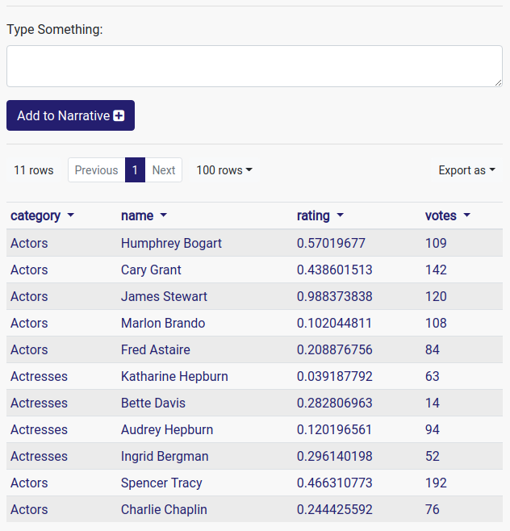

---
title: Natural Language Generation
prefix: Natural Language Generation
...

[TOC]

From v1.54, Gramex includes a Natural Language Generation component. The NLG app
is a smart template creator which:

1. Automatically creates tornado templates from English text in the context of a dataset.
2. Allows for modification and generalization of these templates.
3. Renders these templates as a unified narrative.

To use it, add the following to your `gramex.yaml`:

```yaml
import:
  nlg:
    path: $GRAMEXAPPS/nlg/gramex.yaml
    YAMLURL: $YAMLURL/nlg/
    auth:
      login_url: /$YAMLURL/login
```

This configuration mounts the app at [nlg/](nlg/):

<div class="example">
  <a class="example-demo" href="nlg/">NLG</a>
  <a class="example-src" href="http://github.com/gramexrecipes/gramex-guide/blob/master/nlg/gramex.yaml">Source</a>
</div>

## The NLG Component

The NLG component depends on two sources of information:

1. A source dataset, which can be uploaded on the [NLG webapp](nlg/).
   A dataset is uniquely identified with its filename. Once
   uploaded, the file persists and is available for selection from the app.
   Any *file* that makes a valid URL for
   [FormHandler](http://learn.gramener.com/guide/formhandler) can be used with
   the NLG app.
2. A _narrative_, which is a collection of templates and rules around them.
   The narrative consists of the configuration which governs the rendered text.
   An existing narrative can be uploaded through the "Add Data" button, or can be
   created through the [NLG IDE](nlg/). Once created, the narrative can be
   named and becomes available for selection from the "Add Data" modal.

## The NLG IDE

The primary purpose of the IDE is to create or edit narratives based on a
dataset. Once a dataset has been selected, it is exposed in the IDE as a
[FormHandler table](https://learn.gramener.com/guide/formhandler/#formhandler-tables).



Users can now type English text into the IDE and add it to the narrative. This
automatically templatizes the text, and adds the template to the narrative. For
example, typing "Humphrey Bogart is at the top of the list." does this:


This means that the input statement has been templatized and added
to the narrative. The part of the input text that was successfully templatized
is highlighted in green. Clicking on the spanner button next to a template opens
the [Template Settings] modal.


## Template Settings


This dialog provides configuration options for all template attributes:

### Template Name

Each template can optionally be named.

<iframe width="560" height="315" src="https://www.youtube.com/embed/fexUWzXpyPU" frameborder="0" allow="accelerometer; autoplay; encrypted-media; gyroscope; picture-in-picture" allowfullscreen></iframe>

### Condition

Any Python expression which evaluates to a boolean may be set as a condition,
which controls whether the template is rendered.

<iframe width="560" height="315" src="https://www.youtube.com/embed/V1q7M0PuXUM" frameborder="0" allow="accelerometer; autoplay; encrypted-media; gyroscope; picture-in-picture" allowfullscreen></iframe>


### Editing the Tornado template

The actual Tornado template itself can be edited. Any valid Tornado template is
acceptable. After editing the template, you can preview it's result by clicking
on the 'Run Template' button at the bottom.

<iframe width="560" height="315" src="https://www.youtube.com/embed/5IJjCcFO7JU" frameborder="0" allow="accelerometer; autoplay; encrypted-media; gyroscope; picture-in-picture" allowfullscreen></iframe>


### Token Settings

Every token from the input text that finds a match in the dataset or in
FormHandler arguments (i.e. every token that is highlighted in the preview)
is converted into a
[template
expression](https://www.tornadoweb.org/en/stable/template.html#syntax-reference).

Such tokens have their own attributes, as follows:

* **Token search results** - if a token is found in more than one place (say, a
  dataframe cell as well as a FormHandler argument), this setting allows the
  user to select the right result.
* **Grammar options** - the NLG engine may automatically apply certain
  string formatting or lexical operations to the template expression to make
  it match the input text. Any number of these operations can be enabled /
  disabled through this setting.


## Naming and Saving a Narrative

Once a narrative has been fully configured, it can be named and saved. Doing so
causes it to appear in the narrative dropdown menu on the app.


## Embedding a narrative in an web page

After a narrative has been named and saved, it be embedded in any HTML page.
Click on the "Embed" button and to copy the embed code and paste it in any HTML
file. It will work as long as there is a formhandler element present on the
page, and is connected to the embed code via an event listener.


## Authenticating the NLG App

Saving, sharing and rendering narratives from the NLG app requires authentication.
Authentication can be set via the `$NLG_AUTH` YAML variable which can be any valid
[auth](../auth/#authorization) configuration.

When using the NLG app through the [admin](../admin) page, `$NLG_AUTH` defaults to `$ADMIN_AUTH`.
