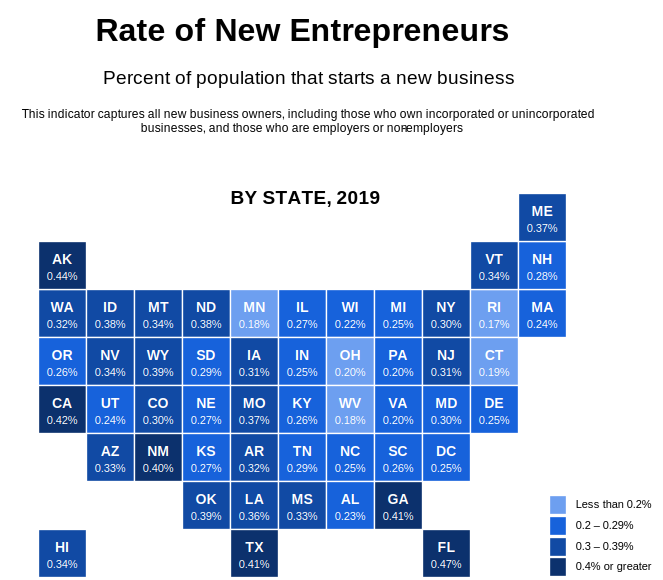
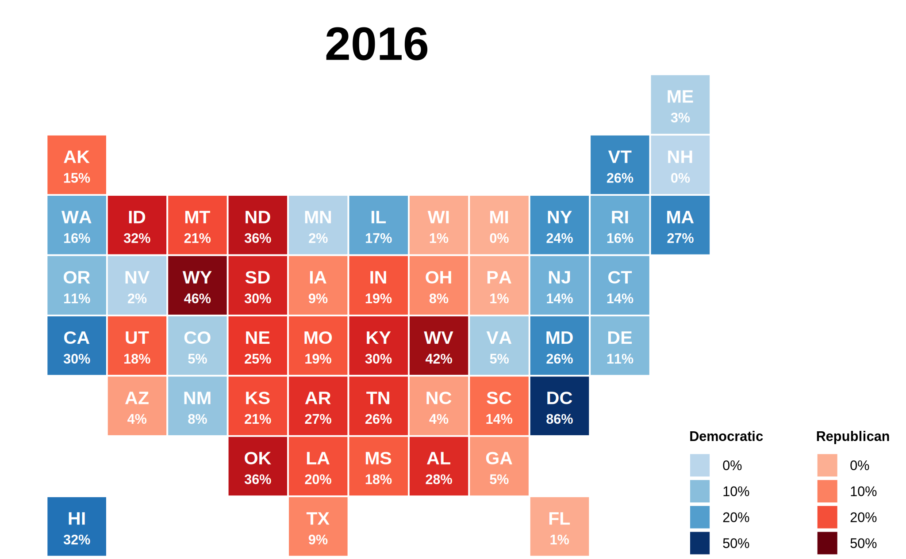
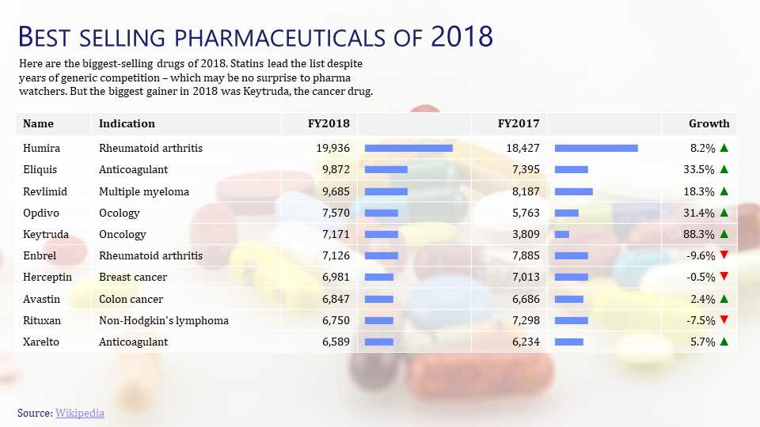
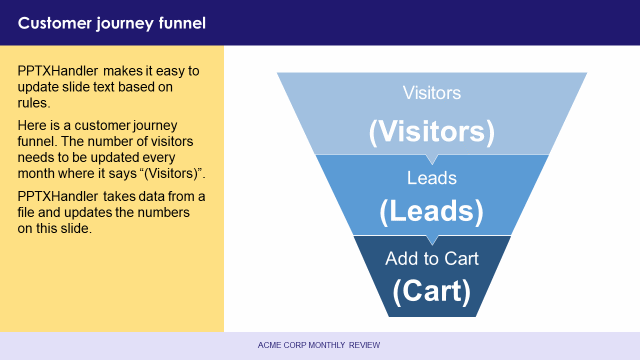
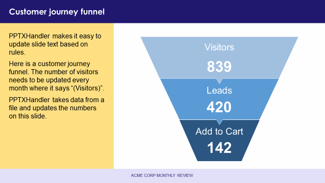
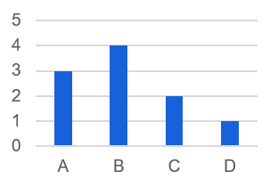
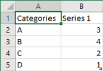

[TOC]

---

## Tutorials

Another way to learn is to pick an example you want to create, and follow the step-by-step tutorials.

### Bar chart race

Create a [bar chart race in PowerPoint](bar-chart-race/) from data.

[{: height=180}](bar-chart-race/)

### Rate of Entrepreneurship

Re-create a portion of the [Kauffman Indicators of Rate of New Entrepreneurship](entrepreneurship) in PowerPoint.

[{: width=320}](entrepreneurship/)

### Causes of death

Re-create the [Shifting Causes of Death](https://flowingdata.com/2018/10/02/shifting-death/) visualization in PowerPoint.

[{: width=320}](death/)

### Albus Dumbledore's screen time

Discover [Albus Dumbledore's screen time](albus-dumbledore-screen-time/) in the Harry Potter movies with PowerPoint.

[{: width=320}](albus-dumbledore-screen-time/)

### Color scales on maps

Create [Choropleths (colored maps)](choropleth/) by exploring the results of the US Presidential elections over time.

[{: width=320}](choropleth/)

### Bestselling Pharmaceutical Drugs

Visualize the [Bestselling Pharmaceutical Drugs of 2017-18][pharma-drugs] data in PowerPoint.

[{: width=320}](table/)

[pharma-drugs]: https://en.wikipedia.org/wiki/List_of_largest_selling_pharmaceutical_products#Best_selling_pharmaceuticals_of_2017/18

## About

[Video](https://youtu.be/c230GZeh9Sc){.youtube}

There are two versions of PPTXHandler.

- [Version 1](v1/) was introduced in **v1.23**. This is deprecated and no longer maintained.
- Version 2 was introduced in **v1.61** is documented on this page.

Here is an example that shows how to change the text of a slide from data:

```yaml
url:
  pptxhandler/sales-funnel:
    pattern: /$YAMLURL/output.pptx
    handler: PPTXHandler
    kwargs:
      version: 2 # Use PPTXHandler v2 instead of v1
      source: $YAMLPATH/template.pptx # Template to use
      data:
        products: { url: $YAMLPATH/products.yaml } # Load products data from products.yaml
      rules:
        - Visitors: # Find all shapes named 'Visitors'
            text: products['visitors'] # Replace text with value from data
          Leads:
            text: products['leads'] # Same for leads
          Cart:
            text: products['cart'] # ... and cart
      headers:
        Content-Disposition: attachment; filename=output.pptx
```

This takes the following PPTX as the source or template:

[](sales-funnel/template.pptx)

... and this [dataset: products.yaml](sales-funnel/products.yaml):

```yaml
visitors: 839
leads: 420
cart: 142
```

... and creates this presentation:

[](sales-funnel/output.pptx)

::: example href=sales-funnel/ source=https://github.com/gramener/gramex-guide/tree/master/pptxhandler/sales-funnel/
Run the Sales Funnel example

## Usage

PPTXHandler accepts a set of keys as `kwargs`. The most used keys are:

- `version`: always set this to 2. Otherwise, [PPTXHandler v1](v1/) is used
- `source`: path to the source or template PPTX, e.g. `$YAMLPATH/source.pptx`
- `data`: dataset dictionary. Rules can use data to change slides. See [how to specify the dataset](#data), e.g. `data: {products: {url: data.csv}}`
- `rules`: list of rules to modify the source using data. See [how to specify rules](#rules)

Less used keys are:

- `target`: path to save target PPTX
- `unit`: (optional) set the [unit of length][length] used by width, height, etc. See [length unit](#length-unit)
- `mode`: (optional) toggle whether value are [expressions](#expressions) (default for PPTXHandler)
  or [literals](#literals) (default for [`pptgen()`](#pptgen-library))
- `register`: (optional) register custom commands. See [how to register a new command](#register)
- `only`: (optional) slide number or list of slide numbers, starting from 1. All slides except these will be deleted
  - If `only=3`, only the 3rd slide will be used
  - If `only=[3, 5, 6]`, only the 3rd, 5th and 6th slide will be used

## Command line

[Video](https://youtu.be/iJ-vzV10SMA){.youtube}

Run `slidesense` to run `PPTXHandler` from the command line. It renders any `gramex.yaml` in the
current folder, creating an `output.pptx` (or the file specified by `target:` in `gramex.yaml`).
It also opens the target PPTX in PowerPoint, if possible.

{.img-fluid}

You can specify the path to your `gramex.yaml`, and also which PPTXHandler to run as the
command-line arguments. For example:

```bash
slidesense                      # Render first PPTXHandler in gramex.yaml
slidesense gramex.yaml my-url   # Render first PPTXHandler in gramex.yaml matching *my-url*
```

The second command above will render the 2nd PPTXHandler in this configuration:

```yaml
url:
  first-pattern: ...
  my-url-pattern:
    pattern: ...
    handler: PPTXHandler
    kwargs: ...
```

[Video](https://youtu.be/z1yFFosaHu8){.youtube}

Run `slidesense config.yaml` to render `config.yaml` with a simplified configuration that just
contains the `kwargs` of a PPTXHandler. Here is a sample `config.yaml`:

```yaml
source: $YAMLPATH/template.pptx
rules:
  - Title 1: { text: New title }
```

You can override configurations by adding these options at the end:

- `--source=...` overrides source PPTX path in config file
- `--target=...` overrides target PPTX path in config file (defaults to output.pptx)
- `--data=...` overrides data file in config path
- `--no-open` don't open target PPTX after generating it

Examples:

```bash
slidesense --source=my-template.pptx
slidesense config.yaml --target=my-output.pptx --no-open
slidesense gramex.yaml my-url --data=my-data.xlsx
```

---

# Rules

[Video](https://youtu.be/j3G7iFScr38){.youtube}

A rule defines how to modify the source presentation. For example:

```yaml
rules: # Apply these rules
  - Title 1: # Take the shape named "Title 1"
      text: f'Total sales is {sales["sales"].sum()}' # Replace text with data template
      fill-opacity: 0.5 # Make shape 50% transparent
  - Rectangle 1: # Take the shape named "Rectangle 1"
      fill: f'#ffff00' # Make its background yellow
```

A rule can pick one or more shape names, and apply one or more [commands](#commands) to each shape.

## Shapes

[Video](https://youtu.be/tRHktfccYpY){.youtube}

Each rule in `rules:` is a dictionary of shape names.

All shapes in PowerPoint have names. To see them in PowerPoint, select
Home tab > Drawing group > Arrange drop-down > Selection pane. Or press <kbd>Alt + F10</kbd>.


To change shape names, double-click on the name in the selection pane.

Shapes shouldn't have the same name as [commands](#commands), e.g. don't name a shape "text".
**Start shape names with a capital letter**, e.g. "Text" instead of "text".

You can use wildcards in a shape name. Use `?` to match a single character, and `*` to match
anything. For example:

```yaml
rules:
  - "TextBox ?": # Select TextBox 1, TextBox 2, ... but not TextBox 10, ...
      color: f'red' #     ... and set font color to red
  - "Text *": # Select ALL shapes starting with Text (case-sensitive)
      color: f'red'
  - "*box*": # Select ALL shapes with "box" anywhere in the text (case-sensitive)
      color: f'red'
```

You can also change the shape name with the `name` command, e.g. `name: New TextBox`. This is
particularly useful with the "morph" [transitions](#transition), which matches shape names
beginning with `!!`. For example:

```yaml
rules:
  - Bar:
      name: f'!!Bar' # Renames the shape "Bar" to "!!Bar"
      text: f'New text'
```

This ensures that the morph will match the shape even if it's text changes.
[Source](https://support.microsoft.com/en-us/office/morph-transition-tips-and-tricks-bc7f48ff-f152-4ee8-9081-d3121788024f)

## Groups

[Video](https://youtu.be/hawg4xhYXA8){.youtube}

Groups are shapes that contain other shapes. You can apply commands to the group itself (e.g. change its [size or position](#position)), or to the shapes inside a group, like this:

```yaml
rules:
  - Group 1: # Take the shape named "Group 1"
      left: 5 # Set the group's left position to 5 (inches)
      Caption: # Find the shape named "Caption" inside it
        text: f'New caption' #   Change its text to "New caption"
      Picture: # Find the shape named "Picture" inside it
        image: f'$YAMLPATH/sample.png' #   Replace the image with sample.png
```

::: example href=groups/ source=https://github.com/gramener/gramex-guide/tree/master/pptxhandler/groups/
Run the Groups example

## Slide filters

[Video](https://youtu.be/o_7l42TBoNU){.youtube}

By default, rules are applied to all slides. You can restrict changes to specific slides with:

- `slide-number`: apply rule to specific slide numbers
  - e.g. `slide-number: 1` picks only the 1st slide
  - e.g. `slide-number: [2, 4]` picks the 2nd and 4th slide (not the 3rd)
- `slide-title`: apply rule to specific slide titles
  - e.g. `slide-title: f'Business Update'` picks all slides with the _exact_ title "Business Update" (case-insensitive)
  - e.g. `slide-title: f'*Update*'` picks all slides with "Update" anywhere in the title (case-insensitive)
  - e.g. `slide-title: f'Day ?'` picks Day 1, Day 2, ... but not Day 10, ...
  - Use `?` to match a single char, and `*` to match anything

For example:

```yaml
source: input.pptx # optional path to source. Default to blank PPT with 1 slide
target: output.pptx # required path to save output as
rules:
  - slide-number: [2, 4] # Pick the 2nd and 4th slide (not the 3rd)
    Title: { text: f'X' }
  - slide-title: f'Business Update' # Pick the slide titled "Business Update" (case-insensitive)
    Title: { text: f'X' }
  - slide-title: f'Day ?' # Picks the slide titled "Day 1" or "Day 2", etc, not "Day 10"
    Title: { text: f'X' }
```

## Transition

[Video](https://youtu.be/yJStzyjRUuM){.youtube}

Add `transition:` to a rule to set the transition for all [applicable slides](#slide-filters).

For example:

```yaml
rules:
  - transition: f'fade' # All slides have fade transition (0.3 seconds duration)
  - slide-number: 1 # Slide 1: Morph transition for 1.5s
    transition:
      type: f'morph'
      duration: 1.5
  - slide-number: 3 # Slide 3: Glitter - Diamonds from Left transition for 3s
    transition:
      type: f'glitter diamond left'
      duration: 3
  - slide-number: 4 # Remove all transitions from slide 4. Auto-advance in 2s
    transition:
      type: f'none'
      advance: 2
```

You can specify transitions by name (with space-separated options). The transition names and their
options are below, e.g. `transition: f'airplane left'`, `transition: f'fly-through in bounce'`.
These are similar to PowerPoint's UI.

- `none`: (removes all transitions)
- `airplane`: left|right
- `blinds`: horizontal|vertical
- `box`: left|right|top|bottom
- `checker`: horizontal|vertical
- `checkerboard`: horizontal|vertical
- `circle`
- `clock`
- `clock-counterclockwise`
- `comb`: horizontal|vertical
- `conveyor`: left|right
- `cover`: left|right|top|bottom|top-left|top-right|bottom-left|bottom-right
- `crush`
- `cube`: left|right|top|bottom
- `curtains`
- `cut`: through-black
- `diamond`
- `dissolve`
- `doors`: horizontal|vertical
- `drape`: left|right
- `fade`: through-black
- `fall-over`: left|right
- `ferris`: left|right
- `flash`
- `flip`: left|right
- `fly-through`: in|out, bounce
- `flythrough`: in|out, bounce
- `fracture`
- `gallery`: left|right
- `glitter`: diamond|hexagon, left|right|top|bottom
- `honeycomb`
- `morph`: by-object|by-word|by-char (see note about using `!!` in [shape names](#shapes))
- `newsflash`
- `orbit`: left|right|top|bottom
- `origami`: left|right
- `page-curl-double`: left|right
- `page-curl-single`: left|right
- `pan`: left|right|top|bottom
- `peel-off`: left|right
- `plus`
- `preset`: left|right|top|bottom
- `prestige`
- `prism`: left|right|top|bottom
- `pull`: left|right|top|bottom|top-left|top-right|bottom-left|bottom-right
- `push`: left|right|top|bottom
- `random-bars`: horizontal|vertical
- `random`
- `randomBar`: horizontal|vertical
- `reveal`: left|right, through-black
- `ripple`: top-left|top-right|bottom-left|bottom-right|center
- `rotate`: left|right|top|bottom
- `shape-circle`
- `shape-diamond`
- `shape-in`
- `shape-out`
- `shape-plus`
- `shred`: strips|particles, in|out
- `split`: in|out horizontal|vertical
- `strips`: top-left|top-right|bottom-left|bottom-right
- `switch`: left|right
- `uncover`: left|right|top|bottom|top-left|top-right|bottom-left|bottom-right
- `vortex`: left|right|top|bottom
- `warp`: in|out
- `wedge`
- `wheel`
- `wheelReverse`
- `wind`: left|right
- `window`: horizontal|vertical
- `windows`: horizontal|vertical
- `wipe`: left|right|top|bottom
- `zoom-and-rotate`
- `zoom`: in|out

You can also specify transitions as a dict with 3 keys:

- `type`: transition name, followed by options, e.g. `type: f'morph'`
- `duration`: length of the transition in seconds (default: `0.3` seconds), e.g. `duration: 3`
- `advance`: auto-advance timeto the next slide, in seconds (default: `f'none'`), e.g. `advance: 3`

::: example href=transition/ source=https://github.com/gramener/gramex-guide/tree/master/pptxhandler/transition/
Run the Transition example

## Copy slides

[Video](https://youtu.be/cFQCdNhNYuY){.youtube}

You can repeat a slide, changing the layouts or content based on data. This is used to:

- Show a report across **time**, e.g. copy the slide and change data across months
- Show a report across **teams**, e.g. copy the slide and change data across teams
- ... across **customers**
- ... across **regions**
- ... across **products**, **channels**, and so on.

`copy-slide:` repeats the selected slides based on data. For example:

```yaml
rules:
  - slide-number: 1
    copy-slide: [A, B, C]
    Title 1:
      text: f'Copy {copy.key} {copy.val}'
```

This repeats slide 1 three times, with titles "Copy 0: A", "Copy 1: B" and "Copy 2: C".

`copy-slide:` must be an [expression](#expressions) that returns one of the following types. When
copying, the values of (`copy.key`, `copy.val`) are set as follows (just like
[`clone-shape:`](#clone-shapes)):

- tuple, list or pd.Index, e.g. `[x, y]` 🡆 `(0, 'x'), (1, 'y')`
- dict, e.g. `{x: 1, y: 2}` 🡆 `(1, 'x'), (2, 'y')`
- `pd.Series(['x', 'y'], index=[3, 4])` 🡆 `(3, 'x'), (4, 'y')`
- `pd.DataFrame({'x': row1, 'y': row2})` 🡆 `('x', row1)), ('y', row2)`
- `data.groupby('key')` 🡆 [GroupBy iterator](https://pandas.pydata.org/pandas-docs/stable/reference/groupby.html) with group name and subsetted data

For each copied slide, the [data variable `copy`](#data) is set. It has these attributes:

- `copy.pos`: 0, 1, 2, ... for each copied slide
- `copy.key`: For lists or tuples, this is the same as `copy.pos`. For dicts, Series, DataFrames, etc, it's the key or index
- `copy.val`: Value corresponding to `copy.key`
- `copy.slides`: Currently copied [PPTX slides list](https://python-pptx.readthedocs.io/en/latest/api/slides.html#slides-objects), e.g. `copy.slides[0].shapes`

::: example href=bar-chart-race/ source=https://github.com/gramener/gramex-guide/tree/master/pptxhandler/bar-chart-race/
Run the Bar Chart Race (copy-slide) example

# Commands

Shapes can be changed using 1 or more commands. These commands can change the shape's style and
content, or add new content (like charts). Here are some common commands:

## Position

[Video](https://youtu.be/yRDahEDcTRA){.youtube}

- `top`: sets top (Y) position in [length units](#length-units), e.g. `top: f'3 inches'`
- `left`: sets left (X) position in [length units](#length-units), e.g. `left: f'3 inches'`
- `width`: sets width in [length units](#length-units), e.g. `width: f'3 inches'`
- `height`: sets height in [length units](#length-units), e.g. `height: f'3 inches'`

::: example href=position/ source=https://github.com/gramener/gramex-guide/tree/master/pptxhandler/position/
Run the Position example

- `add-top`: moves top (Y) position +/- in `[length units](#length-units)`, e.g. `add-top: f'-3 inches'`
- `add-left`: moves left (X) position +/- in `[length units](#length-units)`, e.g. `add-left: f'+3 inches'`
- `add-width`: adds width +/- in `[length units](#length-units)`, e.g. `f'add-width: -3 inch'`
- `add-height`: adds width +/- in `[length units](#length-units)`, e.g. `f'add-height: +3 inches'`

::: example href=add-position/ source=https://github.com/gramener/gramex-guide/tree/master/pptxhandler/add-position/
Run the Add Position example

- `rotation`: sets the rotation in angles, e.g. `rotation: 30`
- `add-rotation`: adds the rotation in angles, e.g. `rotation: -30`
- `zoom`: increases/decreases width & height around the center,
  e.g. `zoom: 1.2` increases the size to 120%, `zoom: 0.6` shrinks it to 60% around the center
- `adjustment1`: sets 1st shape adjustment
- `adjustment2`: sets 2nd shape adjustment
- `adjustment3`: sets 3rd shape adjustment
- `adjustment4`: sets 4th shape adjustment

## Style

[Video](https://youtu.be/-MUymyCO7AQ){.youtube}

- `fill`: sets fill (background) [color](#color-units), e.g. `fill: f'red'`
- `stroke`: sets line [color](#color-units), e.g. `stroke: f'red'`
- `fill-opacity`: sets fill transparency on solid color fills. 0 is transparent, 1 is opaque, e.g. `fill-opacity: 0.5` is half transparent
- `stroke-opacity`: sets line transparency on solid color strokes. 0 is transparent, 1 is opaque, e.g. `stroke-opacity: 0.5` is half transparent
- `stroke-width`: sets width of the line in [length units](#length-units), e.g. `stroke-width: f'0.5 pt'`

::: example href=groups/ source=https://github.com/gramener/gramex-guide/tree/master/pptxhandler/groups/
Run the Groups example to understand styles

## Image

[Video](https://youtu.be/GGTrFc-xou0){.youtube}

- `image`: set image of a picture to a file or URL, e.g. `image: new-pic.png` or `image: https://picsum.photos/200`. Retains aspect ratio, width and position. May change the height
- `image-width`: sets width in [length units](#length-units), e.g. `image-width: 3 inches`. Retains aspect ratio and position (top and left). May change the height
- `image-height`: sets height in [length units](#length-units), e.g. `image-height: 3 inches`. Retains aspect ratio and position (top and left). May change the width

::: example href=clone-shape/ source=https://github.com/gramener/gramex-guide/tree/master/pptxhandler/clone-shape/
Run the Clone Shape example to understand images

## Link

[Video](https://youtu.be/8soEesXZ6t4){.youtube}

- `link`: on click, shape opens another slide, file or URL, e.g. `link: 4`, `link: f'https://gramener.com/'`
- `hover`: on hover, shape opens another slide, file or URL, e.g. `link: 4`, `link: f'https://gramener.com/'`
- `tooltip`: adds a text tooltip, e.g. `f'Title text'`. Does not work with `hover: f'back'` nor `link: f'back'`

`link` and `hover` can be specified as a:

- slide number, e.g. `link: 4`. Values can be any slide number starting from 1
- slide reference, e.g. `link: f'first'`. Values can be `first`, `last`, `next`, `prev` (alias:
  `previous`), `back` (for last viewed slide), or `end` (for end show).
- file, e.g. `link: f'new.pptx'`
- URL, e.g. `link: f'https://gramener.com/'`
- `noaction`. This removes any prior link or hover on the shape

::: example href=link/ source=https://github.com/gramener/gramex-guide/tree/master/pptxhandler/link/
Run the Link example

## Text

[Video](https://youtu.be/T8XBtkhVOTA){.youtube}

- `text`: sets the shape's [text and format](#text-format), e.g. `text: f'<p><a italic="y">New</a> <a bold="y">text</a></p>'`
- `replace`: updates the shape's [text and format](#text-format), e.g. `replace: {old: f'new', (rabbit|fox): f'<a color="red">animal</a>'}`.
  - Replace only works within a run, i.e. for words that have the same formatting. For example, in
    "some<u>where</u>", "where" is underlined. You cannot replace "somewhere". But you can replace
    "some" and "where" independently.
- `bold`: makes the text bold or normal. It can be true/yes/y/1 or false/no/n/0/"", e.g. `bold: true`
- `color`: sets the text color in [color units](#color-units), e.g. `color: f'red'`
- `font-name`: sets the font name. It can be Arial, Calibri, or any valid font name, e.g. `font-name: f'Arial'`
- `font-size`: sets the font size in [length units](#length-units), e.g. `font-size: f'18 pt'`
- `italic`: makes the text italicized or normal. It can be true/yes/y/1 or false/no/n/0/"", e.g. `italic: true`
- `underline`: underlines the text or makes it normal. It can be true/yes/y/1 or false/no/n/0/"", e.g. `underline: true`

::: example href=text/ source=https://github.com/gramener/gramex-guide/tree/master/pptxhandler/text/
Run the Text example
::: example href=certificate/ source=https://github.com/gramener/gramex-guide/tree/master/pptxhandler/certificate/
Run the Certificate example

## Text format

The text for [`text:`](#text) may include `<p>` tags for for paragraphs, which may contain `<a>`
tags for runs. Similarly, the new text for [`replace:`](#text) may include a single `<a>` tags for
the run. (These look like HTML, but they're not.)

Paragraphs (`<p>`) can have attributes like `<p align="right" level="2">`. Valid attributes are:

- `align=` sets the horizontal alignment. It can be left, center, right, justify, justify_low, (justify with low word spacing), distribute (for Japanese characters), thai_distribute, e.g. `align="right"`
- `level=` sets the indentation level number from 0 (default) to 8, e.g. `level="2"`
- `line-spacing=` sets the line spacing in [length units](#length-units), e.g. `line-spacing="3 pt"`
- `space-after=` sets the space after the paragraph in [length units](#length-units), e.g. `space-after="18 pt"`
- `space-before=` sets the space before the paragraph in [length units](#length-units), e.g. `space-before="18 pt"`

Runs (`<a>`) can have attributes like `<a href="https://gramener.com/" bold="y" italic="y">`. Valid attributes are:

- `baseline=` moves text up or down. It can be `superscript`, `subscript`, or any percentage, e.g. `baseline="-25%"`, `baseline="subscript"`
- `bold=` makes the text bold or normal. It can be true/yes/y/1 or false/no/n/0/"", e.g. `bold="y"`
- `color=` sets the text color in [color units](#color-units), e.g. `color="red"`
- `font-name=` sets the font name. It can be Arial, Calibri, or any valid font name, e.g. `font-name="Arial"`
- `font-size=` sets the font size in [length units](#length-units), e.g. `font-size="18 pt"`
- `hover=` sets the [hover link](#link), e.g. `hover="back"` or `hover="3"`
- `italic=` makes the text italicized or normal. It can be true/yes/y/1 or false/no/n/0/"", e.g. `italic="y"`
- `link=` sets the [hyperlink](#link), e.g. `link="back"` or `link="3"`
- `strike=` adds a strikethrough. It can be `single`, `double` or `none`, .e.g `strike="single"`
- `tooltip=` sets the [tooltip](#link), e.g. `tooltip="Tooltip text"`
- `underline=` underlines the text or makes it normal. It can be true/yes/y/1 or false/no/n/0/"", e.g. `underline="y"`

You can't use `<p>` inside another `<p>`, nor an `<a>` inside another `<a>`. If you do, the previous
tag is closed.

Note: Don't use run attributes (like `bold=`, `color=`) on paragraphs. They work on paragraphs, but
are over-ridden by run attributes. E.g. If your source PPTX had a bold run, setting `bold: n` on
the para has no visible effect, since the bold run overrides it.

::: example href=text-format/ source=https://github.com/gramener/gramex-guide/tree/master/pptxhandler/text-format/
Run the Text Format example

## Table

To update table text or style using data, use the `table:` command. Example:

```yaml
data:
  products: {url: $YAMLPATH/products.csv}
rules:
  - Table 1:
      table:                                          # Apply table command
        data: products.head(10)                       # Show top 10 rows from products dataset
        text:
          Sales: f'<p>{cell.val:.0} $mn</p>'          # Format sales column as $mn
          Margin: f'<p>{cell.val:0.1%}</p>'           # Format margin column as %
        fill: 'red' if cell.row.Margin < 0 else 'green'   # Negative margin rows are colored red
```

The `table:` command supports these sub-commands:

- `data`: sets the table's shape using a **DataFrame**, `e.g. data: pd.read_excel('data.xlsx')`. (Lists, dicts, etc won't work)
  - The PPTX table will have the same number of rows and columns as the `data`. You still need to set cell text using `text:` below
  - If `data` has more rows, the last PPTX table row is cloned to add rows. Same for columns
  - If `data` has less rows, the last PPTX table rows are deleted. Same for columns
  - If `data` is not specified, it's auto-populated from the PPTX table text
- `header-row`: turns header row on or off, e.g. `header-row: false`
  - If `header-row` is a list, it sets the header row text, e.g. `header-row: ['Sales', None, 'Growth <a sub="y">%</a>']`. `None` retains the existing header
- `total-row`: turns special formatting for last row on or off, e.g. `total-row: true`
- `first-column`: turns special formatting for first column on or off, e.g. `first-column: true`
- `last-column`: turns special formatting for last column on or off, e.g. `last-column: true`

You can set each cell's properties with these sub-commands:

- `text`: sets each cell's [text and format](#text-format), e.g. `text: f'<p><a italic="y">{cell.val}</a> <a bold="y">$ mn</a></p>'`.
  By default, this just displays the data value. This is the same as `text: cell.val`
- `align`: sets the horizontal alignment. It can be left, center, right, justify, justify_low, (justify with low word spacing), distribute (for Japanese characters), thai_distribute, e.g. `align: right`
- `bold`: makes the text bold or normal. It can be true/yes/y/1 or false/no/n/0/"", e.g. `bold: true`
- `color`: sets the text color in [color units](#color-units), e.g. `color: f'red'`
- `fill`: sets fill (background) [color](#color-units), e.g. `fill: f'red'`
- `fill-opacity`: sets fill transparency on solid color fills. 0 is transparent, 1 is opaque, e.g. `0.5` is half transparent
- `font-name`: sets the font name. It can be Arial, Calibri, or any valid font name, e.g. `font-name: f'Arial'`
- `font-size`: sets the font size in [length units](#length-units), e.g. `font-size: f'18 pt'`
- `italic`: makes the text italicized or normal. It can be true/yes/y/1 or false/no/n/0/"", e.g. `italic: true`
- `underline`: underlines the text or makes it normal. It can be true/yes/y/1 or false/no/n/0/"", e.g. `underline: true`
- `vertical-align`: sets the vertical alignment. It can be top, middle, or bottom, e.g. `vertical-align: middle`

You can set the above cell properties either with a single expression, or an expression per column:

```yaml
rules:
  - Table 1:
      table:
        # You can set every cell's property with an expression.
        # E.g. this makes every row red if the "Margin" column is negative, else it's green
        fill: 'red' if cell.row.Margin < 0 else 'green'
        # You can set a column's property with an expression, too.
        # E.g. this formats the Sales column and Margin column differently
        text:
          Sales: f'<p>{cell.val:.0} $mn</p>'          # Format sales column as $mn
          Margin: f'<p>{cell.val:0.1%}</p>'           # Format margin column as %
```

For each cell, the [data variable `cell`](#data) is set. It has these attributes:

- `cell.val`: value of each cell
- `cell.index`: DataFrame index of the cell
- `cell.column`: DataFrame column name of the cell
- `cell.row`: row that contains the current cell (as a Series)
- `cell.data`: DataFrame that contains the current cell
- `cell.pos.row`: row number
- `cell.pos.column`: column number
- `cell.cell`: currently rendered [PPTX cell object](https://python-pptx.readthedocs.io/en/latest/api/table.html#cell-objects), e.g. `cell.cell.text`

::: example href=table/ source=https://github.com/gramener/gramex-guide/tree/master/pptxhandler/table/
Run the Table example

## Chart

To update a chart's data, use the `chart-data:` command. Example:

```yaml
data:
  products: { url: $YAMLPATH/products.csv }
rules:
  - Chart 1:
      chart:
        data: products.set_index('Name')
```

The `chart:` command supports these sub-commands:

- `data`: sets the chart's data using a **DataFrame**, `e.g. data: pd.read_excel('data.xlsx')`. (Lists, dicts, etc won't work)
  - Charts' `data:` must be a DataFrame exactly the chart data in PowerPoint.
  - The 1st column in PowerPoint must be the index of the DataFrame. The 2nd in PowerPoint must be a column. See example below.
- `header-row`: turns header row on or off, e.g. `header-row: false`
  - If `header-row` is a list, it sets the header row text, e.g. `header-row: ['Sales', None, 'Growth <a sub="y">%</a>']`. `None` retains the existing header
- `total-row`: turns special formatting for last row on or off, e.g. `total-row: true`
- `first-column`: turns special formatting for first column on or off, e.g. `first-column: true`
- `last-column`: turns special formatting for last column on or off, e.g. `last-column: true`

Charts' `data:` must be a DataFrame exactly the chart data in PowerPoint. For example, a 1-series column chart like this:



... uses data like this:



The 1st column must be the index of the DataFrame, and the 2nd must be a column, like this:

```python
data = pd.DataFrame({
  'Categories': ['A', 'B', 'C', 'D'],
  'Series 1': [3, 4, 2, 1]
}).set_index('Categories')
```

Note: The first column name "Categories" is not used. It's just a placeholder for the index name.

::: example href=chart/ source=https://github.com/gramener/gramex-guide/tree/master/pptxhandler/chart/
Run the Chart example

## Clone shapes

[Video](https://youtu.be/MpWUsN41ifg){.youtube}

Use `clone-shape:` to clone a shape for as many times specified. For example:

```yaml
rules:
  - Rectangle 1:
      clone-shape: [A, B, C]
      text: f'Clone {clone.key} {clone.val}'
```

This repeats the shape three times, with text "Clone 0: A", "Clone 1: B" and "Clone 2: C".

`clone-shape:` must be an [expression](#expressions) that returns one of these types. When cloning,
the variables (`clone.key`, `clone.val`) are set as follows (just like [`copy-slide:`](#copy-slides)):

- tuple or list, e.g. `[x, y]` 🡆 `(0, 'x'), (1, 'y')`
- dict, e.g. `{x: 1, y: 2}` 🡆 `(1, 'x'), (2, 'y')`
- pandas Series, e.g. `pd.Series(['x', 'y'], index=[3, 4])` 🡆 `(3, 'x'), (4, 'y')`
- pandas DataFrame, e.g. `pd.DataFrame({'x': row1, 'y': row2})` 🡆 `('x', row1)), ('y', row2)`
- pandas GroupBy, e.g. `data.groupby('key')` 🡆 [GroupBy iterator](https://pandas.pydata.org/pandas-docs/stable/reference/groupby.html) with group name and subsetted data

For each cloned shape, the [data variable `clone`](#data) is set. It has these attributes:

- `clone.pos`: 0, 1, 2, ... for each cloned shape
- `clone.key`: For lists or tuples, this is the same as `clone.pos`. For dicts, Series, DataFrames, etc, it's the key or index
- `clone.val`: Value corresponding to `clone.key`
- `clone.parent`: If a group was cloned, and a shape inside the group was cloned too, `clone.parent` returns the `clone` object of the parent group
- `clone.shape`: Currently cloned [PPTX shape](https://python-pptx.readthedocs.io/en/latest/api/shapes.html#shape-objects-autoshapes), e.g. `clone.shape.width`

::: example href=clone-shape/ source=https://github.com/gramener/gramex-guide/tree/master/pptxhandler/clone-shape/
Run the Clone Shape example

## Debug

[Video](https://youtu.be/1bNmhD5qS_4){.youtube}

If PPTXHandler fails, a good way to debug is to

- `print:` prints the result of an expression using [data](#data), e.g. `print: shape.name` prints
  the current shape name. Print multiple values as a list, e.g. `print: [shape.name, clone.key]`

## Register

Register let you create your own custom commands. It can run any Python code using 3 variables:

1. `shape`: the [PPTX shape](https://python-pptx.readthedocs.io/en/latest/api/shapes.html))
2. `spec`: whatever configuration value you pass to the command
3. `data`: dictionary that has whatever data is available to the command

For example, here are some custom commands:

```yaml
register:
  rename: setattr(shape, "name", spec) # Add a "rename" command that changes the shape's name
  turn: setattr(shape, "rotation", spec) # Add a "turn:" command that changes the shape's angle
  custom: my_method(shape, spec, data) # my_method can do anything with the shape and val
rules:
  - Shape 1: # Take the shape named Shape 1
      rotate: 45 # Rotate clockwise 45
      rename: New Shape 1 # Change the shape name to New Shape 1
      my_method: ... # Any object can be passed to my_method
```

# Reference

## Expressions

[Video](https://youtu.be/_G0N1yiWwDY){.youtube}

PPTXHandler is mostly used to change presentations using [data](#data). So values are evaluated as
Python expressions. For example:

```yaml
data:
  widths: [1, 2, 3]
  colors: [red, blue, green]
rules:
  - Rectangle 1:
      # Type in YAML strings almost like you would type it in Python
      width: sum(widths) # Python expression using "widths" as a variable. Returns 1+2+3=6
      fill: colors[0] # Python expression using "colors" as a variable. Returns "red"
      left: 10 # Numbers in YAML are numbers in Python too. This sets left: 10 inches
      stroke: [255, 0, 0] # Lists in YAML are lists in Python too. This sets the stroke to red
```

What won't work are literal strings. Instead, use `f'...'` -- a Python format-string. For example:

```yaml
      # Incorrect
      color: red              # This is NOT 'red'. This is the VARIABLE red (which is not
      color: 'red'            # This is NOT 'red'. This is the VARIABLE red (which is not defined)
      # Correct
      color: f'red'           # Use formatted strings inside.
      text: f'Color {colors[0]}'  # These can be templates. This sets text to 'Color red'
```

To use literal values, you can also use `{value: ...}`. For example:

```yaml
      # Incorrect
      color: 'red'            # This is NOT 'red'. This is the VARIABLE red (which is not defined)
      # Correct
      color: {value: red}     # Strings inside value: are treated literally
      text: {value: 'Color {colors[0]}'}  # These can be templates. This sets text to 'Color red'
```

To fully switch to [literal values](#literals) instead of expressions, use `mode: literal`. For example:

```yaml
mode: literal
rules:
  - color: red # This sets the color to the string "red"
```

## Literals

By default, values passed to [`pptgen()`](#pptgen-library) are used as-is. For example:

```python
widths = [1, 2, 3]
colors = ['red', 'blue', 'green']
pptgen('source.pptx', rules=[
  'Rectangle 1': {
    'width': sum(widths),   # Values are passed as-is. Returns 1+2+3=6
    'fill': colors[0],      # Values are passed as-is. Returns "red"
    'left': 10,             # Numbers are passed as-is. This sets left: 10 inches
    'stroke': [255, 0, 0],  # Lists are passed as-is. This sets the stroke to red
    'color': 'red',         # Strings can be passed as-is
    'text': 'Shape {shape.name}'  # Strings are formatted with data. This sets text to 'Shape Rectangle 1'
  }
])
```

To use [expressions](#expressions) instead of literals, use `{expr: ...}`. For example:

```python
pptgen('source.pptx', rules=[
  'Rectangle 1': {
    'clone-shape': widths,                # Clone the shape for each entry in "widths"
    'width': {'expr': '1 + clone.val'},   # The value is an expression. Sets width to 1 + width
  }
])
```

To fully switch to [expressions](#expressions) instead of literals, use `mode='expr'`. For example:

```python
pptgen('source.pptx', mode='expr', rules=yaml_config['rules'])
```

## Data

[Video](https://youtu.be/kFkt3JlIGtU){.youtube}

PPTGen can change presentations with data from various sources. It uses the same syntax as
[FormHandler](../formhandler/). It supports these keys:

- `url:` A SQLAlchemy URL or file name
- `ext:` file extension (if url is a file). Defaults to url extension
- `table:` table name (if url is an SQLAlchemy URL)
- `query:` optional SQL query to execute (if url is a database)
- `transform:` optional in-memory transform. The loaded data (typically a DataFrame) is in the
  variable `data`. It should return a revised dataset (typically a DataFrame)
- `args:` optional filters to apply to dataset, passed as a dict of lists. For example,
  `{'city':['Oslo', 'Kiev']}` filters where city is Oslo or Kiev. `{'population>~', '100000'}`
  filters where population is 100,000+.
- Any additional keys are passed to `gramex.data.filter()`, and in turn to `gramex.cache.open()` or
  `sqlalchemy.create_engine()`.

You can also specify the data as a function using `function:`. This can be any Python [expression or pipeline](../function/).

Example:

```yaml
data:
  cities: { url: cities.csv } # Load cities.csv into "cities" key
  sales: { url: sales.xlsx, sheet: Sheet1 } # Load Sheet1 from sales.xlsx into "sales" key
  tweets: { url: tweets.json } # Load JSON data into "tweets" key
  sample: { url: mysql://server/db, table: sample } # Load sample data from MySQL
  filter:
    url: cities.csv # Load cities.csv
    args: # Filter results
      city: [Oslo, Kiev] # WHERE column "city" is Oslo or Kiev
      population>~: 100000 # AND column population is 100,000+
  custom1:
    function: gramex.cache.open('data.xlsx') # Run a custom function
  custom2:
    function: gramex.cache.open(handler.get_arg('file')) # Functions can accept handler as argument
  big_cities:
    function: cities[cities.population > 100000] # You can also access loaded datasets
```

These datasets are available in [expressions](#expressions) as variables. For example, you can use:

```yaml
rules:
  - Rectangle 1:
      text: cities.columns[0]
  - Rectangle 2:
      text: tweets[0]['text']
```

[Video](https://youtu.be/khq4zItxbJQ){.youtube}

Expressions can also use these pre-defined variables. (DON'T create a variable with these names.
They will be over-ridden.)

- `prs`: the source PPTX as a pptx.Presentation object, e.g. `len(prs.slides)`
- `slide`: the current slide being processed, e.g. `slide.shapes.title`
- `shape`: the current shape being processed, e.g. `shape.width` or `slide.name`
- `handler`: the PPTXHandler instance (if available), e.g. `handler.get_arg('title')`

They may also use these variables where available:

- `copy`: info on the currently [copied slide](#copy-slides), e.g. `copy.key`, `copy.val`
- `clone`: info on the currently [cloned shape](#clone-shapes), e.g. `clone.key`, `clone.val`
- `cell`: info on the currently processed cell in a [table](#table), e.g. `cell.val`

## Length units

Any command that sets a length, e.g. `width: 5`, uses "inches" by default. You can change the unit
to "cm" using `width: 5 cm`. Or, you can change the default unit from "inches" to "cm" by passing
`unit: inches` to the [PPTXHandler configuration](#usage).

[Valid length units][length-units] are:

- `inches`: inches. Use `in`, `inch`, or `"` as an alias -- e.g. `3.2"` is `3.2 inches`)
- `cm`: centimeters
- `mm`: millimeters
- `pt`: points are 1/72 inches
- `centipoints`: hundredths of a point, i.e. 1/7200 inch. Use `cp` or `centipoint` as an alias
- `emu`: English metric units (1/914400 inches)

[length-units]: https://python-pptx.readthedocs.io/en/latest/api/util.html#pptx.util.Length

## Color units

Any command that sets a color, e.g. `fill: f'red'`, accepts colors in one of these formats:

- a named color, like `red`
- a hex value, like `#f80` or `#ff8800`
- an RGB value, like `rgb(255, 255, 0)`
- a tuple or list of integer RGB values, like `(255, 255, 0)` or `[255, 255, 0]`
- a tuple or list of float RGB values, like `(1.0, 0.5, 0.0)` or `[1.0, 0.5, 0.0]`
- a [theme color][theme-colors], like `ACCENT_1`, `ACCENT_2`, `BACKGROUND_1`, `DARK_1`, `LIGHT_2`
- a [theme color][theme-colors] with a brightness modifier, like `ACCENT_1+40`, which is 40%
  brighter than Accent 1, or `ACCENT_2-20` which is 20% darker than Accent 2
- `none` clears the color, i.e. makes it transparent

[theme-colors]: https://python-pptx.readthedocs.io/en/latest/api/enum/MsoThemeColorIndex.html

## PPTGen Library

You can access the [pptgen][pptgen] library to change presentations programmatically.
[PPTXHandler](#usage) is just a wrapper around pptgen. The keyword arguments for `pptgen()` are the
same as for [PPTXHandler](#usage). Here's an example:

```python
from gramex.pptgen2 import pptgen
target = pptgen(
  source='input.pptx',                # Input file to load
  data={
    'sales': {'url': 'sales.csv'}     # Load sales data from sales.csv
  },
  rules=[                             # Apply these rules
    {
      'slide-number': 1,              # Take only the first slide
      'Title 1': {                    # Find all shapes named "Title 1"
        'text': 'Total sales is {sales["sales"].sum()}'   # Replace text with data template
      }
    }
  ]
)
target.save('slide1.pptx')  # Save the target
```

The Python library does not treat strings as [expressions](#expressions). So `'red'` means the
string "red", not the variable `red`. You can specify string values as-is. (If you want to use the
variable `red` in Python, use `data['red']`).

But if you need to use expressions (e.g. to specify `copy.val` in a [`copy-slide:`](#copy-slides)),
you can use `{'expr': '...'}`. For example:

```python
from gramex.pptgen2 import pptgen
target = pptgen(
  source='input.pptx',                # Input file to load
  rules=[                             # Apply these rules
    {
      'slide-number': 1,              # Take only the first slide
      'copy-slide': ['A', 'B'],       # Copy it twice
      'Title 1': {                    # Find all shapes named "Title 1"
        'add-top': {'expr': 'copy.key * 10'}, # Add 0 * 10 to slide A's top, 1 * 10 to slide B's top
      }
    }
  ]
)
target.save('slide1.pptx')  # Save the target
```

## PPTX to images

To convert presentations to images, install [LibreOffice](https://www.libreoffice.org/) and
[ImageMagick](https://imagemagick.org/). On Linux, the commands are:

```bash
apt-get install default-jre
apt-get install libreoffice-core --no-install-recommends
```

This command converts `source.pptx` into `source.pdf` using LibreOffice, and then into
`img-01.png`, `img-02.png`, etc (one image per slide) using ImageMagick.

```bash
soffice --headless --convert-to pdf source.pptx     # Convert to PDF first for multi-slide export
convert source.pdf -resize 800x600 'img-%03d.png'   # Convert into img-01.png, img-02.png, etc
```

## Support

PPTGen currently cannot handle:

- Equations
- Zoom

[pptxhandler]: https://gramener.com/gramex/guide/api/handlers/#gramex.handlers.PPTXHandler
[pptgen]: https://gramener.com/gramex/guide/api/pptgen/
