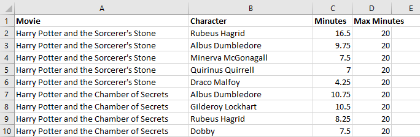
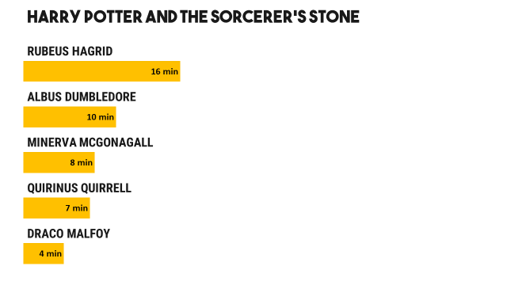
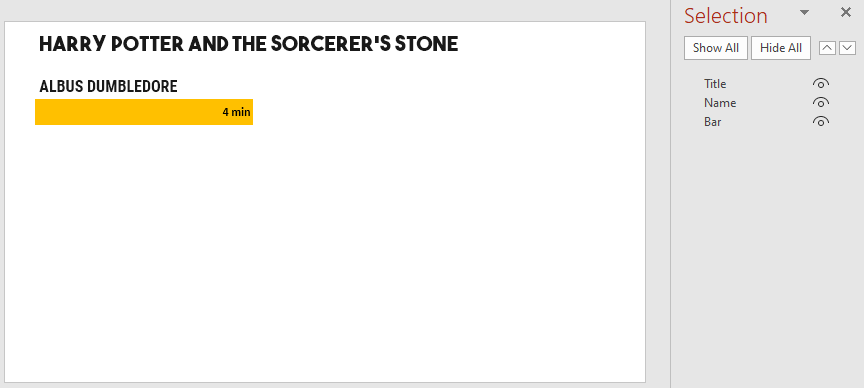
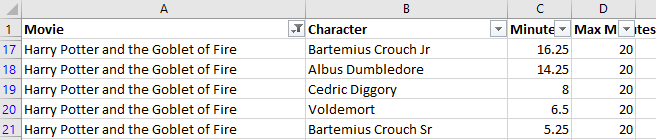

---
title: Albus Dumbledore's Screen Time
...

Who do you think has the most screen time among the Harry Potter movies?

Let's ignore Harry, Hermione and Ron. Who's next? Dumbledore? Voldemort? Someone else? Explore the video below for the answer.

<div class="ratio ratio-16x9">
  <iframe src="https://www.youtube.com/embed/dZqXbh8CkRo" allowfullscreen></iframe>
</div>

This is a bar chart race. This tutorial explains how to create it.

Here's a video explaining each step of this tutorial.

<div class="ratio ratio-16x9">
  <iframe src="https://www.youtube.com/embed/E1SeoUV8awI" allowfullscreen></iframe>
</div>

## Create the data

Let's start with the data. The original dataset has every [Harry Potter character's Screen Time](https://data.world/priyankad0993/harry-potter-screen-time/workspace/file?filename=Screen+Time.xlsx). We can take a [simpler dataset](screen-time.xlsx) that has the top 5 characters (by screen time) in each movie.



Each row has the screen time for a character in a movie -- ignoring Harry, Hermione and Ron.

- `Movie` is the name of the movie (e.g. Harry Potter and the Sorcerer's Stone)
- `Character` is the name of the character (e.g. Rubeus Hagrid)
- `Minutes` is the number of minutes they appear on screen in the movie
- `Max Minutes` -- well, let's get into that later

## Create the source template

We'll create a template where each slide has 1 movie, and we'll show the characters as a bar chart, like this:

{.img-fluid}

Start by creating a [template.pptx](template.pptx) like this:

[{.img-fluid}](template.pptx)

The relevant shapes are:

- `Title`: The slide title (movie name)
- `Name`: Name of the character
- `Bar`: Character's Screen time

## Create the rules

Let's set up a basic `gramex.yaml` file that loads the template and the data.

```yaml
url:
  pptxhandler/albus-dumbledore:
    pattern: /$YAMLURL/output.pptx
    handler: PPTXHandler
    kwargs:
      version: 2
      source: template.pptx
      data:
        url: screen-time.xlsx
```

At this point (and any other time), you can run `slidesense` on the command line to see the output PPTX. Right now the output is exactly the same as `template.pptx`.

Next, we create a rule to copy one slide for each movie using [`copy-slide`](../#copy-slides). It loops through each row in the dataset `data`

```yaml
rules:
  - copy-slide: data.groupby('Movie', sort=False)
    transition:
      type: f'morph'
      duration: 1
```

`data.groupby('Movie', sort=False)` [groups](https://pandas.pydata.org/pandas-docs/stable/reference/api/pandas.DataFrame.groupby.html)
by movie. This ensures that we have one slide per movie (without sorting alphabetically).

We also apply a 1-second `morph` transition for the bars to animate smoothly into each other.

Next, we set the title of the slide to be the movie name.

```yaml
Title:
  text: "copy.key"
```

`copy.key` has the index of `data`. Since we grouped by `movie`, `copy.key` is the same as the `movie`.

Now, the output will have one slide for each of the movies. The slide title is updated.


Next, copy each character name -- once for each character.

```yaml
Name:
  clone-shape: copy.val
  add-top: 1.2 * clone.pos
  name: f"!!{clone.val['Character']} name"
  text: clone.val['Character']
```

Here, `copy.val` has one row for each movie. This is what it looks like:



- `clone-shape: copy.val` clones the shape `Name` once for each row, i.e. for each character.
- `add-top: 1.2 * clone.pos` moves each shape down 1.2 inches times the row position (0, 1, 2, ...)
- `text: clone.val['Character']` sets the text of the shape to the "Character" column
- Shape names begin with `!!` so that PowerPoint's Morph transition will [match the shape][match-shape] across slides. `name: f"!!{clone.val['Character']} name"` ensures that names will move up/down correctly across slides

[match-shape]: https://support.microsoft.com/en-us/office/morph-transition-tips-and-tricks-bc7f48ff-f152-4ee8-9081-d3121788024f

Next, we set the widths of the bars.

```yaml
Bar:
  clone-shape: copy.val
  add-top: 1.2 * clone.pos
  name: f"!!{clone.val['Character']} bar"
  width: 5 * clone.val['Minutes'] / clone.val['Max Minutes']
  text: f"{clone.val['Minutes']:.0f} min"
  fill: "'ACCENT_2' if clone.val['Character'] == 'Albus Dumbledore' else 'ACCENT_4'"
```

- `clone-shape: copy.val` clones the shape `Bar` once for each row, i.e. for each character.
- `add-top: 1.2 * clone.pos` moves each shape down 1.2 inches times the row position (0, 1, 2, ...)
- `name: f"!!{clone.val['Character']} bar"` ensures that bars will move up/down correctly across slides along with the character

These three are practically identical to what we did with the name.

- `width: 5 * clone.val['Minutes'] / clone.val['Max Minutes']` sets the width of the bar. We limit
  this to 5 inches. The "Max Minutes" column is set to 20, indicating that 20 minutes = 5". But we
  also have a total minutes slide at the end. There, we use 80 minutes = 5".
- `text: f"{clone.val['Minutes']:.0f} min"` sets the bar's text to the character's screen time.
- `fill: "'ACCENT_2' if clone.val['Character'] == 'Albus Dumbledore' else 'ACCENT_4'"` fills the
  bar red (Accent 2) for Albus Dumbledore, but orange (Accent 4) for others. This highlights Albus
  Dumbledore across slides.

[This is the final configuration](gramex.yaml.source){.source}

## See the result

This creates these 9 slides, with transitions:

[{.img-fluid}](output.pptx)

These slides were exactly the ones used to create this video:

<div class="ratio ratio-16x9">
  <iframe src="https://www.youtube.com/embed/dZqXbh8CkRo" allowfullscreen></iframe>
</div>
