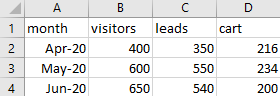
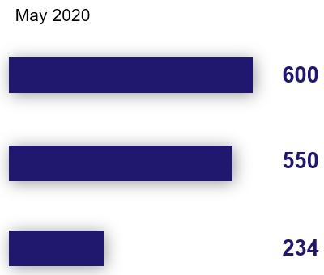

---
title: Bar Chart Race
...

Let's see how we can create a [bar chart race](https://blog.gramener.com/bar-chart-race-in-powerpoint/) in PowerPoint, using the `copy-slide:` command.

[{.img-fluid}](output.pptx)

This first row shows the number of visitors who arrive on a shopping website every month. The
second row shows how many of these are converted into leads. The third row shows the number that
added an item to the shopping cart.

We will create 3 slides -- one for each month, containing this data.

Here's a video explaining each step of this tutorial.

<div class="ratio ratio-16x9">
  <iframe src="https://www.youtube.com/embed/-Qh7o1aWb2c" allowfullscreen></iframe>
</div>

## Create the source template

Start by creating a [template.pptx](template.pptx) like this:

[{.img-fluid}](template.pptx)

The relevant shapes are:

- 3 rectangles, named "!!Visitors Bar", "!!Leads Bar" and "!!Cart Bar"
- 3 text boxes, named "!!Visitors Value", "!!Leads Value" and "!!Cart value"
- A text box named "Month"

Shape names begin with `!!` so that PowerPoint's Morph transition will [match the shape][match-shape] across slides.

[match-shape]: https://support.microsoft.com/en-us/office/morph-transition-tips-and-tricks-bc7f48ff-f152-4ee8-9081-d3121788024f

## Create the data

The data is in a CSV file: [sales.csv](sales.csv).

[{.img-fluid}](data.csv)

It has 4 columns:

- `month`: Each row represents data for a month. The `month` column specifies which month
- `visitors`: Number of visitors to the site each month
- `leads`: Number of visitors who converted into leads each month
- `cart`: Number of visitors who added a product to the shopping cart each month

## Create the rules


Let's set up a basic `gramex.yaml` file that loads the template and the data.

```yaml
url:
  pptxhandler/morph:
    pattern: /$YAMLURL/output.pptx
    handler: PPTXHandler
    kwargs:
      version: 2
      source: $YAMLPATH/template.pptx
```

Next, we load the data.

```yaml
      data:
        sales:
          url: '$YAMLPATH/sales.csv'
          transform: data.set_index('month')
        max_visitors: {function: sales.values.max()}
```

`sales` is loaded from [sales.csv](sales.csv). But we also set the `month` column as the index.
This makes it easy to calculate our next (derived) value, `max_visitors`.

`max_visitors` is the maximum of all the numeric columns. We need this to scale the bars.

Next, we create one slide for each month using [`copy-slide`](../#copy-slides). It loops through
each row in the dataset `sales`.

```yaml
      rules:
        - copy-slide: sales
          transition:
            type: f'morph'
            duration: 1
```

We also apply a 1-second `morph` transition for the bars to animate smoothly into each other.

Next, we set the widths of the bars.

```yaml
          '!!Visitors Bar':
              width: (copy.val['visitors'] / max_visitors) * 3
          '!!Leads Bar':
              width: (copy.val['leads'] / max_visitors) * 3
          '!!Cart Bar':
              width: (copy.val['cart'] / max_visitors) * 3
```

`copy.val` has the value of each row in `sales`. Dividing by `max_visitors`, we get a number
between 0 - 1. We multiply by 3 to scale it to 3 inches. The default [length
units](../#length-units) are inches.

{.img-fluid}

Then, we set the text of the labels on the right.

```yaml
          '!!Visitors Value':
              text: copy.val['visitors']
          '!!Leads Value':
              text: copy.val['leads']
          '!!Cart Value':
              text: copy.val['cart']
```

{.img-fluid}

Finally, we show the month on the title.

```yaml
          Month:
              text: 'copy.key'
```

{.img-fluid}

`copy.key` has the index of each row in `sales`. Since we set the `month` as the index, it has the current month.

[This is the final configuration](gramex.yaml.source){.source}

## See the result

[This is the output PPTX](output.pptx)

[{.img-fluid}](output.pptx)
