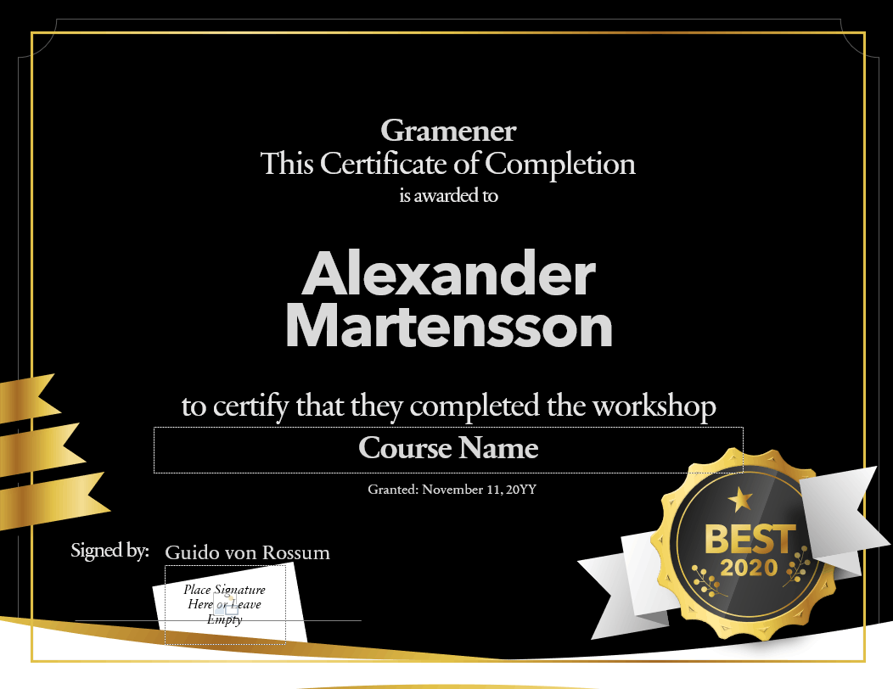
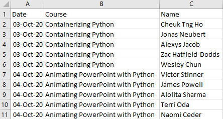

# Certificates

Let's say you run a course or workshop. You need to create e-certificates for participation.

It will be be tedious to generte these manually for each participants -- especially if the volume is large.

Let's automate this, and create certificates like this:

{.img-fluid}

## Create the source template

Start by creating a [template.pptx](template.pptx) that has the static content laid out. This is from PowerPoint's online templates [Ribbon certificate of completion](https://templates.office.com/en-us/ribbon-certificate-of-completion-tm89356863).

[{.img-fluid}](template.pptx)

It has 3 shapes that will be updated from data:

1. `Name`: name of the person who receives the certificate, e.g. James Smith
2. `Course`: name of the course they completed, e.g. Introduction to Python
3. `Date`: date on which , e.g. 4 Oct 2020


## Create the data

The [data](people.csv) has 3 columns that correspond to the shape names on the template:

1. `Name`: name of the person who receives the certificate, e.g. James Smith
2. `Course`: name of the course they completed, e.g. Introduction to Python
3. `Date`: date on which , e.g. 4 Oct 2020

[{.img-fluid}](people.csv)


## Create the rules

Let's set up a basic `gramex.yaml` file that loads the template and the data.

```yaml
version: 2
source: $YAMLPATH/template.pptx
data:
  url: $YAMLPATH/people.csv
```

Now, we'll set up a rule that copies the slide for each row of the data.

```yaml
rules:
  - copy-slide: data
```

This copies the slide for each year. The variable `copy.val` has the data for each row.

Next, let's set the name of the person on each slide:

```yaml
    Name:
      text: copy.val.Name
```

Let's do the same thing for Date and Course.
```yaml
    Course:
      text: copy.val.Course
    Date:
      text: copy.val.Date
```

That's all it takes to update every field.

## See the result

[This is the final configuration](gramex.yaml.source){.source}

[This is the output PPTX](output.pptx)

[{.img-fluid}](output.pptx)
