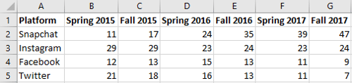

# Chart example

Let's create this visual "[Snapchat is tops with American Teens](https://www.businessinsider.com/for-us-teens-snapchat-is-more-popular-than-instagram-twitter-charts-2017-10)"
(created on [Tableau](https://public.tableau.com/profile/makeover.monday#!/vizhome/MakeoverMondayWeek47/W47))
using PPTXHandler.

{.img-fluid}

It shows the percentage of US teens who consider the following social networks their favorite:

- Snapchat
- Instagram
- Facebook
- Twitter

Data is from [Piper Sandler's Taking Stock With Teens](http://www.pipersandler.com/3col.aspx?id=5552).

## Create the source template

Start by creating a [template.pptx](template.pptx) that has the static content laid out.

[{.img-fluid}](template.pptx)

It has only 1 chart shape updated from data, called `Column Chart`.

## Create the data

The data is available from the [Piper Sandler](http://www.pipersandler.com/3col.aspx?id=5552). To simplify things, we typed it into a simple structure: [social-media-platform.csv](social-media-platform.csv).

[{.img-fluid}](social-media-platform.csv)

The rows form the categories. The columns form the series.

The first column is the category names. The first row has the series names.

## Create the rules

Let's set up a basic `gramex.yaml` file that loads the template and the data.

```yaml
url:
  pptxhandler/chart:
    pattern: /$YAMLURL/output.pptx
    handler: PPTXHandler
    kwargs:
      version: 2
      source: $YAMLPATH/template.pptx
      data: { url: $YAMLPATH/social-media-platform.csv }
```

Now, let's update the `Column Chart` with the data:

```yaml
rules:
  - Column Chart:
      chart-data: data.set_index('Platform')
```

PowerPoint charts need eac category to have the same color. To re-create the colors in the original, we need 4 charts. But we will skip that for this tutorial (and leave that as an exercise for you.)

[This is the final configuration](gramex.yaml.source){.source}

## See the result

[This is the output PPTX](output.pptx)

[{.img-fluid}](output.pptx)
