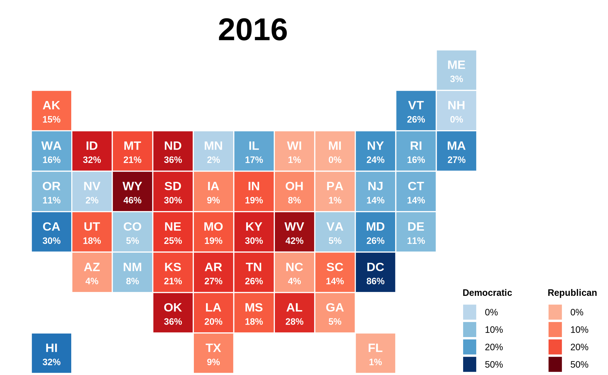
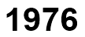

# US Election Results Map

Let's create a map of the US Presential Election results by state using PPTXHandler.

{.img-fluid}

This colors the US states by the party that won in the state (Democrat - Blue, Republican - Red).
Darker colors represent a higher margin of victory.
Data is from [MIT's Election Lab](https://electionlab.mit.edu/data).

## Create the source template

Start by creating a [template.pptx](template.pptx) that has the static content laid out.

[{.img-fluid}](template.pptx)

It has 3 types of shapes that will be updated from data:

1. `AL`, `AK`, `AR`, `AZ` ...: one rectangle for each state
2. `Year`: the title that'll show the year
3. `Dem-0`, `Rep-0`, `Dem-10`, `Rep-10`, ...: color scales for different margins of victory

## Create the data

The [data](https://dataverse.harvard.edu/dataset.xhtml?persistentId=doi:10.7910/DVN/42MVDX) is from
[MIT's Election Lab](https://electionlab.mit.edu/data). To simplify things, we aggregated it
by year and state into [us-president-election-margin.csv](us-president-election-margin.csv).

[{.img-fluid}](us-president-election-margin.csv)

- `year`: the election year
- `state`: 2-letter US state abbreviation
- `party`: party that won the state Presidential election
- `margin`: margin of victory as a %

## Create the rules

Let's set up a basic `gramex.yaml` file that loads the template and the data.

```yaml
url:
  pptxhandler/choropleth:
    pattern: /$YAMLURL/output.pptx
    handler: PPTXHandler
    kwargs:
      version: 2
      source: $YAMLPATH/template.pptx
      data:
        margin:
          url: $YAMLPATH/us-president-election-margin.csv
```

Now, we'll set up a rule that copies the slide for each year.

```yaml
rules:
  - copy-slide: data.groupby('year')
```

This copies the slide for each year. The variable `copy.key` holds the year. `copy.val` has the data for the year.

Next, let's set the year on each slide:

```yaml
"Year":
  text: copy.key
```

{.img-fluid}

Now, we'll create a new dataset called `margins`. This has the data for each year, indexed by state.

```yaml
data:
  margins: copy.val.set_index('state')
```

`margins` looks like this. For example, `margins['AL']` has the data for Alabama.

{.img-fluid}

We'll color each state shape with a color scale for the party. Add this under `data:`

```yaml
color: >
  {
    'democrat': gramex.scale.color(domain=[-20, 50], range='Blues'),
    'republican': gramex.scale.color(domain=[-20, 50], range='Reds'),
    'democratic-farmer-labor': gramex.scale.color(domain=[-20, 50], range='Purples'),
  }
```

Now `colors['democrat'](5)` returns the color for a 5% democrat margin (a light blue color.)

- `gramex.scale.color` creates a color scale
- `domain=[-20, 50]` sets the lightest color for -20 and the darkest for 50. (We chose -20 instead of 0 because that makes 0 look slightly brighter, instead of a faded white)
- `range='Blues'` uses the "Blues" color map. [See the list of color maps](https://matplotlib.org/stable/gallery/color/colormap_reference.html)

We'll use this to color each state based on the winning party and margin.

```yaml
"??":
  fill: color[margins['party'][shape.name]](c)
```

- `??` selects all shapes with 2 letters (e.g. `AL`, `AK`, `AR`, `AZ`)
- `margins['party'][shape.name]` has the winning party for each state code (`shape.name`)
- `margins['party'][shape.name]` has the winning party's margin for each state code (`shape.name`)
- These are used to effectively create `fill: color[party](margin)`

Next, we'll add the margin to the text

```yaml
text: f'<p><a font-size="11 pt">{shape.name}</a></p><p><a font-size="8 pt">{margins["margin"][shape.name]}%</a></p>'
```

- `<p><a font-size="11 pt">{shape.name}</a></p>` is the first line. It shows the state code in 11 pt
- `<p><a font-size="8 pt">{margins["margin"][shape.name]}%</a></p>` is the second line. It shows the margin% in 8 pt

Finally, we'll set the color scales:

```yaml
Dem-0: { fill: 'color["democrat"](0)' }
Rep-0: { fill: 'color["republican"](0)' }
Dem-10: { fill: 'color["democrat"](10)' }
Rep-10: { fill: 'color["republican"](10)' }
Dem-20: { fill: 'color["democrat"](20)' }
Rep-20: { fill: 'color["republican"](20)' }
Dem-50: { fill: 'color["democrat"](50)' }
Rep-50: { fill: 'color["republican"](50)' }
```

[This is the final configuration](gramex.yaml.source){.source}

## See the result

[This is the output PPTX](output.pptx)

[{.img-fluid}](output.pptx)
