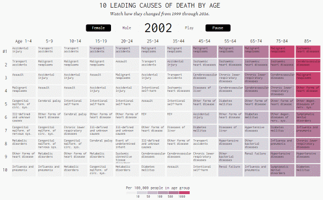
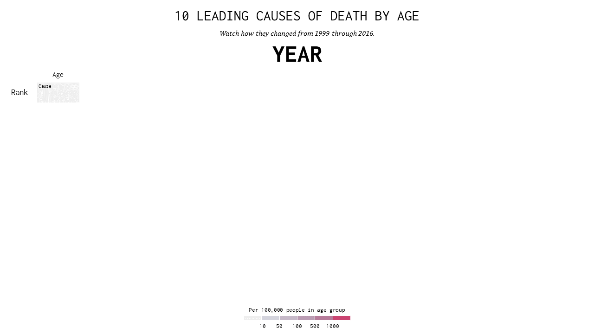
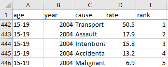
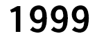
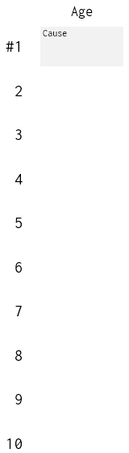
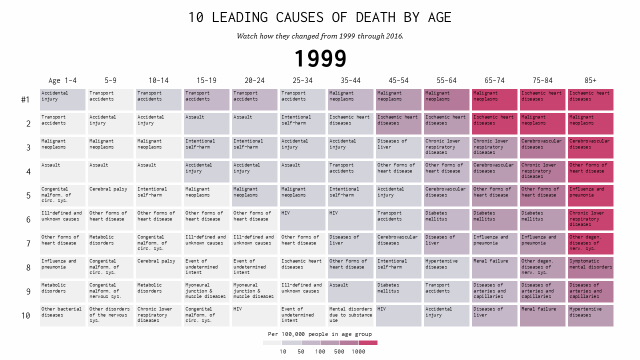

# Shifting Causes of Death

Let's see how we can create this visual on the "[Shifting Causes of Death](https://flowingdata.com/2018/10/02/shifting-death/)" using PPTXHandler.

{.img-fluid}

This shows the top 10 causes of death by age group, across years. Data is from the [CDC Wonder Database](https://wonder.cdc.gov/), and the visualization was created by [Nathan Yau](https://flowingdata.com/).

## Create the source template

Start by creating a [template.pptx](template.pptx) that has the static content laid out.

[{.img-fluid}](template.pptx)

It has 4 shapes that will be updated from data:

1. `Year`: the current year, e.g. 1996, 1997, ...
2. `Age`: the age group, e.g. Age 1-4, 5-9, ...
3. `Rank`: the rank of the cause of death, e.g. #1, 2, ...
4. `Cause`: the actual cause of death, e.g. Assault, HIV, ...

## Create the data

The [data][data] is available from the [Flowing Data
website](https://flowingdata.com/projects/2018/mortality-ranks/). To simplify things, we combine
Male & Female rates, re-rank them, and save this as [mortality.xlsx](mortality.xlsx).

[{.img-fluid}](mortality.xlsx)

The relevant columns correspond to the shape names on the template:

- `age`: the age group
- `year`: the current year
- `cause`: the actual cause of death
- `rank`: the rank of the cause of death

## Create the rules

Let's set up a basic `gramex.yaml` file that loads the template and the data.

```yaml
url:
  pptxhandler/death:
    pattern: /$YAMLURL/output.pptx
    handler: PPTXHandler
    kwargs:
      version: 2
      source: $YAMLPATH/template.pptx
      data:
        url: $YAMLPATH/mortality.xlsx
        transform: data[data['rank'] <= 10]
```

Now, we'll set up a rule that copies the slide for each year.

```yaml
rules:
  - copy-slide: data.groupby('year')
```

This copies the slide for each year. The variable `copy.key` holds the year. `copy.val` has the data for the year.

Next, let's set the year on each slide:

```yaml
"Year":
  text: copy.key
```

{.img-fluid}

Now, we'll clone the `Rank` shape for each rank from 1 to 10.

```yaml
Rank:
  clone-shape: '["#1", 2, 3, 4, 5, 6, 7, 8, 9, 10]'
  add-top: clone.pos * 0.5
  text: clone.val
```

We explicitly set the ranks as an array. The first rank is shown as `#1`. The rest are 2, 3, ...
`add-top:` moves the cloned Rank down by `clone.pos * 0.5`. `clone.pos` goes from 0 to 9. So the
first Rank `#1` is at the original position. The rest move down by 0.5" (half-an-inch -- determined
by trial-and-error) from the previous.

The text shown is the value in our `clone-shape:` array.

{.img-fluid}

Now, we'll clone the `Age` shape for each age in the dataset.

```yaml
Age:
  clone-shape: copy.val.groupby('age', sort=False)
  add-left: clone.pos * 1
  text: clone.key if clone.pos else f'Age {clone.key}'
```

We clone based on the current slide's value (`copy.val`), grouped by age. This creates one clone
per age group. Don't sort it, because it's already sorted in [`mortality.xlsx`](mortality.xlsx)
(and sorting would mess it up: `5-9` would appear after `55-64`.)

`add-left:` moves the cloned Age right by `clone.pos * 1`. `clone.pos` counts the
age groups from 0 .. 11. So the first Age `1-4` is at the original position. The rest move right by
1" (one inch -- determined by trail and error) from the previous.

The `text:` is set up to show `Age 1-4` in the first column, `5-9` on the second, and so on.

{.img-fluid}

Now, we'll clone the `Cause` shape for each row in the dataset.

```yaml
Cause:
  clone-shape: copy.val
  add-top: clone.pos % 10 * 0.5
  add-left: clone.pos // 10 * 1
  text: clone.val.cause
  fill: >
    '#f0f0f0' if clone.val.rate < 10 else
    '#d4d4dd' if clone.val.rate < 50 else
    '#c6b9c9' if clone.val.rate < 100 else
    '#ba9cb3' if clone.val.rate < 500 else
    '#b67b9a' if clone.val.rate < 1000 else
    '#ca4471'
```

`copy.val` has every row of data for the current year. There are 120 entries -- for 12 age groups
and 10 ranks. Rows 1-10 are ranks 1-10 for age 1-4, then for age 5-9, etc.

`add-top: clone.pos % 10 * 0.5` moves the cloned Cause 0.5" down based on rank. `add-left: clone.pos // 10 * 1` moves the cloned Cause 1" right based on age group.

`text: clone.val.cause` uses the "cause" field to set the text.

The fill color is set in line with the legend we created on [template.pptx](template.pptx).

{.img-fluid}

Finally, to animate the slides, let's set a transition.

```yaml
          # Add this under the "Cause:" shape
            name: f'!!{clone.val.age} {clone.val.cause}'
          # Create a rule for slide transitions
          transition:
            type: f'morph'
            duration: 0.3
            advance: 1
```

The transition takes 0.3 seconds per slide, and waits for 1 second before auto-advancing.

This almost works magically... but there's one problem. It moves the causes from one age-group
column to another. We want them to stay within the same column.

{.img-fluid}

We can [use the shape name to match morph shapes][match-shape]. By setting the `name:`, the shape name will be `!!1-4 Accidental injury`, `!!1-4 Assault`, etc. These will be moved only within the same age group, and not across.

[match-shape]: https://support.microsoft.com/en-us/office/morph-transition-tips-and-tricks-bc7f48ff-f152-4ee8-9081-d3121788024f
[data]: https://flowingdata.com/projects/2018/mortality-ranks/data/mortality_top10.tsv

### Automated insights

Let's go a step beyond, and add simple automated insights to this. The `rankchange` column has the number of ranks a cause has jumped. We can find which rank jumped up or down the most, and add a simple annotation in the subtitle, like "Metabolic disorders changed -4 ranks for age 5-9".

First, let's find the row that has the maximum change -- positive or negative -- and store it in a variable `maxrow`.

```yaml
data:
  maxrow: copy.val.rankchange.abs().idxmax()
```

Next, let's change the Subtitle shape.

```yaml
Subtitle:
  text: f'{copy.val.cause[maxrow]} changed {copy.val.rankchange[maxrow]:+0.0f} ranks for age {copy.val.age[maxrow]}' if maxrow == maxrow else None
```

- `copy.val.cause[maxrow]` shows the cause name, e.g. "Metabolic disorders"
- `copy.val.rankchange[maxrow]` shows the number of ranks it changed, e.g. -4
- `copy.val.age[maxrow]` shows the age group of the change, e.g. 5-9
- `maxrow == maxrow` is a hack to check if there is any row that has the highest change. For the first year (1999), there is no change. So we don't change the text in that case.

[This is the final configuration](gramex.yaml.source){.source}

## See the result

[This is the output PPTX](output.pptx)

[{.img-fluid}](output.pptx)

## Try it yourself

[Download this pack](shifting-causes-of-death.zip)
