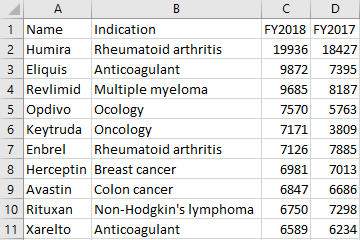

# Bestselling Pharmaceutical Drugs

Let's see how we can visualize the [Best selling pharmaceuticals of 2017/18][data] using PPTXHandler.

{.img-fluid}

We're aiming for a result like this:

{.img-fluid}


## Create the source template

Start by creating a [template.pptx](template.pptx) that has the static content laid out.

[{.img-fluid}](template.pptx)

All of the content is static, except for the table called `Sales Table`.

## Create the data

The [data][data] is available from the [Wikipedia][data]. Let's copy the data into a CSV file [sales.csv](sales.csv).

[{.img-fluid}](sales.csv)

[data]: https://en.wikipedia.org/wiki/List_of_largest_selling_pharmaceutical_products#Best_selling_pharmaceuticals_of_2017/18

## Create the rules

Let's set up a basic `gramex.yaml` file that loads the template and the data.

```yaml
url:
  pptxhandler/table:
    pattern: /$YAMLURL/output.pptx
    handler: PPTXHandler
    kwargs:
      version: 2
      source: $YAMLPATH/template.pptx
      data:
        sales:
          url: $YAMLPATH/sales.csv
```

The data has fewer columns than we need, so let's add 3 columns:

- `Bar 2018`: a dummy column to show the bar chart of 2018 sales
- `Bar 2017`: a dummy column to show the bar chart of 2017 sales
- `Growth`: Yearly growth in 2018

We add these columns with the Pandas `transform:` key. This needs a single expression, so we
combine the transforms using `or`.

```yaml
          transform: data.insert(3, 'Bar 2018', data['FY2018']) or
                     data.insert(5, 'Bar 2017', data['FY2017']) or
                     data.insert(6, 'Growth', data['FY2018'] / data['FY2017'] - 1) or
                     data
```

We now set up the basic formatting for the table, using `sales` data. This also sets the font size
and vertical alignment for the entire table.

```yaml
      rules:
        - Sales Table:
            table:
              data: sales
              vertical-align: f'middle'
              font-size: f'11 pt'
```

That gives us this result.

{.img-fluid}

Let's start by adjusting the table headers, and aligning the numeric columns to the right.

```yaml
              header-row:
                - Name
                - Indication
                - '<p align="right">FY2018</p>'
                - ''
                - '<p align="right">FY2017</p>'
                - ''
                - '<p align="right">Growth</p>'
```

Now, let's look at the text. The first two columns are straight-forward.

```yaml
              text:
                Name: cell.val
                Indication: cell.val
```

For the numbers, we just need to right align them and add a comma separator (e.g. "10,000" instead of "10000"). We use Python string formatting for this.

```yaml
                FY2018: f'<p align="right">{cell.val:,}</p>'
                FY2017: f'<p align="right">{cell.val:,}</p>'
```

{.img-fluid}


For the bars, we repeat the same "█" character multiple times, using

- a blue shade (`accent_1` from the theme)
- Arial font
- 6 pt (determined through trial and error)

For every $1,000 million (or a billion) of sales, we show one "█".

```yaml
                Bar 2018: f'<a color="accent_1" font-name="Arial" font-size="6pt">' + ('█' * int(cell.val / 1000)) + '</a>'
                Bar 2017: f'<a color="accent_1" font-name="Arial" font-size="6pt">' + ('█' * int(cell.val / 1000)) + '</a>'
```

{.img-fluid}

We've manually added spaces between character to give you an idea of character width.

Finally, the Growth column has a red ▼ or a green ▲ depending on whether growth was positive or negative.

```yaml
                Growth: f'<p align="right">{cell.val:.1%} ' +
                  ('<a color="red">▼</a>' if cell.val < 0 else '<a color="green">▲</a>') +
                  '</p>'
```

{.img-fluid}


Finally, let's adjust the width of these columns (determined by trial and error).

```yaml
              width:
                Name: 1
                Indication: 2.5
                FY2018: 1
                Bar 2018: 1.5
                FY2017: 1
                Bar 2017: 1.5
                Growth: 1
```

[This is the final configuration](gramex.yaml.source){.source}

## See the result

[This is the output PPTX](output.pptx)

[{.img-fluid}](output.pptx)
