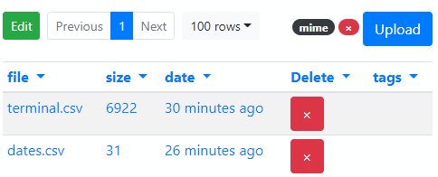

---
title: Gramex 1.60 release notes
prefix: 1.60
...

[TOC]

## File Manager is a UI for DriveHandler

[File Manager](../../drivehandler/#file-manager) is a FormHandler-compatible UI
component. It makes it easy to create a file upload and file management page as
part of any Gramex application.



## Bug fixes

- Gramex runs on Tornado 6 as well as 5 [#211](https://github.com/gramener/gramex/issues/211)
- Log viewer runs on Vega Lite 4
- Linting code rewritten to pass on [Travis CI](https://travis-ci.com/github/gramener/gramex)
- Deployment code for gramener.com and uat.gramener.com streamlined
- UI components have been updated to the latest patch versions.

## API changes

There are some significant changes to Gramex's default behavior:

- Gramex no longer tries to set up apps on `pip install`. You need to run `gramex setup --all` explicitly after installing Gramex.
- If there's no `gramex.yaml` in the directory from where you run Gramex, Gramex used to show the Gramex Guide. Now, it prints a message saying there is no `gramex.yaml` and a link to the Guide.

## Statistics

The Gramex code base has:

- 17,344 lines of Python (640 less than 1.59)
- 2,409 lines JavaScript (69 more than 1.59)
- 10,086 lines of test code (127 less than 1.59)
- 77% test coverage (1% less than 1.59)

## How to upgrade

To upgrade Gramex, run:

```bash
pip install --upgrade gramex
pip install --upgrade gramexenterprise    # If you use DBAuth, LDAPAuth, etc.
gramex setup --all
```
