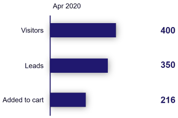

---
title: Gramex 1.61 release notes
prefix: 1.61
...

[TOC]

Gramex 1.61 brings the ability to create interactive PPTs, a distributed cache, and a few minor
enhancements and bug fixes.

## Create interactive presentations

With this release, [SlideSense, a.k.a. PPTXHandler v2](../../pptxhandler/) also supports
transitions and links. So you can use Gramex to directly create bar chart races, like below, and
more.



[Read the documentation](../../pptxhandler/) to learn how to:

- [Map data to shape colors and text](../../pptxhandler/entrepreneurship/)
- [Animate shapes using data](../../pptxhandler/death/)
- [Create links from any shape or text into a page](../..//pptxhandler/link/)
- [Add transitions](../../pptxhandler/transition/)
- [Style text with a HTML-like language](../../pptxhandler/text-format/) (e.g. `<p bold="y" font-size="13"><a link="last">...</a></p>`)
- [Clone shapes using data to create custom visualizations](../../pptxhandler/clone-shape/)

## Fast, persistent, distributed cache

Gramex uses caches to speed up requests. The new [Redis Cache store](../../cache/#cache-stores)
lets multiple Gramex instances (even on different servers) use the same cache. So when a user
requests a page on one server, it will be served fast on all other servers.

This is an advantage over the two existing caches:

1. The memory cache, which is fast but ephemeral and single-server
2. The disk cache, which is persistent but slow and single-server

The Redis cache uses Redis as a back-end. It is fast, persistent and distributed.

```yaml
cache:
  distributed-cache: # Define a name for the cache
    type: redis # This is a redis cache
    path: localhost:6379:0 # Connection string for Redis instance
    size: 1000000000 # Allow ~1GB of data in the cache
```

Thanks [Niyas](@https://github.com/mniyas)!

## Improved `gramex init`

[`gramex init`](../../init/) provides a better default login URL now. Earlier, the login link may
take you to a different app, post-login (particularly when you deploy multiple apps on a single
server). This is fixed in 1.61. Your app will redirect to your own app's login page, not the
default `/login/` of the server.

Some Gramex instances raised a [UnicodeError](https://github.com/gramener/gramex/issues/142) when
running Gramex. This is also resolved.

## Use Python expressions in YAML

Handlers like [FunctionHandler](../../functionhandler/) or [FormHandler](../../formhandler/) only allowed Python _functions_ in YAML, like `function: mymodule.my_method()` or `modify: data.sort_values()`.

Now, you can also use _expressions_. For example, `function: 1 + 2` or `modify: data.T`.

## Bug fixes

- [Gramex test cases on Travis](https://travis-ci.com/github/gramener/gramex/builds) have been
  re-factored to have few or no failuers

## What next

The August 2020 release (1.62) will

- Improve [**PPTXHandler**](../../pptxhandler/) with visualizations like the Treemap, Sunburst, Sand dance, and more
- Launch **Gramex Charts**, which lets non-programmers (designers, analysts, etc) create charts
- Improve **installation** with a one-line `conda install` and `docker` install
- Improve **documentation**, with a new design that's easier to explore

## How to install

To [install Gramex](../../install/), run:

```bash
pip install --upgrade gramex
pip install --upgrade gramexenterprise    # If you use DBAuth, LDAPAuth, etc.
gramex setup --all
```

## Statistics

The Gramex code base has:

- 17,377 lines of Python (33 more than 1.60)
- 1,694 lines JavaScript (715 less than 1.60)
- 10,645 lines of test code (559 more than 1.60)
- 81% test coverage (4% more than 1.60)
