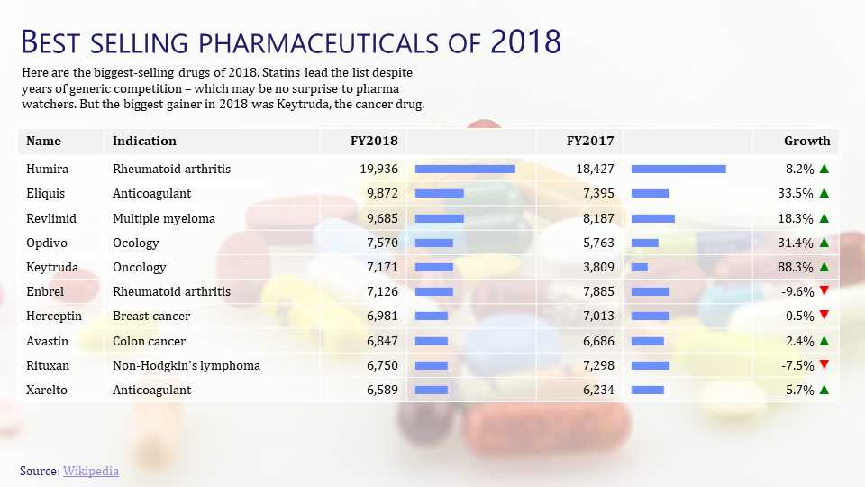

---
title: Gramex 1.62 release notes
prefix: 1.62
...

[TOC]

Gramex 1.62 lets you create dynamic tables and charts from data, run `slidesense` from the command
line to update presentations, and launches a preview of the new Gramex Charts.

## PowerPoint tables and charts

[SlideSense, a.k.a. PPTXHandler v2](../../pptxhandler/) supports tables and charts.

The [`table`](../../pptxhandler/#table) rule lets you specify the contents and format of each cell,
which even allows you to create micro-charts in cells, such as bars or icons.

{:.img-fluid}

The [`chart-data`](../../pptxhandler/#chart) rule lets you update chart data from any source. This
makes it easy to copy charts and create multiple variations for different slices of data.

{:.img-fluid}

## Create presentations from the command line

When you [install Gramex](../../install/), you now have a new [command called
`slidesense`](../../pptxhandler/#command-line). Run `slidesense` or `slidesense gramex.yaml` to
create the target presentations specified by your `gramex.yaml` file and open them.

{.img-fluid}

## Gramex Charts preview

[Gramex Charts](https://gramener.com/gramexcharts/) is a UI-based Gramex app that lets you:

- **Pick a chart** from a catalog
- **Configure** the chart using a UI
- **Export** the chart as PNG, SVG, or embeddable code

[{.img-fluid}](https://youtu.be/RC8sB6zy9gw)

This will be included as part of the Gramex code base once it's ready. For now, try the beta version at <https://gramener.com/gramexcharts/>.

## Other features

- The [SMS Service](../../sms/) supports the [new API from Exotel](https://developer.exotel.com/) to send SMS messages.
- [Gramex init](../../init/) no longer adds quotes to the URL keys in `gramex.yaml`. So an app named "My App" will have URL keys like `my-app-home:` rather than the less pretty `"My App-home":`.
- [Gramex test cases on Travis](https://travis-ci.com/github/gramener/gramex/builds) no longer fail. The coverage is significantly higher (89%). Local tests on Windows are also a lot more robust now.

## What next

We promised two features in this release that are delayed. Both will land in the September 2020 release as well.

- Improve **installation** with a one-line `conda install` and `docker` install
- Improve **documentation**, with a new design that's easier to explore

In addition, the September 2020 release (1.63) will:

- Preview the **Gramex IDE**. This September version will let you launch Gramex containers in Docker via a UI
- Extend [**PPTXHandler**](../../pptxhandler/) with color gradients and custom charts
- Extend [**ProxyHandler**](../../proxyhandler/) to proxy websockets as well
- Add a 1-year **roadmap** for Gramex

## How to install

See the [Gramex installation and upgrade instructions](../../install/)

Note: Gramex 1.62 does not work with Python 3.8. We recommend Python 3.7.

## Statistics

The Gramex code base has:

- 17,668 lines of Python (291 more than 1.61)
- 1,694 lines JavaScript (same as 1.61)
- 10,938 lines of test code (293 more than 1.61)
- 89% test coverage (8% more than 1.61)
