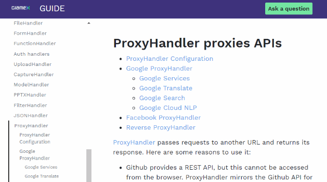
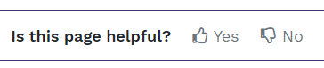

---
title: Gramex 1.63 release notes
prefix: 1.63
...

<link rel="stylesheet" type="text/css" href="../../node_modules/asciinema-player/resources/public/css/asciinema-player.css">


[TOC]

Gramex 1.63 is easier to install with Conda and Docker installations. The Gramex Guide is easier to
use. You can also [proxy websockets](../../proxyhandler/).

## Conda install

Python developers and beginners can use the Conda installation.

Install [Anaconda3-2020.02][anaconda]. Then type this in your Anaconda Prompt / shell:

```bash
conda create -y --name gramex python=3.7            # Create a new environment
conda activate gramex                               # Activate it
conda install -y -c conda-forge -c gramener gramex  # Install Gramex
```

<asciinema-player src="../../install/gramex-conda.json" cols="100" rows="20" idle-time-limit="0.5" autoplay="1" font-size="medium" loop="1"></asciinema-player>


## Docker install

To try out new versions, set up a clean version, or deploy apps, use the Docker installation. [Gramex docker containers](https://hub.docker.com/r/gramener/gramex/) are again up to date.

```bash
docker run -it -p 9988:9988 gramener/gramex /bin/bash
```

<asciinema-player src="../../install/gramex-docker.json" cols="100" rows="20" idle-time-limit="0.5" autoplay="1" font-size="medium" loop="1"></asciinema-player>


## New Gramex Guide

The new [Gramex Guide](https://gramener.com/gramex/guide/) has a new design and a new URL: <https://gramener.com/gramex/guide/>



On the top right, we have an "[Ask a question](https://github.com/gramener/gramex/issues/new?labels=question)" feature that raises an issue. The Gramex team will take respond to these issues within 3 days.

At the bottom, there's a link to share feedback, and add comments.



## Embedding other apps

[ProxyHandler](../../proxyhandler/) already allows you to embed other apps into Gramex apps. This
includes BI tools like Tableau, portals like SharePoint, and content management systems like
WordPress.

But sites that use WebSockets for real-time communication were not supported. This means that
embedding editors like Visual Studio Code, commenting systems, real-time feeds and many other
systems can now be embedded.

The upcoming Gramex IDE is based on Visual Studio Code, and relies on this feature.


## Other features

If you add a key called `comment:` anywhere in `gramex.yaml`, it is ignored. In this example:

```yaml
url:
  home:
    comment: This URL is for the app's home page
    pattern: /
    ...
```

... the `comment:` key is ignored. This feature will become more useful when the IDE is released,
since it'll let you add comments to your configurations for future reference.


## What next

We promised three features in this release that are delayed. These will get pushed mid-September.

- Preview the **Gramex IDE**. This September version will let you launch Gramex containers in Docker via a UI
- Extend [**PPTXHandler**](../../pptxhandler/) with custom charts
- Add a 1-year **roadmap** for Gramex

In addition, the October 2020 release (1.63) will:

- Add ElasticSearch connectivity for [Log Viewer](../../logviewer/), which will let you log any events and query them


## How to install

See the [Gramex installation and upgrade instructions](../../install/)

Note: Gramex 1.63 does not work with Python 3.8. We recommend Python 3.7.

## Statistics

The Gramex code base has:

- 17,630 lines of Python (58 less than 1.62)
- 1,694 lines JavaScript (same as 1.62)
- 10,947 lines of test code (9 more than 1.62)
- 89% test coverage (same as 1.62)

<script src="../../node_modules/asciinema-player/resources/public/js/asciinema-player.js"></script>
