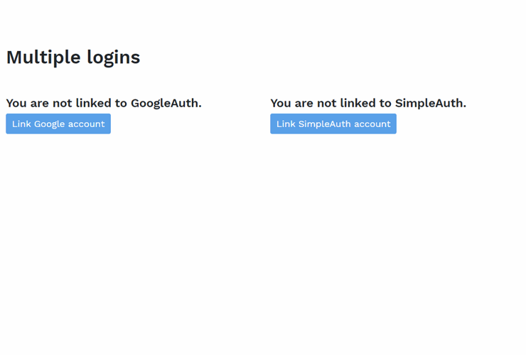

---
title: Gramex 1.64 release notes
prefix: 1.64
...

[TOC]

Gramex 1.64 makes deployment easier, with better support multiple apps per server, multiple logins per app, and secure and offline deployment.

## Gramex IDE is in beta

You can access the IDE Beta at <https://gramex.gramener.com/>. The current version allows you to
clone projects from Github and Gitlab, as well as create a repo from scratch.

[](https://gramex.gramener.com/)

## Run multiple apps on a server

Running two Gramex instances on one server, e.g. at
`server.com/app1/` at port 8001 and `server.com/app2/` at port 8002, is more robust.

When redirecting, Gramex needs the actual URL it's deployed at (not `localhost:8001`). For example,
when [logging in](../../auth/) or [screen capturing](../../capturehandler/).

Just add an **`X-Request-URI` HTTP header** in your proxy server to the actual URL. Gramex handles
redirections automatically after that.

The [configuration for nginx](../../deploy/#proxy-servers) looks like this:

```nginx
    proxy_set_header X-Request-URI $request_uri;
```

## Log into multiple apps simultaneously

Two apps on one server may still need different login methods.
E.g. `app1/` uses [Google Auth](../../auth/#google-auth).
`app2/` uses [Database Auth](../../auth/#database-auth).

You can now define a **different cookie for each app**. Configure `app1/` as follows:

```yaml
app:
  session:
    cookie: app1-sid # Use 'app1-sid' cookie for this app instead of 'sid'
```

## Multiple logins for the same app

A user may need to log in with multiple accounts. E.g. to share charts on
multiple social media via
[Google](../../auth/#google-auth),
[Facebook](<(../../auth/#facebook-auth)>),
[Twitter](../../auth/#twitter-auth), _and_
[Database Auth](../../auth/#database-auth).

The documentation on [multiple logins](../../auth/#multiple-logins) explains how to set this up,
along with a [demo](../../auth/multi)

[](../../auth/multi)

## Deploy secrets securely

Passwords, access tokens, and other sensitive information needs to be protected. Gramex now
supports a `.secrets.yaml` file where you can save these securely.

If you can edit files on the server (directly, or via CI), add an _uncommitted_ `.secrets.yaml`
file with your secrets, like this:

```yaml
PASSWORD: your-secret-password
GOOGLE_AUTH_SECRET: your-secret-key
TWITTER_SECRET: your-secret-key
# ... etc
```

These variables are available in `gramex.yaml` as `$PASSWORD`, `$GOOGLE_AUTH_SECRET`,
`$TWITTER_SECRET`, etc. For example:

```yaml
url:
  login/google:
    pattern: /$YAMLURL/login/
    handler: GoogleAuth
    kwargs:
      key: add-your-key-directly # This is not a secret
      secret: $GOOGLE_AUTH_SECRET # This comes from .secrets.yaml
```

If you can't edit files on the server, you can pick up _encrypted_ secrets from a public URL in 3 steps.

1. Encrypt your secrets using this **[secret encryption tool](../../deploy/secrets)**
2. Store the encrypted secret anywhere publicly (e.g. at [PasteBin](https://pastebin.com/) or [Github](https://gist.github.com/))
3. Add the URL and the encryption secret, in `.secrets.yaml`:

```yaml
SECRET_URL: https://pastebin.com/raw/h75e4mWx
SECRET_KEY: SECRETKEY # Replace with your secret key
```

When Gramex loads, it loads `SECRET_URL` (ignoring comments beginning with `#`) and decrypts it using your `SECRET_KEY`.

[Read more about deploying secrets](../../deploy/#secrets)

## Offline installation

[Offline installation](../../install/#offline-install) is now a simple 2-step process:

1. [Install Gramex using conda](../../install/#conda-install) into a folder called `gramex-offline`
2. Copy the `gramex-offline` folder into the target system (which need not have an Internet connection)

## Connect to more databases

[Gramex FormHandler connections to 14 databases](../../formhandler/#supported-databases)
are now documented.

1. Amazon Redshift (**new**)
2. Apache Hive (**new**)
3. Apache Solr (**new**)
4. DB2 (**new**)
5. ElasticSearch (**new**)
6. Google BigQuery (**new**)
7. Google Sheets (**new**)
8. Microsoft SQL Server
9. MySQL
10. Oracle
11. PostgreSQL
12. SAP Hana (**new**)
13. SQLite
14. Teradata (**new**)

## Client-side screen capture

CaptureHandler reloads a page to take a screenshot. This can be slow. To avoid this, you can use
[html2canvas](https://github.com/niklasvh/html2canvas) and
[FileSaver.js](https://www.npmjs.com/package/file-saver), which are now part of the
[UI component library](../../uicomponents/).

Trigger the download as follows:

```js
html2canvas(document.querySelector(".chart")) // Pick the element to download
  .then((canvas) => {
    canvas.toBlob((blob) => {
      saveAs(blob, "chart.png"); // Pick your filename
    });
  });
```

**[Try the demo](../../capturehandler/html2canvas.html)**

## Protect the entire app

To protect an entire app, i.e. [**add auth on all pages**](../../auth/#authorization), use:

```yaml
app:
  auth: true # All pages require login -- including CSS/images on login page!
```

**Use with caution**. This will be used as the default auth on _every_ handler.
The CSS/JS/images on your login page won't appear unless you set `auth: false` on those URLs.

## Tutorial on building an ML classifier

There's a [new tutorial](../../tutorials/) on
[Creating an ML classifier application](https://github.com/gramexrecipes/gramex-ml-workshop).

This is designed as a step-by-step 1.5 hour workshop for new Gramex users to introduce Gramex, show
interactions, and teach them how to build a simple machine learning classifier.

## Other changes

- The [UI component](../../uicomponents/) `bootstraptheme.css` is now cached in the browser
  for a day -- improving page load speed.
- The [UI component](../../uicomponents/) [`moment.js`](https://momentjs.com/) is deprecated in
  favor of [`dayjs`](https://day.js.org/). Both will remain as part of Gramex, for backward
  compatibility.
- When [using XSRF via AJAX](../../filehandler/#xsrf), just add the header
  `X-Requested-With: XMLHttpRequest` to ignore the check. You don't need to fetch an XSRF token
  from the server.
- [CaptureHandler](../../capturehandler/) sometimes disconnects from Chrome after long usage. Now,
  it detects and automatically re-connects as required.
- [Translation](../../translate/) via Google Cloud now uses the new v3 API, and no longer fails.
- [FileHandler](../../filehandler/) now downloads Web Font files (e.g. `.woff`) instead of
  displaying them on screen.

## What next

We promised two features in this release that are delayed. These will get pushed to November.

1. Extend [PPTXHandler](../../pptxhandler/) with custom charts
2. Add a 1-year **roadmap** for Gramex

In addition, the [October 2020 release (1.65)](https://github.com/gramener/gramex/milestone/14) will feature:

1. Python 3.8 support [#300](https://github.com/gramener/gramex/issues/300)
2. [ModelHandler](../../modelhandler/) support for TensorFlow, Keras and PyTorch models
3. Simplified FunctionHandler support [#304](https://github.com/gramener/gramex/issues/304)
4. Notification for errors in alerts [#292](https://github.com/gramener/gramex/issues/292)
5. [Logviewer](../../logviewer/) components that you can embed in any page to track usage [#288](https://github.com/gramener/gramex/issues/288)

... and more.

## How to install

See the [Gramex installation and upgrade instructions](../../install/)

Note: Gramex 1.64 does not work with Python 3.8. We recommend Python 3.7.

## Statistics

The Gramex code base has:

- 17,712 lines of Python (82 more than 1.63)
- 1,709 lines JavaScript (17 more than 1.63)
- 11,087 lines of test code (140 more than 1.63)
- 89% test coverage (same as 1.62)
