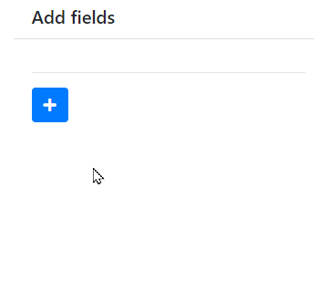
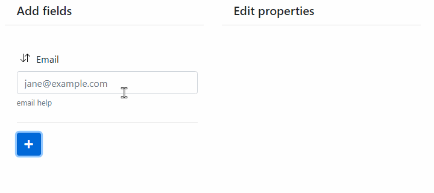
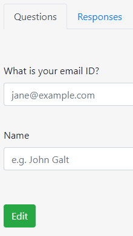
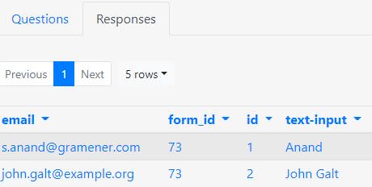
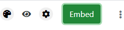

---
title: Gramex 1.68 release notes
prefix: 1.68
...

[TOC]

Gramex 1.68 introduces UI Factory -- an app that allows users and developers to create and
customize user interfaces using drag-and-drop.

**This release in ALPHA**. Please do not use it in production.

## UI Factory - Forms

Currently, the UI Factory lets you create forms using a UI. This also makes it easy for business
users to edit forms (like Google or Survey Monkey) and embed them in an app.

### Add fields

Users can add new fields using the UI.



### Edit fields

Users can configure the form (e.g. form name, description) and fields (e.g field label, default value, etc.) using the UI.



### Collect responses

These forms act as mini applications by themselves, and can collect user responses.






### Embed form

Users can embed this form in the app using JavaScript.



Here's a sample embed code:

```html
<link rel="stylesheet" href=".../forms/ui/bootstrap5/dist/css/bootstrap.min.css">
<script src=".../forms/ui/jquery/dist/jquery.min.js"></script>
<div class="form-container">
  <script src=".../forms/embed/73.js"></script>
</div>
```

**Note**: The embed code shows the actual server instead of `...`.

## Import secrets

If you run multiple apps in the same instance, each app may need a different
[`.secrets.yaml`](../../deploy/#secrets) file.

You can now use [`SECRETS_IMPORT: */.secrets.yaml`](../../deploy/#secretsyaml-imports) in your
`.secrets.yaml` file to import secrets from other apps or directories.

## Bug fixes

The SCSS library we use (`node-sass`) does not work on Windows 64 with the latest versions of
NodeJS ([ref](https://stackoverflow.com/a/64645028/100904)), leading to the error `Node Sass does
not yet support your current environment`. Gramex now uses more stable versions of NodeJS to avoid
this.

## What next

Gramex 1.69 will be released on 1 Mar 2021 and will feature an improved Log Viewer.

## Statistics

The Gramex code base has:

- 19,031 lines of Python (126 more than 1.67)
- 2,171 lines of JavaScript (392 more than 1.67)
- 12,050 lines of test code (5 more than 1.67)
- 89% test coverage (same as 1.67)

## How to install

See the [Gramex installation and upgrade instructions](../../install/)

Note: Gramex 1.68 does not work with Python 3.8. We recommend Python 3.7.
