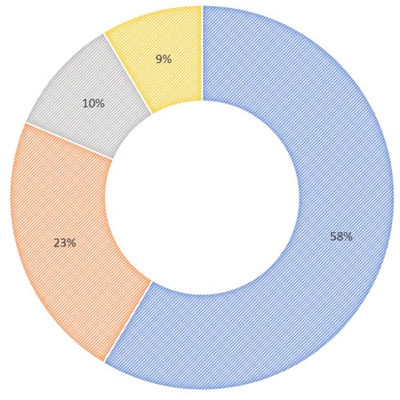

---
title: Gramex 1.69 release notes
prefix: 1.69
...

[TOC]

Gramex 1.69 makes it easier to auto-render template files, generate Donut charts, and offline access to Google Data.

## Auto-render template files

Let's say you have a folder of HTML files. But only 1 file, say `report.html`, uses [FileHandler
templates](../../filehandler/#templates).

Earlier, you would have had to create a separate [FileHandler](../../filehandler/) for this with
`template: true`.

Now, just rename it to `report.tmpl.html` or `report.template.html`, and it will be rendered as a
template.

You can choose any file pattern to render as HTML. For example, this renders `report*.html` and
`template*.html` as templates, but other files are rendered as-is.

```yaml
url:
  template:
    pattern: ...
    handler: FileHandler
    kwargs:
      path: ...
      template: ['report*.html', 'template*.html']
```

## Donut Charts in PPTXHandler

You can update the data for a Donut Chart in [PPTXHandler](../../pptxhandler/#chart), like any chart.




## Offline access to Google data

You can set up [GoogleAuth](../../auth/#google-auth) to have
[offline access](../../auth/#offline-access-to-google-data)

To perform offline actions on behalf of the user (e.g. send email, poll Google Drive, etc), you
need to request offline access by adding `access_type: offline` under `extra_params`.

```yaml
url:
  login/google:
    pattern: /$YAMLURL/google   # Map this URL
    handler: GoogleAuth         # to the GoogleAuth handler
    kwargs:
      key: YOURKEY              # Set your app key
      secret: YOURSECRET        # Set your app secret
      # Scope list: https://developers.google.com/identity/protocols/googlescopes
      scope:
        - https://www.googleapis.com/auth/contacts.readonly
        - https://www.googleapis.com/auth/gmail.readonly
      extra_params:
        access_type: offline
```

When the user logs in for the first time, Google sends a refresh token that you can access via
`handler.current_user.refresh_token`.

If the `access_token` has expired, you will get a HTTP 401 Unauthorized error, with a JSON response like this:

```json
{
  "error": {
    "code": 401,
    "message": "Request had invalid authentication credentials...",
    "status": "UNAUTHENTICATED"
  }
}
```

In this case, you can get a new access token using `GoogleAuth.exchange_refresh_token()`:

```python
@tornado.gen.coroutine
def get_contacts(handler):
    # Make an authenticated request
    url = 'https://www.google.com/m8/feeds/contacts/default/full'
    headers = {'Authorization': 'Bearer ' + handler.current_user.get('access_token', '')}
    r = requests.get(url, headers=headers)
    # If the access token has expired
    if r.status_code == 401:
        # Exchange refresh token
        yield gramex.service.url['login/google'].handler_class.exchange_refresh_token(
            handler.current_user)
        # Make the request again
        headers = {'Authorization': 'Bearer ' + handler.current_user.get('access_token', '')}
        r = requests.get(url, headers=headers)
    return r.text
```

## Other improvements

- [Installation documentation](../../install/) is much improved. We tested it on Windows & Linux
  for every variation of Conda, Docker, Pip and Offline installs.
- You can use the variable `gramex.appconfig` in any [function](../../functionhandler/). It shows full
  `gramex.yaml` configuration for the running app.

## Bug fixes

- [MLHandler](../../mlhandler/) templates used to drop the target column.
  [Fixed #369](https://github.com/gramener/gramex/issues/369)
- [MLHandler](../../mlhandler/) didn't work with
  [sklearn 0.24](https://scikit-learn.org/stable/whats_new/v0.24.html#sklearn-compose)
  because it needed the same order of columns.
  [Fixed #378](https://github.com/gramener/gramex/issues/378)
- [WebSocketHandler](../../websockethandler/) supports an `origins:` list of allowed domains. This
  was not working when set. It's now resolved.
- [Conda install](../../install/#conda-install) failed if the Anaconda directory had spaces.
  [Fixed #374](https://github.com/gramener/gramex/issues/374)
- [Pip install](../../install#pip-install) ensures that we use Python 3.7 and Node 10+.

## What next

Gramex 1.70 will be released on 1 Mar 2021 and will feature an improved Log Viewer and Admin Panel.
The Log Viewer was promised in 1.69, but is delayed.

## Statistics

The Gramex code base has:

- 19,059 lines of Python (31 more than 1.68)
- 2,146 lines of JavaScript (25 less than 1.68)
- 12,095 lines of test code (45 more than 1.68)
- 89% test coverage (same as 1.68)

## How to install

See the [Gramex installation and upgrade instructions](../../install/) (which are **much** better now 😃)

Note: Gramex 1.69 does not work with Python 3.8. We recommend Python 3.7.
