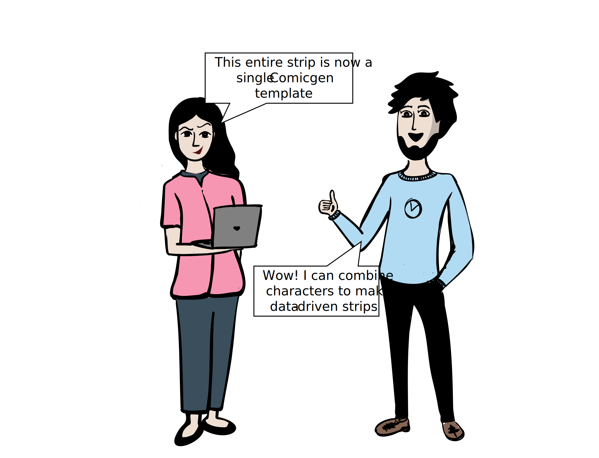
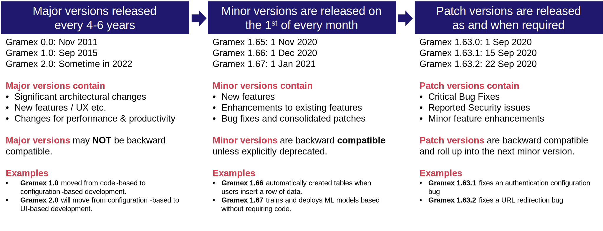

---
title: Gramex 1.72 release notes
prefix: 1.72
...

[TOC]

Gramex 1.72 introduces OpenAPI support, a root cause algorithm, charts in UIFactory, and more.


## OpenAPI support

[OpenAPIHandler](../../openapihandler/) automatically generates documentation for your APIs.
Here's what the output looks like:


To expose your entire app as an [OpenAPI spec](https://swagger.io/specification/), add this to `gramex.yaml`:

```yaml
url:
  openapi:
    pattern: /$YAMLURL/docs
    handler: OpenAPIHandler
```

When creating [FunctionHandlers](../../functionhandler/), Python type annotations (see below) are
automatically converted into the right types on the UI, making it easy to test the app.

```python
from gramex.transforms import handler
from typing import List
from typing_extensions import Annotated

@handler
def compare(
    x: Annotated[List[float], 'First list'] = [],
    y: Annotated[List[float], 'Second list'] = [],
) -> bool:
    '''
    Return True if the first list (x) is larger than the second list (y)
    '''
    return True if sum(x) > sum(y) else False
```


## TopCause analysis

TopCause is an algorithm that answers the question ***What's the single biggest change I can make to improve my outcome?***.

Say a Rugby team is recruiting for heavy people, and have [weight data](../../topcause/weight.csv) like this.

| male  |  age  | height | weight |
| :---: | :---: | :----: | :----: |
|   1   | 90.0  | 151.7  |  47.8  |
|   0   | 90.0  | 139.7  |  36.4  |
|   0   | 90.0  | 136.5  |  31.8  |
|   1   | 20.0  | 156.8  |  53.0  |
|   0   | 10.0  | 145.4  |  41.2  |

If they want to know **What's the single biggest driver of weight?**, TopCause can answer that.

```python
import gramex.ml
import gramex.cache
from gramex.transforms import handler

@handler
def drivers():
    data = gramex.cache.open('weight.csv')
    model = gramex.ml.TopCause()
    model.fit(data, data['weight'])
    return model.result_
```

This returns:

|        | value | gain  |    p     | type  |
| :----: | :---: | :---: | :------: | :---: |
| weight | 55.0  | 16.9  | 1.8e-267 |  num  |
| height | 164.5 | 12.7  | 8.4e-13  |  num  |
|  male  |  NaN  |  NaN  |  0.057   |  num  |
|  age   |  NaN  |  NaN  |  0.453   |  num  |

... and it indicates that:

1. **weight** has the biggest impact on weight (obviously) -- let's ignore this
2. **height** has the second biggest impact on weight. Specifically:
    - **value**: Picking people with the (high) height of 164.5 cm
    - **gain**: This can increase average weight by 12.7 kg.
    - **p**: The probability of error is small (8E-13), i.e. height definitely impacts weight
    - **type**. This column was treated as a number
3. **male** does not impact weight with enough confidence. There's a 5.7% chance it doesn't. (The default cutoff is 5%)
4. **age** does not impact weight with enough confidence. There's a 45.3% chance it doesn't.


## UIFactory charts

[UIFactory](../../uifactory/) now supports a `<vega-chart>` component that embeds Vega charts.

```html
<script src="https://cdn.jsdelivr.net/npm/lodash@4.17.21/lodash.min.js"></script>
<script src="https://cdn.jsdelivr.net/npm/uifactory@0.0.16" import="https://cdn.jsdelivr.net/npm/uifactory@0.0.16/src/vega-chart.html"></script>
<vega-chart spec="https://vega.github.io/editor/spec/vega-lite/bar_diverging_stack_transform.vl.json"></vega-chart>
```

This embeds a chart in-place:

<script src="https://cdn.jsdelivr.net/npm/lodash@4.17.21/lodash.min.js"></script>
<script src="https://cdn.jsdelivr.net/npm/uifactory@0.0.16" import="https://cdn.jsdelivr.net/npm/uifactory@0.0.16/src/vega-chart.html"></script>
<vega-chart spec="https://vega.github.io/editor/spec/vega-lite/bar_diverging_stack_transform.vl.json">
</vega-chart>

Any attributes are passed to the chart as [Vega Signals](https://vega.github.io/vega/docs/signals/),
making it possible to create dynamic charts. The Gramex Guide will soon feature a tutorial on this.

This feature is in beta, and only the core capability is released. A collection of charts will
be shared in the next release, and documented.

## FormHandler MongoDB writeback

[FormHandler](../../formhandler/) introduced MongoDB read support in [1.71](../1.71/). Now it has
MongoDB write-back support. In other words, `PUT`, `POST` and `DELETE` methods work as expected.

In addition, FormHandler also supports nested keys. For example:

```bash
# Search for records where `{"parent": {"child": "value"}}
curl 'localhost:9988/mongodb?parent.child=value'
# Search for records where `{"date": {"year": "2020", "month": "12"}}`
curl 'localhost:9988/mongodb?date.year=2020&date.month=12'
```

It also supports inserting or updating nested values using the `.=` operator. For example:

```bash
# To insert `{"parent": {"child": "value"}}`
curl -X POST 'localhost:9988/mongodb?parent.={"child": "value"}'
# To insert `{"date": {"year": 2020, "month": 12}}`
curl -X POST 'localhost:9988/mongodb?date.={"year": 2020, "month": 12}'
```

## ComicHandler templates

[ComicHandler](../../comichandler/) supports templates that combine multiple characters.

{.img-fluid}

This feature is in beta, and only the core capability is released. A collection of templates will
be shared in the next release, and documented.


## Release process

The [Gramex release process](../release/#release-process) is documented.

- **Major versions** are released every **4-6 years** with significant architectural changes, New features / UX etc and changes for performance & productivity. They may **NOT** be backward compatible.
- **Minor versions** are released on the **1st of every month** with new features, enhancements to existing features, and bug fixes and consolidated patches. They are **backward compatible** unless explicitly deprecated.
- **Patch versions** are released as and **when required** with critical bug fixes, reported security issues, and minor feature enhancements. They are **backward compatible** and roll up into the next minor version.

[{:.img-fluid}](../gramex-release-process.pptx)


## Bug fixes

- The [Gramex Node.js bridge](../../node/) now works on systems and Docker containers with IPv6
  addresses. Earlier, it would raise a HTTP 401 error.
- If a Gramex [cache](../../cache/) runs out of memory because a *single* object is larger than its
  size, it recommends increasing `cache.memory.size` in `gramex.yaml`. Earlier, it reported that it
  couldn't cache, not why.

## Backward compatibility & security

Gramex 1.72 is backward compatible with [previous releases](../) unless the release notes say otherwise.
[Automated builds](https://travis-ci.com/github/gramener/gramex/builds) test this.

[Backward compatibility tests for 1.72](https://travis-ci.com/github/gramener/gramex/builds/TODO){:.btn .btn-lg .btn-primary}

Every Gramex release is tested for security vulnerabilities using the following tools.

1. [Bandit](https://bandit.readthedocs.io/) tests for back-end Python vulnerabilities.
   [See Bandit results](https://github.com/gramener/gramex/blob/master/reports/bandit.txt){:.btn .btn-xs .btn-success}
2. [npm-audit](https://docs.npmjs.com/cli/v6/commands/npm-audit) tests for front-end JavaScript vulnerabilities.
   [See npm-audit results](https://github.com/gramener/gramex/blob/master/reports/npm-audit.txt){:.btn .btn-xs .btn-success}
3. [Snyk](https://snyk.io/) for front-end and back-end vulnerabiliti  es.
   [See Synk results](https://github.com/gramener/gramex/blob/master/reports/snyk.txt){:.btn .btn-xs .btn-success}
4. [ClamAV](https://www.clamav.net/) for anti-virus scans.
   [See ClamAV results](https://github.com/gramener/gramex/blob/master/reports/clamav.txt){:.btn .btn-xs .btn-success}

## Statistics

The Gramex code base has:

- 19,611 lines of Python (418 more than 1.71)
- 3,359 lines of JavaScript (2 less than 1.71)
- 12,458 lines of test code (138 more than 1.71)
- 89% test coverage (same as 1.71)


## How to install

See the [Gramex installation and upgrade instructions](../../install/).

Note: Gramex 1.72 does not work with Python 3.8 or 3.9. We recommend Python 3.7.
