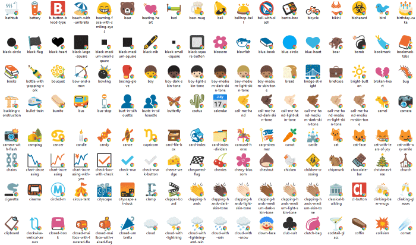

---
title: Gramex 1.73 release notes
prefix: 1.73
...

[TOC]

Gramex 1.73 introduces UIFactory events, InfluxDB support, Comicgen icons and more.


## UIFactory

[UIFactory](../../uifactory/) is now out of beta.
[Version 1.20](https://www.npmjs.com/package/uifactory/v/1.20.0) is packaged in
Gramex 1.73, and features a simpler way to add events and create blocks.

### UIFactory events

You can write event listener code inside `<script $onclick>...</script>`, like this:

```html
<template $name="count-button" count:number="0" step:number="2">
  <button>Click here</button>
  <span>Count: ${count}</span>
  <script $onclick="button">
    this.count += step
  </script>
</template>
```

Now, `<count-button></count-button>` renders this:


### UIFactory blocks

To re-use HTML later, add it into a `<script type="text/html" $block="blockname">...</script>`. For example:

```html
<template $name="block-example" greeting="hello">
  <script type="text/html" $block="one">one says ${greeting}.</script>
  <script type="text/html" $block="two">two says ${greeting}.</script>

  <%= one() %>
  <%= two({ greeting: 'Ola' }) %>
</template>
```

When you add the component to your page:

```html
<block-example></block-example>
```

... it renders this output:

```text
one says hello. two says Ola.
```

## Comicgen icons

[Comicgen](https://gramener.com/comicgen/v1/) supports two new icon libraries that can be used as props.

1. [Microsoft's FXEmoji with over 1,000 icons](https://gramener.com/comicgen/v1/#name=fxemoji)
2. [Google's Noto Emoji with over 2,000 icons](https://gramener.com/comicgen/v1/#name=noto)

[{.img-fluid}](https://gramener.com/comicgen/v1/#name=fxemoji)

[{.img-fluid}](https://gramener.com/comicgen/v1/#name=noto)


## OpenAPIHandler supports FormHandlers

You can expose a [FormHandler via OpenAPIHandler](../../openapihandler/#formhandler-openapis).
You must explicitly [specify the columns](../formhandler/#formhandler-columns), like this:

```yaml
url:
  flagdata:
    pattern: flagdata
    handler: FormHandler
    kwargs:
      url: flags.csv
      columns: [Name, Continent, Symbols, Shapes, Stripes]
```

This lets you render a [user interface for FormHandler-based data APIs](../../openapihandler/example.html):

[](../../openapihandler/example.html)


## FormHandler InfluxDB support

FormHandler can read from and write into [InfluxDB](https://portal.influxdata.com/downloads/), a time series database.

```yaml
url:
  influxdb:
    pattern: /data
    handler: FormHandler
    kwargs:
      url: 'mongodb://$USER:$PASS@$HOST:27017'
      token: ...  # token for authorization
      org: ...    # default organization to connect to
```

## LogViewer supports custom KPIs

[LogViewer](../../logviewer/#add-custom-kpis) lets you add new KPIs using
`LOGVIEWER_CUSTOM_DIMENSIONS`.

```yaml
logviewer:
  LOGVIEWER_CUSTOM_DIMENSIONS:
    # Create a 'slow' column to log slow requests
    slow: df['duration'] > 100
```

[{:.img-fluid}](../../logviewer/#add-custom-kpis)

## Gramex Roadmap

The [Gramex Roadmap](../../roadmap/) is now a live dashboard showing what's planned for Gramex in
the next few months, and the status of these items.

[{:.img-fluid}](../../roadmap/)

## Bug fixes

- The [Gramex Node.js bridge](../../node/) now works on systems and Docker containers with IPv6
  addresses. Earlier, it would raise a HTTP 401 error.
- If a Gramex [cache](../../cache/) runs out of memory because a *single* object is larger than its
  size, it recommends increasing `cache.memory.size` in `gramex.yaml`. Earlier, it reported that it
  couldn't cache, not why.

## Backward compatibility & security

Gramex 1.73 is backward compatible with [previous releases](../) unless the release notes say otherwise.
[Automated builds](https://travis-ci.com/github/gramener/gramex/builds) test this.

[Backward compatibility tests for 1.73](https://travis-ci.com/github/gramener/gramex/builds/TODO){:.btn .btn-lg .btn-primary}

Every Gramex release is tested for security vulnerabilities using the following tools.

1. [Bandit](https://bandit.readthedocs.io/) tests for back-end Python vulnerabilities.
   [See Bandit results](https://github.com/gramener/gramex/blob/master/reports/bandit.txt){:.btn .btn-xs .btn-success}
2. [npm-audit](https://docs.npmjs.com/cli/v6/commands/npm-audit) tests for front-end JavaScript vulnerabilities.
   [See npm-audit results](https://github.com/gramener/gramex/blob/master/reports/npm-audit.txt){:.btn .btn-xs .btn-success}
3. [Snyk](https://snyk.io/) for front-end and back-end vulnerabiliti  es.
   [See Synk results](https://github.com/gramener/gramex/blob/master/reports/snyk.txt){:.btn .btn-xs .btn-success}
4. [ClamAV](https://www.clamav.net/) for anti-virus scans.
   [See ClamAV results](https://github.com/gramener/gramex/blob/master/reports/clamav.txt){:.btn .btn-xs .btn-success}

## Statistics

The Gramex code base has:

- 19,857 lines of Python (246 more than 1.72)
- 3,359 lines of JavaScript (same as 1.72)
- 12,501 lines of test code (43 more than 1.71)
- 89% test coverage (same as 1.72)


## How to install

See the [Gramex installation and upgrade instructions](../../install/).

Note: Gramex 1.73 does not work with Python 3.8 or 3.9. We recommend Python 3.7.
