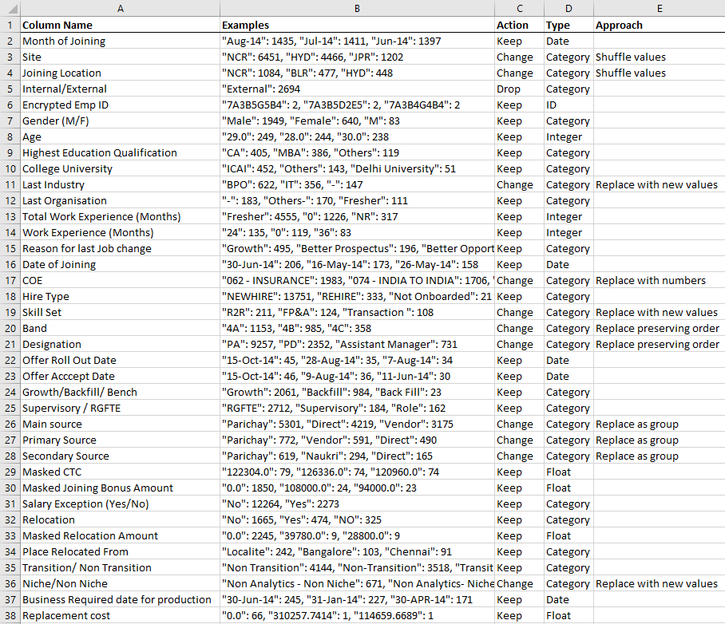

---
title: Guide to Anonymising data
prefix: Tip
...

We anonymize data to mask confidential information, but preserving the insights that emerge from the data. Here's a step-by-step process:

1. List all columns
2. Pick columns action: Drop, Keep or Change. If a column has confidential business results, drop or change it.
3. Fill the strategy to anonymize the column. Here are some strategies:
   - **Categories** (text columns with few unique values): Replace values. E.g.:
     - State: _Replace_ Indian state names with US state names
     - Product: _Replace_ banking products with retail products
     - City: _Shuffle_ the cities (i.e. replace values with others in the same list)
   - **Ordered categories** (categories with order): Replace preserving order. E.g.:
     - Designation: Replace _preserving order_ (i.e. If Manager -> Boss, Asst Manager -> Asst Boss)
   - **Hierarchies** (related columns): Replace as a group. E.g.:
     - State & District: _Replace_ (State, District) with a new (State, District) combination
   - **IDs** (e.g. email ID, mobile, etc). Substitute alphanumerics. Retain symbols.
   - **Words**: Replace sensitive words
   - **Dates**: May be retained
   - **Integers**: Add a random integer. For example, `ROUND(±20% * val * RANDOM())`
   - **Floats**: Add a random number. For example, `±20% * value * RANDOM()`
4. Reduce data size by sampling. Take a **natural subset** by applying a filter. Use 2+ values so
   that filters show multiple values. E.g:
   - instead of world data, use data for any 2+ continents, or 2+ countries
   - instead of all products, pick any 2+ categories or 2+ products
   - instead of 12 months data, pick 2+ months

This is example of a plan:

{: .img-fluid}

Useful tools:

- Excel
- [Open Refine](http://openrefine.org/)
- [Faker Python](https://faker.readthedocs.io/en/latest/)
- [Faker JavaScript](https://github.com/marak/Faker.js/)

## Reading material

- [A practical guide to anonymizing datasets](http://blog.districtdatalabs.com/a-practical-guide-to-anonymizing-datasets-with-python-faker)
