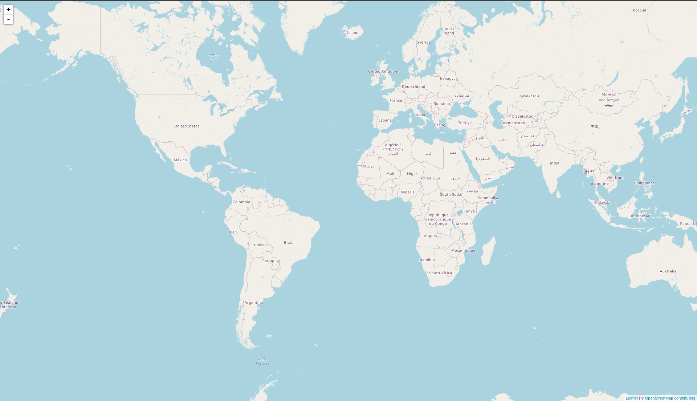
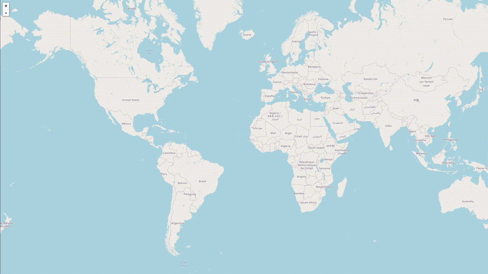

---
title: Visualizing Subsurface Float Movement with InfluxDB & FormHandler
prefix: influxdb
...

[TOC]

This tutorial shows how to use [InfluxDB](https://www.influxdata.com/) via [FormHandler](../../formhandler/).
Specifically, we will store a dataset of the GPS coordinates of a [set of
subsurface floats](https://www.aoml.noaa.gov/phod/float_traj/index.php) in InfluxDB,
and visualize them on a map with [Leaflet](https://leafletjs.com).

## Prerequisites

To follow through this tutorial completely, you will need:

1. Gramex community edition
2. An InfluxDB server

Gramex can be installed as follows:

```bash
conda install -c conda-forge -c gramener gramex
```

We recommend running InfluxDB via Docker,
but it can be installed in a [variety of ways](https://portal.influxdata.com/downloads/).

## Setting Up FormHandler for InfluxDB

Once InfluxDB is set up with an initial bucket, you will need these details to proceed with the
tutorial.

- Username
- A token associated with the username
- The org name
- The bucket name

All of these can be obtained when creating the initial setup with InfluxDB.
Once we have these details, we can create a FormHandler connection to InfluxDB
as follows:

```yaml
url:
  home:
    pattern: /$YAMLURL/data
    handler: FormHandler
    kwargs:
      url: influxdb:http://localhost:8086/  # Assuming the InfluxDB server is
                                            # running locally on port 8086.
      username: username                    # Your username
      token: token  	                    # Token associated with the username
      org: org                              # Organization
      bucket: bucket                        # Bucket
      xsrf_cookies: false
      id: _time
```

Now, when Gramex and InfluxDB are both running, we are ready to push data to
InfluxDB and query data from it.

## The Dataset - Subsurface Float Trajectories

In this tutorial, we will explore a dataset of SOFAR (SOund Fixing and Ranging)
floats. These are acoustically tracked submersible devices left in the ocean,
and their movements are tracked over a period of time to study oceanic currents.

We will use a subset of this dataset, which covers some of floats that have
traveled the longest in nearly a decade. The data looks like
this:


<table class="table table-striped">
  <thead>
    <tr>
      <th>lat</th>
      <th>long</th>
      <th>exp</th>
      <th>day</th>
    </tr>
  </thead>
  <tbody>
    <tr>
      <td>46.521</td>
      <td>-33.005</td>
      <td>CLIMODE</td>
      <td>22</td>
    </tr>
    <tr>
      <td>49.419</td>
      <td>-39.945</td>
      <td>CLIMODE</td>
      <td>21</td>
    </tr>
    <tr>
      <td>-58.568</td>
      <td>-91.521</td>
      <td>DIMES2</td>
      <td>31</td>
    </tr>
    <tr>
      <td>47.157</td>
      <td>-33.939</td>
      <td>CLIMODE</td>
      <td>23</td>
    </tr>
    <tr>
      <td>59.501</td>
      <td>-47.510</td>
      <td>ACALACE</td>
      <td>19</td>
    </tr>
  </tbody>
</table>

Each row represents the latitude and longitude of a float corresponding to an
experiment on a single day. Originally, the time period covered by this dataset
is nearly a decade, but since we need to finish running the visualization in a
much shorter time (say, 30 seconds), we have preprocessed the data such that it
appears as if the entire lifetime of the floats is a little over 30 seconds.

Download the dataset [here](floats.json).

## Visualizing Float Trajectories in Real Time

The dataset contains floats belonging to six experiments. Over the course of the
experiment, the floats travelled along the Americas as shown here:

{.img-fluid}

In the following steps, we will attempt to build a real-time visualization of
how the floats travelled.

### Making a Map

Create a file named `map.html` next to `gramex.yaml`, and add the following code
to it.

```html
<!DOCTYPE html>
<html>
  <head>
    <meta charset="utf-8" />
    <link rel="stylesheet" href="http://cdn.leafletjs.com/leaflet-0.7/leaflet.css"/>
    <style>
      html,
      body {
          height: 100%;
          width: 100%;
      }
      body {
          margin: 0;
      }
      #map {
          width: 100%;
          height: 100%;
      }
    </style>
  </head>
  <body>
    <div id="map"></div>
  </body>
  <script src="http://d3js.org/d3.v3.min.js" type="text/javascript"></script>
  <script src="http://cdn.leafletjs.com/leaflet-0.7/leaflet.js"></script>
  <script src="https://cdnjs.cloudflare.com/ajax/libs/jquery/3.6.0/jquery.min.js"></script>
  <script src="https://cdn.jsdelivr.net/npm/lodash@4.17.21/lodash.min.js"></script>
  <script>
    var map = L.map('map')
    L.tileLayer('https://{s}.tile.openstreetmap.org/{z}/{x}/{y}.png', {
      attribution: '&copy; <a href="https://openstreetmap.org/copyright">OpenStreetMap contributors</a>'
    }).addTo(map)
    map.fitBounds([
      [67, 147],
      [-63, -189]
    ])

    var data = null
    var polyLines = {}
    var colors = {}
    
    const updatePath = function(name, latlongs, colors) {
      let lat = _.filter(latlongs, {_field: 'lat'})[0]._value
      let lon = _.filter(latlongs, {_field: 'long'})[0]._value
      if (name in polyLines) {
        polyLines[name].addLatLng([lat, lon])
      } else {
        polyLines[name] = L.polyline([[lat, lon]], {color: colors[name]})
        polyLines[name].addTo(map)
      }
    }
    // More JS goes here.
  </script>
</html>
```

Note that we have:

* added some empty variables to accommodate data later, 
* added a function that renders the path of a float on the map, and
* left a placeholder comment to accommodate more Javascript code
as we develop the application through the following steps.

Run Gramex in this folder, and visit
[http://localhost:9988/map.html](http://localhost:9988/map.html) in your browser.
You should be able to see a map in your browser as follows:

{.img-fluid}

### Getting the data into the web app

Assuming that the [downloaded dataset](floats.json) is in the same folder as the
HTML and `gramex.yaml` files, add the following snippet at the end of the
`<script>` tag:

```js

function runApp(data) {
  // Note: The main function that the page will run,
  // to be modified later
  console.log(data)
}
$(document).ready(function() {
  $.getJSON('floats.json').done(runApp)
})
```

Now, when you refresh the page and open the browser console, you should be able
to see the dataset as a Javascript array.

### Preprocessing the Data

Now that we have access to the data from within the application, before pushing
it to influxdb, we need to do some preprocessing. Primarily, we need to answer
questions like:

* At what rate do we push the data to InfluxDB so that the visualization cycle
  finishes in a reasonable time?
* How do we render each experiment with a different color?

We have already modified the original data to make look like the experiment ran over
a course of 35 days (refer to the `day` column in the dataset). Therefore, if we
were to visualize one day's data in a second, we should be able to run through
the entire visualization in about 35 seconds.

In order to do this, modify the `runApp` function to look like this:

```javascript
function runApp(data) {
  // Note: The main function that the page will run,
  // to be modified later
  
  // Find the columns in the dataset
  var columns = _.keys(data[0]);

  // Find the number of days in the dataset
  let n_days = Math.max(..._.map(data, 'day'))

  // Get the names of the experiments
  let expNames = _.map(_.uniqBy(data, 'exp'), 'exp')

  // Map experiment names to colors
  var colors = _.zipObject(
    expNames,
    ["red", "green", "blue", "yellow", "black", "magenta"]
  )
}

```

### Pushing the Data to InfluxDB

Next, we add a recurring function to the app, which pushes a day's data to
InfluxDB every second. We have already established a FormHandler connection to
InfluxDB in the [second section](#setting-up-formhandler-for-influxdb) of this tutorial.

Now, we need to filter the dataset for each day, and push the filtered dataset
to InfluxDB every second. To do this, add the following lines to the `runApp`
function:

```javascript
// Initialize a counter to keep track of how many days' data has been pushed
let day_ix = 0

let pusher = setInterval(function() {

  // If the counter exceeds the number of days in the dataset, stop pushing.
  if (day_ix > n_days) {
    clearInterval(pusher)
  } else {

    // Filter the dataset by the current counter value
    let day_data = _.filter(data, {day: day_ix})
    chunk = _.zipObject(columns, _.map(columns, key => _.map(day_data, key)));

    // POST the data to FormHandler
    $.ajax({
      type: 'POST',
      url: 'data?measurement=latlong&tags=exp',
      data: JSON.stringify(chunk),
      contentType: 'application/json',
      traditional: true,

      // On success, increment the counter, move to the next day
      success: function(xhr) {
        day_ix += 1
      },
      error: console.log
    })
  }
}, 1000)  // Run this every second
```

### Pulling the Data from InfluxDB

Next, we need to pull data from InfluxDB every second, and render the GPS
coordinates of the fetched data points on the map, and update them as time
passes. To do this, we add another recurring function, as follows:

```javascript
let puller = setInterval(function() {

  // Get data accumulated in the last one second
  $.getJSON('data?bucket=sofar&_offset=-1s').done(function(d) {
    
    // If no data comes in the last one second, stop pulling
    if (d.length == 0) {
      clearInterval(puller)
    } else {

      // Otherwise plot it on the map
      let latest = _.groupBy(_.filter(d, i => ['lat', 'long'].includes(i._field)), 'exp')
      for (const [expname, latlongs] of Object.entries(latest)) {
  	updatePath(expname, latlongs, colors)
      }
    }
  })
}, 1000)  // Run this every second
```

### Putting it all together

By now, your `runApp` function should look like this:

```javascript
function runApp(data) {
  
  // Find the columns in the dataset
  var columns = _.keys(data[0]);

  // Find the number of days in the dataset
  let n_days = Math.max(..._.map(data, 'day'))

  // Get the names of the experiments
  let expNames = _.map(_.uniqBy(data, 'exp'), 'exp')

  // Map experiment names to colors
  var colors = _.zipObject(
    expNames,
    ["red", "green", "blue", "yellow", "black", "magenta"]
  )

  // Initialize a counter to keep track of how many days' data has been pushed
  let day_ix = 0
  
  let pusher = setInterval(function() {
  
    // If the counter exceeds the number of days in the dataset, stop pushing.
    if (day_ix > n_days) {
      clearInterval(pusher)
    } else {
  
      // Filter the dataset by the current counter value
      let day_data = _.filter(data, {day: day_ix})
      chunk = _.zipObject(columns, _.map(columns, key => _.map(day_data, key)));
  
      // POST the data to FormHandler
      $.ajax({
        type: 'POST',
        url: 'data?measurement=latlong&tags=exp',
        data: JSON.stringify(chunk),
        contentType: 'application/json',
        traditional: true,
  
        // On success, increment the counter, move to the next day
        success: function(xhr) {
          day_ix += 1
        },
        error: console.log
      })
    }
  }, 1000)  // Run this every second

  let puller = setInterval(function() {
  
    // Get data accumulated in the last one second
    $.getJSON('data?bucket=sofar&_offset=-1s').done(function(d) {
      
      // If no data comes in the last one second, stop pulling
      if (d.length == 0) {
        clearInterval(puller)
      } else {
  
        // Otherwise plot it on the map
        let latest = _.groupBy(_.filter(d, i => ['lat', 'long'].includes(i._field)), 'exp')
        for (const [expname, latlongs] of Object.entries(latest)) {
    	updatePath(expname, latlongs, colors)
        }
      }
    })
  }, 1000)  // Run this every second
}
```

Refresh the page, and you should see a visualization that looks like this:

{.img-fluid}
