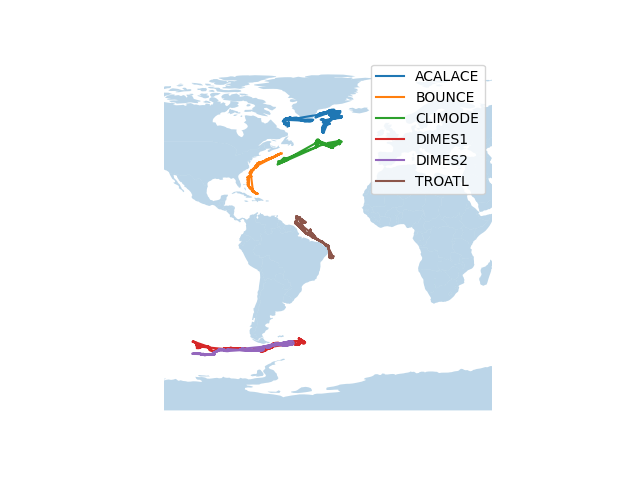

---
title: Visualizing Subsurface Float Movement with InfluxDB & FormHandler
prefix: influxdb
...

[TOC]

This tutorial shows how to use [InfluxDB](https://www.influxdata.com/) via [FormHandler](../../formhandler/).
Specifically, we will store a dataset of the GPS coordinates of a [set of
subsurface floats](https://www.aoml.noaa.gov/phod/float_traj/index.php) in InfluxDB,
and visualize them on a map with [Leaflet](https://leafletjs.com).

## Prerequisites

To follow through this tutorial completely, you will need:

1. Gramex community edition
2. An InfluxDB server

Gramex can be installed as follows:

```bash
conda install -c conda-forge -c gramener gramex
```

We recommend running InfluxDB via Docker,
but it can be installed in a [variety of ways](https://portal.influxdata.com/downloads/).

## Setting Up FormHandler for InfluxDB

Once InfluxDB is set up with an initial bucket, you will need these details to proceed with the
tutorial.

- Username
- A token associated with the username
- The org name
- The bucket name

All of these can be obtained when creating the initial setup with InfluxDB.
Once we have these details, we can create a FormHandler connection to InfluxDB
as follows:

```yaml
url:
  home:
    pattern: /$YAMLURL/data
    handler: FormHandler
    kwargs:
      url: influxdb:http://localhost:8086/  # Assuming the InfluxDB server is
                                            # running locally on port 8086.
      username: username                    # Your username
      token: token  	                    # Token associated with the username
      org: org                              # Organization
      bucket: bucket                        # Bucket
      xsrf_cookies: false
      id: _time
```

Now, when Gramex and InfluxDB are both running, we are ready to push data to
InfluxDB and query data from it.

## The Dataset - Subsurface Float Trajectories

In this tutorial, we will explore a dataset of SOFAR (SOund Fixing and Ranging)
floats. These are acoustically tracked submersible devices left in the ocean,
and their movements are tracked over a period of time to study oceanic currents.

We will use a subset of this dataset, which covers some of floats that have
traveled the longest in nearly a decade. The data looks like
this:


<table class="table table-striped">
  <thead>
    <tr>
      <th>lat</th>
      <th>long</th>
      <th>exp</th>
      <th>day</th>
    </tr>
  </thead>
  <tbody>
    <tr>
      <td>46.521</td>
      <td>-33.005</td>
      <td>CLIMODE</td>
      <td>22</td>
    </tr>
    <tr>
      <td>49.419</td>
      <td>-39.945</td>
      <td>CLIMODE</td>
      <td>21</td>
    </tr>
    <tr>
      <td>-58.568</td>
      <td>-91.521</td>
      <td>DIMES2</td>
      <td>31</td>
    </tr>
    <tr>
      <td>47.157</td>
      <td>-33.939</td>
      <td>CLIMODE</td>
      <td>23</td>
    </tr>
    <tr>
      <td>59.501</td>
      <td>-47.510</td>
      <td>ACALACE</td>
      <td>19</td>
    </tr>
  </tbody>
</table>

Each row represents the latitude and longitude of a float corresponding to an
experiment on a single day. Originally, the time period covered by this dataset
is nearly a decade, but since we need to finish running the visualization in a
much shorter time (say, 30 seconds), we have preprocessed the data such that it
appears as if the entire lifetime of the floats is a little over 30 seconds.

Download the dataset [here](floats.json).

## Visualizing Float Trajectories in Real Time

{.img-fluid}
