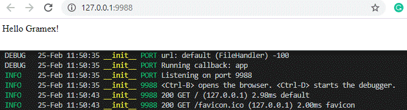
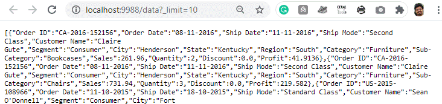
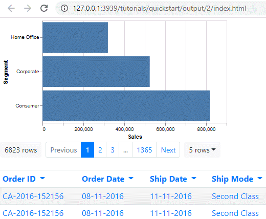

---
title: Quickstart with Gramex
prefix: Quickstart
...

Gramex is a platform that allows users to create visual storyboards from data.

This guide creates a simple dashboard for SuperStore, a fictional supermarket.
We'll analyse the supermarket's sales by product segment, region and category.

[TOC]

## Requirements

In order to start this tutorial, we will need to:

- [Install Gramex](../../install/)
- [Download the data](../store-sales.csv) and save it as `store-sales.csv`.

## Introduction

This is what SuperStore's sales data looks like:

<div class="formhandler" data-src="../data?_c=Order%20ID&_c=Sales&_c=Region&_c=State&_c=City&_c=Category&_c=SubCategory&_c=Segment"></div>
<script>
  $('.formhandler').formhandler({pageSize: 5})
</script>

Our goal is to display the sales by product segment, region and category. The relevant fields are:

- Sales - the value in USD of a particular order.
- Region, State and City - the place where the sale was made.
- Category, SubCategory - the type of the product that was sold.
- Segment - the type of customer who bought the product.

After finishing this tutorial, you will be able to:

1. convert any data file into a REST API,
2. preview the data in an interactive table, and
3. create a chart showing sales across multiple categories.

Our application should look like:

[View source](output/3/index.html){: class="source"}

## Step 0: Create the Project

1. Create a folder called `superstore` anywhere.
2. Move the downloaded [store-sales.csv](../store-sales.csv) into it.
3. Create a text file `gramex.yaml` in it. Leave it blank for now.
4. Create a text file `index.html` in it. Just enter "Hello Gramex" in it.

Open a terminal, change to the `superstore` folder and [start Gramex](../../install/#run-a-gramex-app):

```bash
conda activate gramex
gramex
```

You'll see log messages on the terminal. Once you see a line `Listening on port 9988`, Gramex is ready.

```console
...
INFO    22-Apr 13:34:26 __init__ PORT Listening on port 9988
INFO    22-Apr 13:34:26 __init__ 9988 <Ctrl-B> opens the browser...
```

**Note**: Gramex may print other lines after this -- so it _may not_ be the last line on the log.

Open your browser and visit `http://localhost:9988`.
You'll see "Hello Gramex".

{: width=500}

[View source](output/1/index.html){: class="source"}

## Step 1: Expose the data through a REST API

Let's create a URL that sends data to the dashboard. We'll use a Gramex microservice called
[`FormHandler`](../../formhandler).

Add this to the (currently empty) `gramex.yaml`:

```yaml
url:
  superstore-data:
    pattern: /$YAMLURL/data
    handler: FormHandler
    kwargs:
      url: $YAMLPATH/store-sales.csv
```

Now visit `http://localhost:9988/data` in your browser.
You should now see a JSON payload representing the first 1,000 lines of the dataset:

```js
[
  { "Order ID":"CA-2016-152156","Order Date":"08-11-2016",... },
  { "Order ID":"CA-2016-152156","Order Date":"08-11-2016",... },
  // etc
]
```

You could also visit
[http://localhost:9988/data?\_limit=10&\_format=html](http://localhost:9988/data?_limit=10&_format=html)
to see the first ten rows as a simple HTML table.

{: width=500}

## Step 2: Lay out some scaffolding

Since we now have access to the data from a REST API, we are ready to start
building the frontend.

First, add this code into `gramex.yaml`:

```yaml
import:
  ui:
    path: $GRAMEXAPPS/ui/gramex.yaml # Import the UI components
    YAMLURL: $YAMLURL/ui/ # ... at this URL
```

This imports the [UI components library](../../uicomponents/), which includes:

- [Bootstrap](https://getbootstrap.com) -- for UI components
- [lodash](https://lodash.com) -- for data manipulation
- [g1](https://www.npmjs.com/package/g1) -- the Gramex UI library
- [vega](http://vega.github.io/) -- the charting library

We won't change `gramex.yaml` for the rest of this tutorial. We are done with the backend configuration.

Now, copy this code into `index.html`. It's a boilerplate that includes the CSS and JS files we'll need.

```html
<!doctype html>
<html>
  <head>
    <meta charset="utf-8" />
    <title>SuperStore Sales Dashboard</title>
    <link rel="stylesheet" href="ui/bootstraptheme.css" />
  </head>
  <body>
    <div class="placeholder">This div shall hold our data</div>
  </body>
  <script src="ui/jquery/dist/jquery.min.js"></script>
  <script src="ui/bootstrap/dist/js/bootstrap.bundle.min.js"></script>
  <script src="ui/lodash/lodash.min.js"></script>
  <script src="ui/g1/dist/g1.min.js"></script>
  <script src="ui/vega/build/vega.min.js"></script>
  <script src="ui/vega-lite/build/vega-lite.min.js"></script>
</html>
```

[View source](output/4/index.html){: class="source"}

## Step 3: Fill in the Data

The simplest and sometimes most effective way to represent data can be a table.
Accordingly, Gramex provides a way of embedding tabular data in any HTML page as
an interactive table.

To show the data as a table, insert the following lines in
<kbd>index.html</kbd>:

```html
<div class="formhandler" data-src="data"></div>
<script>
  $(".formhandler").formhandler({ pageSize: 5 });
</script>
```

[View source](output/5/index.html){: class="source"}

After saving the file, when we open
[`http://localhost:9988`](http://localhost:9988),
we should see a table similar to the one below.


The table is interactive. Try playing around with it. Here's a few things you could try:

- Click the dropdown arrows near the column headers to see column options.
- Try getting the second, third or the 1365th 'page' of the dataset from the menu at the top of the table.
- See 20, 50 or more rows at a time in the table from the dropdown menu to the right of the page list.

## Step 4: Adding A Chart

Let's add a simple barchart to display data grouped by Segment. Formhandler automatically does the grouping for us simply by changing the URL. Adding a `?_by` query to any FormHandler URL, like [data?\_by=Segment](../data?_by=Segment), changes the output: each of our numeric columns now has the sum of all rows having a particular Segment value.

FormHandler lets us do a lot of data querying, filtering and grouping just by editing the URL. See [FormHandler Filters](../../formhandler/#formhandler-filters) for list of all possible values.

To actually draw the chart, we'll use a library called
[Vega-lite](https://vega.github.io/vega-lite/). Vega-lite is a really simple to
use, configuration driven javascript charting library and supports many common
chart types. To draw a chart, we add a few pieces to our `index.html`.

Add the following _chart specification_ to your HTML, followed by some JS code
to render the chart.

```html
<div id="chart"></div>
<script>
  var spec = {
    $schema: "https://vega.github.io/schema/vega-lite/v3.json",
    description: "A bar chart that sorts the y-values by the x-values.",
    width: 360,
    height: 200,
    data: { url: "data?_by=Segment" },
    mark: "bar",
    encoding: {
      y: {
        field: "Segment",
        type: "nominal",
        sort: { encoding: "x" },
        axis: { title: "Segment" },
      },
      x: {
        field: "Sales|sum",
        type: "quantitative",
        axis: { title: "Sales" },
      },
    },
  };
  var view = new vega.View(vega.parse(vegaLite.compile(spec).spec))
    .renderer("svg")
    .initialize("#chart")
    .hover()
    .run();
</script>
```

After saving the file, when we open
[`http://localhost:9988`](http://localhost:9988), we should see a chart and table like below.



[View source](output/2/index.html){: class="source"}

Details of the specification can be found in the vega-lite [docs](https://vega.github.io/vega-lite/docs/), but some things to note:

- the spec consists of a bunch of nested fields, `width`, `height`, `data`, etc
- the data key is set to the FormHandler URL with grouping by Segment: `{"url": "data?_by=Segment"}`
- We've set the x and y axis values to `Sales|sum` and `Segment` respectively,
  telling Vega-lite to plot those quantities from the data that FormHandler
  returns.

## Step 5: Appearance and Final Touches

We can now flex front-end muscle to make our dashboard look slightly better. We will keep this section short, but frontend appearances can be endlessly configured. Feel free to go through the rest of our guides to get a better handle on some of these.

Let's add a second chart to plot the aggregate sum of Quantity by Segment.
It's the same chart - we are just changing the axes.
Thus, we can reuse the earlier specification, but we still need to change values
of certain fields.
So we create a function to which we can pass the fields that need to be updated:
the div to draw the chart, the x-axis column name and the title of the chart.

```js
function render_charts(chartid, xfield, title) {
  spec.title.text = title;
  spec.encoding.x.field = xfield;
  var view = new vega.View(vega.parse(vegaLite.compile(spec).spec))
    .renderer("svg")
    .initialize(chartid)
    .hover()
    .run();
}
render_charts("#chart1", "Sales|sum", "Sales by Segment");
render_charts("#chart2", "Quantity|sum", "Quantity by Segment");
```

Here are a few more ways in which we can tweak our dashboard:

1. To hide some of the columns from our dataset, we can use a FormHandler filter similar to what we had introduced in Step 4.
2. We can use a feature of UI components, which allows us to override [bootstrap variables by passing url query parameters to the css import line](../../uicomponents/#custom-bootstrap). For example, setting link-color to black.
3. We can modify the vega-lite configuration of the chart to add a color scale, and change the fonts of the chart.

[View source](output/3/index.html){: class="source"}

## Next steps

If you have followed along with this quickstart, you now have a basic idea of how to build a simple static dashboard with Gramex.
To see more of what Gramex's functionality and features, including how to build interactive, URL driven dashboards; look at:

- the rest of our [tutorials](../),
- our [demos](https://gramener.com/demo), and,
- our detailed [documentation](../../).

## Troubleshooting

- Gramex doesn't start:
  - [Inotify watch limit reached](https://unix.stackexchange.com/questions/13751/kernel-inotify-watch-limit-reached)
  - Port is busy
    - Gramex runs on port 9988 by default, you can run `gramex --listen.port=<port number>` to run on an arbritary port.
- Don't see any text at localhost:9988, instead just a list of files in the directory
  - You may not have a gramex.yaml in your project directory. Create one and restart Gramex.
- CSS/JS Not available.
  - You may have forgotten to add UI Components in Step 2, or could be missing NodeJS; ensure NodeJS is installed, run `gramex setup ui` and restart gramex. If it still doesn't work, open an issue on [github](https://github.com/gramener/gramex) or email cto@gramener.com
- vega chart not rendering for some reason
  - You may have forgotten to include vega and vega lite dependencies in step 2.

<script src="../tutorial.js"></script>
