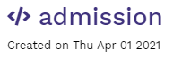
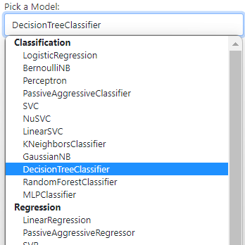

---
title: Building Machine Learning Apps Rapidly
prefix: workshop
...


- Guide link: [https://bit.ly/mlappworkshop](https://bit.ly/mlappworkshop)
- Opening survey link: [https://bit.ly/mlappsurvey](https://bit.ly/mlappsurvey)
- Project template: [https://github.com/gramener/building-ml-apps-rapidly](https://github.com/gramener/building-ml-apps-rapidly)
- Dataset link: [admission.csv](admission.csv)
- IDE link: [https://gramex.gramener.com](https://gramex.gramener.com)
- Final survey link: [https://bit.ly/mlworkshopresponse](https://bit.ly/mlworkshopresponse)

<!--
- Output for certificate link (NPTEL): [http://bit.ly/GramexOP](http://bit.ly/GramexOP)
-->

<div class="ratio ratio-16x9">
  <iframe src="https://www.youtube.com/embed/JSEntM00QVw" allowfullscreen></iframe>
</div>

### A Quick Survey

Before we start, could you please fill in this 15-second survey? [https://bit.ly/mlappsurvey](https://bit.ly/mlappsurvey)


## Objective

This workshop aims to teach you how:

- modern ML Apps are built, with a practical example
- low-code approaches make this fast and flexible
- micro-services make it easier to extend applications

## Overview

In this workshop, we’ll predict whether or not a student will get admitted into a college in the US. Specifically, we’re going to

- [Explore the data](#explore-the-data)
- [Build a model to predict who'll get admitted](#build-a-model-to-predict-wholl-get-admitted)
- [Build an app that predicts admission](#build-an-app-that-predicts-admission)
- [Publish your project on GitHub](#publish-your-project-on-github)
- [Summarize Learnings](#summarize-learnings)


## Explore the data

The dataset [admission.csv](admission.csv) looks like this:

{.img-fluid}

Each row is a student. We have data for 500 students. For every student, we know their

- Name
- GRE Scores (out of 340)
- TOEFL Scores (out of 120)
- University Rating (out of 5)
- Statement of Purpose strength (out of 5)
- Letter of Recommendation strength (out o
- Undergraduate GPA (out of 10)
- Research Experience (0=no, 1=yes)
- Admitted (0=no, 1=yes). This is the outcome variable

## Build a model to predict who'll get admitted

We’ll use the Gramex IDE at [https://gramex.gramener.com](https://gramex.gramener.com/) for this.

[Sign into Gramex](https://gramex.gramener.com/) with a Microsoft or Google account. [Create a Google account if required](https://support.google.com/accounts/answer/27441).

### IDE Tutorial

1. Visit <https://gramex.gramener.com/>. Click on the "Create new project" button

   {.img-fluid}

2. Set the project name to "admission". Then click "Create Project". The "admission" project is created. Click on it to open the IDE.

   {.img-fluid}

3. Add an [MLHandler](/mlhandler) component

   {.img-fluid}

4. Enter "predict" under the Pattern: as the MLHandler end point URL.
   Download the dataset `admission.csv` and upload it using the Upload icon.
   Click on Preview to see the dataset.

{.img-fluid}

Next,

1. In Columns to Exclude, select "Name"
2. In Categorical Columns, select "Research"
3. In Numerical Columns, select everything except "Name", "Research" and "Admitted"
4. In Pick a Target Column, select "Admitted"
5. In Pick a Model, select "Logistic Regression" (default)
6. Press Submit

   {.img-fluid}

7. After a few seconds, click on the "/predict" link. This opens the trained model page

   {.img-fluid}

The URL will look something like this: `https://1234.gramex.gramener.co/predict`. From now on, we’ll refer to it as `/predict`. You need to type out the `https://1234.gramex.gramener.co/` before the URLs.

You can train the model with other models using the "Pick a Model" dropdown and clicking on "Train".

{.img-fluid}

Choose "DecisionTreeClassifier" as the final model and click on "Train".

NOTE: You can do the same steps via configuration. Open the "Editor", edit `gramex.yaml` and add this configuration:

```yaml
  building-ml-apps-predict:
    pattern: /$YAMLURL/predict
    handler: MLHandler
    kwargs:
      data:
        url: $YAMLPATH/admission.csv
      config_dir: $YAMLPATH
      model:
        class: LogisticRegression
        target_col: Admitted
        exclude: [Name]
        cats: [Research]
        nums: [GREScore, TOEFLScore, UniversityRating, SOP, LOR, CGPA]
```

Let’s predict the admissions of a few people. Add these query parameters to your URL and see if the "Admitted" field is correct.

- Ethan Koch: `/predict?GREScore=337&TOEFLScore=118&UniversityRating=4&SOP=4.5&LOR=4.5&CGPA=9.65&Research=1`
- Diana Strong: `/predict?GREScore=324&TOEFLScore=107&UniversityRating=4&SOP=4&LOR=4.5&CGPA=8.87&Research=1`

Now let’s explore a student — Darius Michael. He has an excellent GRE score — 340. In fact, that’s the highest score. But Darius did not get admitted. What could he have done differently? Let’s explore.

`/predict?GREScore=340&TOEFLScore=114&UniversityRating=5&SOP=4&LOR=4&CGPA=9.6&Research=1`

- Increase his TOEFL score from 114 to 115. Does he get admitted?
- Increase his SOP from 4 to 4.5. Does he get admitted?
- Increase his LOR from 4 to 4.5. Does he get admitted?
- Increase his CGPA from 9.6 to 9.7. Does he get admitted?

Which of these worked? Which of these didn’t?

## Build an app that predicts admission

Let’s now build a web app that uses this data like an API.

1. Click on the code editor on the left — the second icon. This shows a list of all files created for the app. Select `index.html`

   {.img-fluid}

2. Delete all lines from `index.html`
3. Copy paste the following file into `index.html`

```html
<!doctype html>
<html lang="en">
<head>
  <meta charset="utf-8">
  <meta http-equiv="x-ua-compatible" content="ie=edge">
  <title>admission</title>
  <meta name="viewport" content="width=device-width, initial-scale=1">
  <link rel="stylesheet" href="ui/theme/default.scss">
  <style>
    #result { font-weight: normal; }
  </style>
</head>
<body>
  <div class="container py-4">
    <div class="row">
      <div class="col-sm-6">
        <form class="admission">
          <div class="form-group row">
            <label for="GREScore" class="col-md-4">GRE Score</label>
            <input type="number" class="form-control col-md-8" name="GREScore" min="280" max="340">
          </div>
          <div class="form-group row">
            <label for="TOEFLScore" class="col-md-4">TOEFL Score</label>
            <input type="number" class="form-control col-md-8" name="TOEFLScore" min="90" max="120">
          </div>
          <div class="form-group row">
            <label for="UniversityRating" class="col-md-4">University Rating</label>
            <input type="number" class="form-control col-md-8" name="UniversityRating" min="1" max="5">
          </div>
          <div class="form-group row">
            <label for="SOP" class="col-md-4">SOP</label>
            <input type="number" class="form-control col-md-8" name="SOP" step="0.5" min="1" max="5">
          </div>
          <div class="form-group row">
            <label for="LOR" class="col-md-4">LOR</label>
            <input type="number" class="form-control col-md-8" name="LOR" step="0.5" min="1" max="5">
          </div>
          <div class="form-group row">
            <label for="CGPA" class="col-md-4">CGPA</label>
            <input type="number" class="form-control col-md-8" name="CGPA" step="0.01" min="6" max="10">
          </div>
          <div class="form-group row">
            <label for="Research" class="col-md-4">Research</label>
            <select class="form-control col-md-8" name="Research">
              <option value="0">0: No</option>
              <option value="1">1: Yes</option>
            </select>
          </div>
          <button type="submit" class="btn btn-primary">Submit</button>
        </form>
      </div>
      <div class="col-sm-6 text-center text-middle">
        <h1 id="result"></h1>
      </div>
    </div>
  </div><!-- .container-fluid -->
  <script src="ui/jquery/dist/jquery.min.js"></script>
  <script src="ui/bootstrap/dist/js/bootstrap.bundle.min.js"></script>
  <script src="ui/lodash/lodash.min.js"></script>
  <script src="ui/g1/dist/g1.min.js"></script>
  <script>
    $('.admission').on('submit', function (e) {
      e.preventDefault()
      $.getJSON('predict?' + $(this).serialize())
        .then(function (results) {
          console.log('Results', results)
          $('#result').html(
            results[0].Admitted ? 'You will <strong class="text-success">be admitted</strong>' : 'You will <strong class="text-danger">not be admitted</strong>'
          )
        })
        .fail(function (xhr) {
          console.error(xhr)
          $('#result').html('<strong class="text-danger">Error</strong>. Please enter values correctly')
        })
    })
    $('.admission :input').on('change', function () {
      $('#result').html('')
    })
  </script>
</body>
</html>
```

Visit your app by going to the home page and clicking on "Launch app" against the "admissions" app

{.img-fluid}

Now, try out different combinations of marks and see the result.

<!--
## Publish your project on GitHub

Now, let’s save your app as repository on Github. You (or anyone) can run it with the Gramex IDE.

1. Create a new repository at https://github.com/new. Call it "admission". Click "Create repository"

   {.img-fluid}

2. Once the repository  is created, copy the HTTPS link on the next page. It will look like `https://github.com/<your-id>/admission.git`

   {.img-fluid}

3. Click on the code editor on the left — the second icon. Press `` Ctrl+` `` (Ctrl-Backtick) to open the Terminal.
   Then copy-paste these commands using `Shift+Ins`.

```bash
git config --global user.name "<Your Name>"           # Add your name
git config --global user.email "<you@example.com>"    # Add your email
git init
git add .                                             # Remember the . at the end
git commit -m "basic prediction"
git remote add origin https://github.com/<your-id>/admission.git    # Use YOUR Github id here
git push -u origin master
```

{.img-fluid}

While typing `git push -u origin master`, Github will prompt you to authorize the code serve. Select "Authorize cdr" when this appears.

{.img-fluid}


Now, this project is is available on your Github repository. To clone it, anyone can:


1. Visit https://gramex.gramener.com/
2. Click on the "Create new project" button

   {.img-fluid}

3. Type your repository link under "Clone a Repository". It will be like `https://github.com/<your-id>/admission.git`.
4. Type any new project name.
5. Then click "Clone"

   {.img-fluid}

-->

## Summarize Learnings


- Low-code platforms make it easy to create applications quickly
- They can be extended in any way using custom code
- This makes them a powerful combination of speed and flexibility

## Learning more

### Try next steps

- Explore the models to see which model has the best accuracy
- Extend the application to show the list of users. Click on a user to fill the form with their score.
- Extend the application to build a live simulator like [https://gramener.com/processmonitor/predictor](https://gramener.com/processmonitor/predictor)
- Learn more about configuring the micro-service at [https://learn.gramener.com/guide/mlhandler/](https://learn.gramener.com/guide/mlhandler/)

### What if you need help?

First, let’s set up your StackOverflow accounts.


- If you don’t have a StackOverflow account, sign up: <https://stackoverflow.com/users/signup>
- If you have a StackOverflow account, log in: <https://stackoverflow.com/users/login>
- Search for questions tagged Gramex: <https://stackoverflow.com/questions/tagged/gramex>
- Click on any question. Test your account by upvoting it. (You can undo it later if you wish.)
- Now you can ask any question about Gramex via <https://stackoverflow.com/questions/ask?tags=gramex>

With your Github account, you can report a Gramex bug at [https://github.com/gramener/gramex/issues/new](https://github.com/gramener/gramex/issues/new)

You can browse the Gramex Guide and learn more at [https://gramener.com/gramex/guide/](https://gramener.com/gramex/guide/)

Finally, you can e-mail cto@gramener.com (e.g. on this project, pushing to git, etc.) for help

### Share feedback

We’d love to get your feedback, and help you with your learning & career.
Could you please fill this 1-minute survey:
[https://bit.ly/mlworkshopresponse](https://bit.ly/mlworkshopresponse)

If you like Gramex, visit [https://github.com/gramener/gramex/](https://github.com/gramener/gramex/)
and click on `☆ Star` to stay updated with Gramex.
